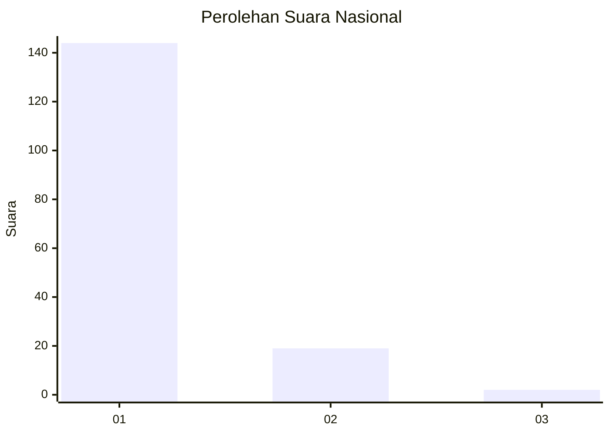
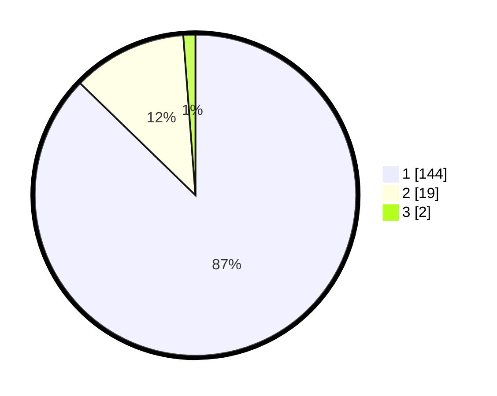

# Hasil

## Grafik

## Tabel

| No. | Nama Paslon    | Suara | Suara (raw) | Persentase |
|:--- |:-------------- | -----:| -----------:| ----------:|
| 1   | ANIES MUHAIMIN | 144   | [144][p-1]  | 87,27      |
| 2   | PRABOWO GIBRAN | 19    | [19][p-2]   | 11,52      |
| 3   | GANJAR MAHFUD  | 2     | [2][p-3]    | 1,21       |

[p-1]: https://github.com/gigit-pemilu/pemilu-2024/blob/main/pilpres/hitung-suara/sub/11-aceh/sub/01-aceh-selatan/sub/01-bakongan/sub/2001-keude-bakongan/sub/001-tps/sub/paslon-1.txt
[p-2]: https://github.com/gigit-pemilu/pemilu-2024/blob/main/pilpres/hitung-suara/sub/11-aceh/sub/01-aceh-selatan/sub/01-bakongan/sub/2001-keude-bakongan/sub/001-tps/sub/paslon-2.txt
[p-3]: https://github.com/gigit-pemilu/pemilu-2024/blob/main/pilpres/hitung-suara/sub/11-aceh/sub/01-aceh-selatan/sub/01-bakongan/sub/2001-keude-bakongan/sub/001-tps/sub/paslon-3.txt

## Foto C Plano

https://sirekap-obj-formc.kpu.go.id/204f/pemilu/ppwp/11/01/01/20/01/1101012001001-20240215-101421--bf8d6f39-234c-410b-89d4-8339434bf62a.jpg

https://sirekap-obj-formc.kpu.go.id/204f/pemilu/ppwp/11/01/01/20/01/1101012001001-20240219-235651--89440bcf-5883-4d48-8e8e-c2f42480c5c4.jpg

https://sirekap-obj-formc.kpu.go.id/204f/pemilu/ppwp/11/01/01/20/01/1101012001001-20240219-235828--c3b0fa3c-dd61-4f3f-a794-e76cd7fb287e.jpg

## Metadata

| Key        | Value               |
| ---------- | ------------------- |
| Time Stamp | 2024-02-20 13:00:00 |

## DATA PEMILIH TETAP

Jumlah pemilih dalam DPT: **284**.
 * L: **139**.
 * P: **145**.

## DATA PENGGUNA HAK PILIH

Jumlah pengguna hak pilih dalam DPT: **236**.
 * L: **110**.
 * P: **126**.

Jumlah pengguna hak pilih dalam DPTb: **1**.
 * L: **0**.
 * P: **1**.

Jumlah pengguna hak pilih dalam DPK: **2**.
 * L: **2**.
 * P: **0**.

Jumlah pengguna hak pilih: **239**.
 * L: **112**.
 * P: **127**.

## JUMLAH SUARA SAH DAN TIDAK SAH

JUMLAH SELURUH SUARA SAH: **165**.

JUMLAH SUARA TIDAK SAH: **1**.

JUMLAH SELURUH SUARA SAH DAN SUARA TIDAK SAH: **166**.

