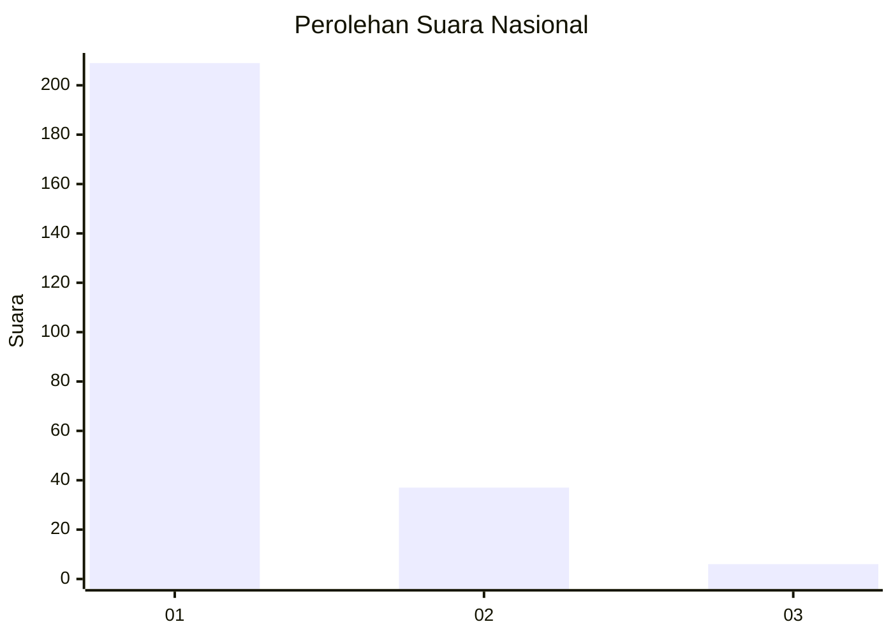
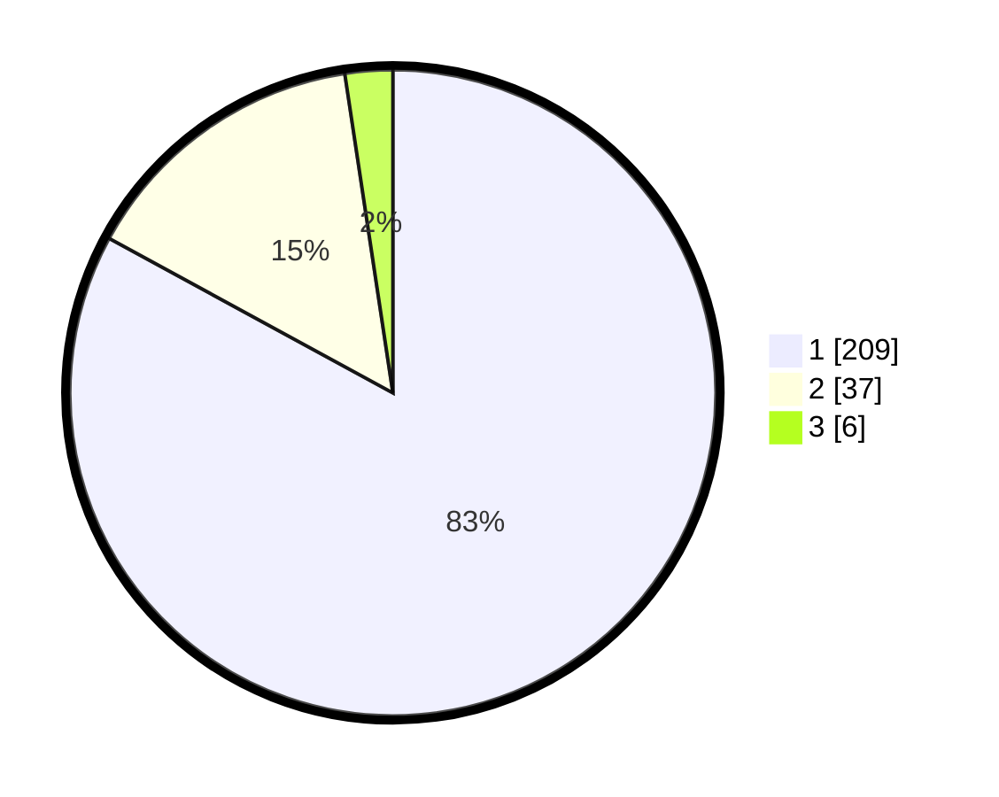

# Hasil

## Grafik

## Tabel

| No. | Nama Paslon    | Suara | Suara (raw) | Persentase |
|:--- |:-------------- | -----:| -----------:| ----------:|
| 1   | ANIES MUHAIMIN | 209   | [209][p-1]  | 82,94      |
| 2   | PRABOWO GIBRAN | 37    | [37][p-2]   | 14,68      |
| 3   | GANJAR MAHFUD  | 6     | [6][p-3]    | 2,38       |

[p-1]: https://github.com/gigit-pemilu/pemilu-2024/blob/main/pilpres/hitung-suara/sub/11-aceh/sub/01-aceh-selatan/sub/01-bakongan/sub/2001-keude-bakongan/sub/002-tps/sub/paslon-1.txt
[p-2]: https://github.com/gigit-pemilu/pemilu-2024/blob/main/pilpres/hitung-suara/sub/11-aceh/sub/01-aceh-selatan/sub/01-bakongan/sub/2001-keude-bakongan/sub/002-tps/sub/paslon-2.txt
[p-3]: https://github.com/gigit-pemilu/pemilu-2024/blob/main/pilpres/hitung-suara/sub/11-aceh/sub/01-aceh-selatan/sub/01-bakongan/sub/2001-keude-bakongan/sub/002-tps/sub/paslon-3.txt

## Foto C Plano

https://sirekap-obj-formc.kpu.go.id/6244/pemilu/ppwp/11/01/01/20/01/1101012001002-20240215-173345--ecea867e-ef01-4ce2-8381-0f5a416a7d36.jpg

https://sirekap-obj-formc.kpu.go.id/6244/pemilu/ppwp/11/01/01/20/01/1101012001002-20240215-212221--3f6542a3-8f75-4a73-999c-1962858ae199.jpg

https://sirekap-obj-formc.kpu.go.id/6244/pemilu/ppwp/11/01/01/20/01/1101012001002-20240215-163053--7c400443-9bb3-406f-8034-9deab7b95848.jpg

## Metadata

| Key        | Value               |
| ---------- | ------------------- |
| Time Stamp | 2024-02-16 12:51:22 |

## DATA PEMILIH TETAP

Jumlah pemilih dalam DPT: **296**.
 * L: **138**.
 * P: **158**.

## DATA PENGGUNA HAK PILIH

Jumlah pengguna hak pilih dalam DPT: **248**.
 * L: **115**.
 * P: **133**.

Jumlah pengguna hak pilih dalam DPTb: **2**.
 * L: **0**.
 * P: **2**.

Jumlah pengguna hak pilih dalam DPK: **3**.
 * L: **2**.
 * P: **1**.

Jumlah pengguna hak pilih: **253**.
 * L: **116**.
 * P: **137**.

## JUMLAH SUARA SAH DAN TIDAK SAH

JUMLAH SELURUH SUARA SAH: **252**.

JUMLAH SUARA TIDAK SAH: **1**.

JUMLAH SELURUH SUARA SAH DAN SUARA TIDAK SAH: **253**.

