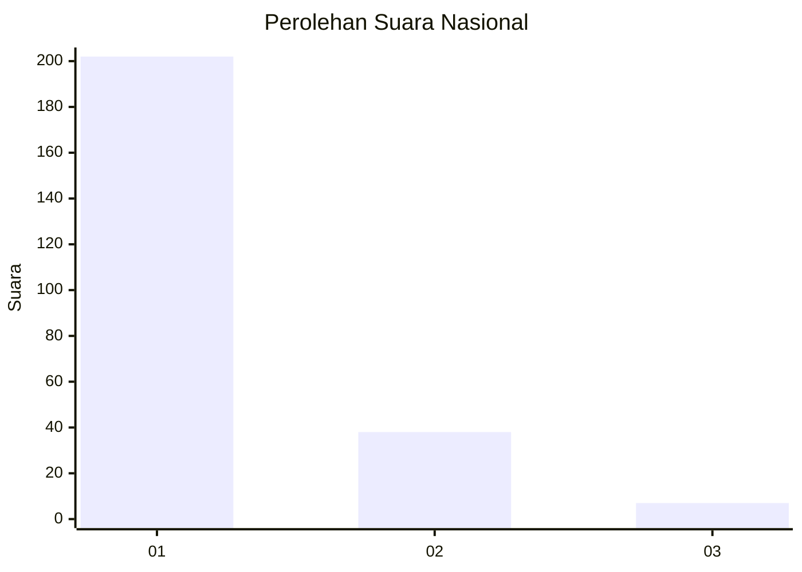
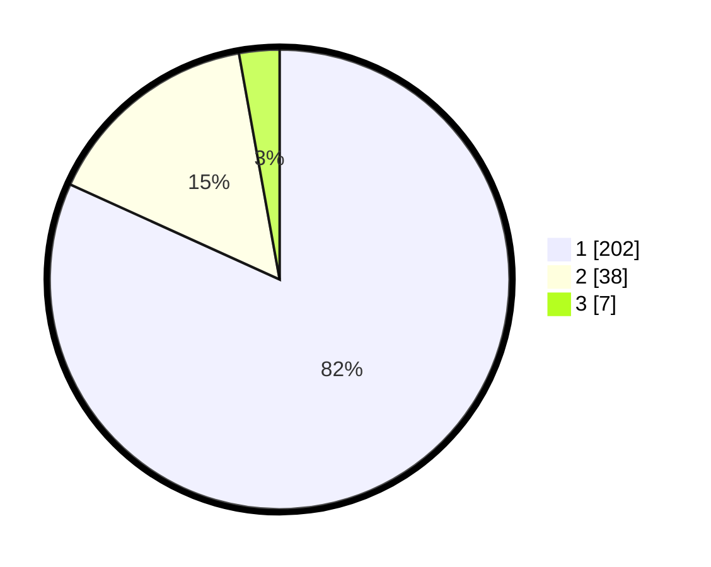

# Hasil

## Grafik

## Tabel

| No. | Nama Paslon    | Suara | Suara (raw) | Persentase |
|:--- |:-------------- | -----:| -----------:| ----------:|
| 1   | ANIES MUHAIMIN | 202   | [202][p-1]  | 81,78      |
| 2   | PRABOWO GIBRAN | 38    | [38][p-2]   | 15,38      |
| 3   | GANJAR MAHFUD  | 7     | [7][p-3]    | 2,83       |

[p-1]: https://github.com/gigit-pemilu/pemilu-2024/blob/main/pilpres/hitung-suara/sub/11-aceh/sub/01-aceh-selatan/sub/01-bakongan/sub/2001-keude-bakongan/sub/003-tps/sub/paslon-1.txt
[p-2]: https://github.com/gigit-pemilu/pemilu-2024/blob/main/pilpres/hitung-suara/sub/11-aceh/sub/01-aceh-selatan/sub/01-bakongan/sub/2001-keude-bakongan/sub/003-tps/sub/paslon-2.txt
[p-3]: https://github.com/gigit-pemilu/pemilu-2024/blob/main/pilpres/hitung-suara/sub/11-aceh/sub/01-aceh-selatan/sub/01-bakongan/sub/2001-keude-bakongan/sub/003-tps/sub/paslon-3.txt

## Foto C Plano

https://sirekap-obj-formc.kpu.go.id/c688/pemilu/ppwp/11/01/01/20/01/1101012001003-20240218-163000--d645cb66-b966-41a9-b8ca-6b0a17af6723.jpg

https://sirekap-obj-formc.kpu.go.id/c688/pemilu/ppwp/11/01/01/20/01/1101012001003-20240218-163411--8c7b9f46-99b0-432c-a581-a3fd792df3e1.jpg

https://sirekap-obj-formc.kpu.go.id/c688/pemilu/ppwp/11/01/01/20/01/1101012001003-20240218-163656--82ef6a93-fa37-471b-b2b5-a67bd4749cd0.jpg

## Metadata

| Key        | Value               |
| ---------- | ------------------- |
| Time Stamp | 2024-02-22 17:00:00 |

## DATA PEMILIH TETAP

Jumlah pemilih dalam DPT: **293**.
 * L: **138**.
 * P: **155**.

## DATA PENGGUNA HAK PILIH

Jumlah pengguna hak pilih dalam DPT: **248**.
 * L: **118**.
 * P: **130**.

Jumlah pengguna hak pilih dalam DPTb: **1**.
 * L: **0**.
 * P: **1**.

Jumlah pengguna hak pilih dalam DPK: **4**.
 * L: **2**.
 * P: **2**.

Jumlah pengguna hak pilih: **253**.
 * L: **120**.
 * P: **133**.

## JUMLAH SUARA SAH DAN TIDAK SAH

JUMLAH SELURUH SUARA SAH: **247**.

JUMLAH SUARA TIDAK SAH: **6**.

JUMLAH SELURUH SUARA SAH DAN SUARA TIDAK SAH: **253**.

