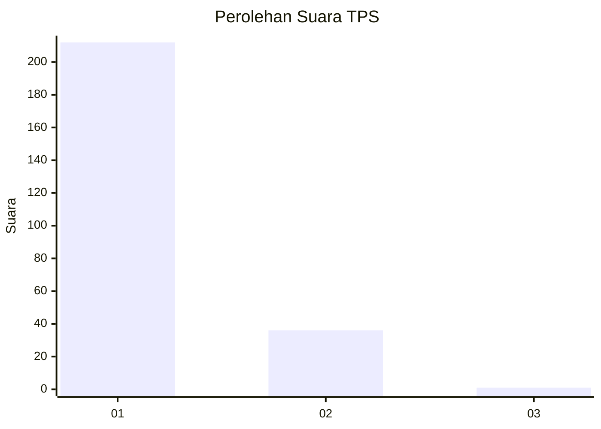
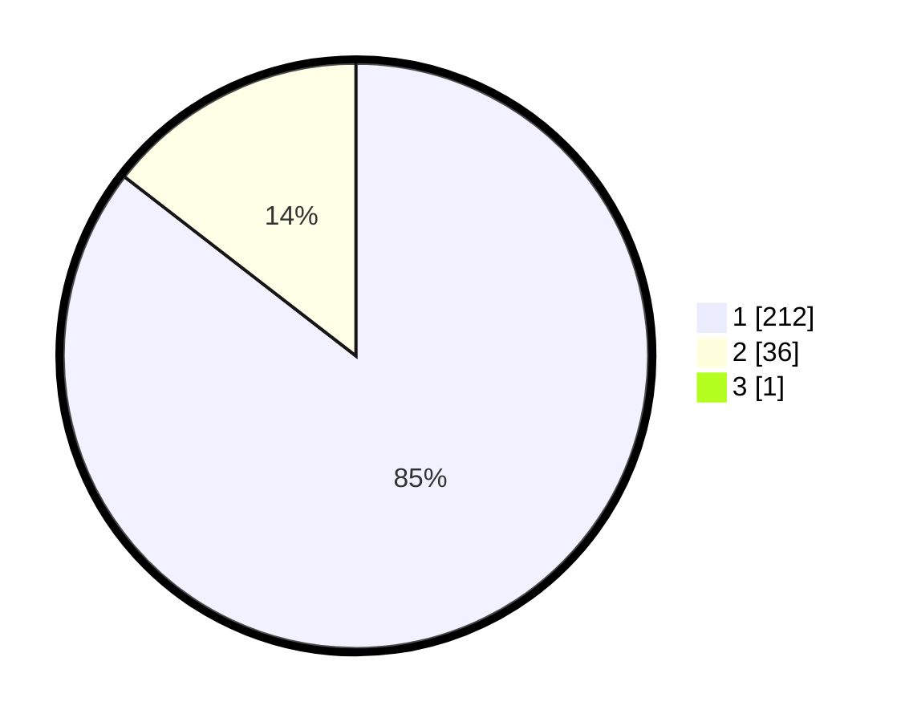

# Hasil

## Grafik

## Tabel

| No. | Nama Paslon    | Suara | Suara (raw) | Persentase |
|:--- |:-------------- | -----:| -----------:| ----------:|
| 1   | ANIES MUHAIMIN | 212   | [212][p-1]  | 85,14      |
| 2   | PRABOWO GIBRAN | 36    | [36][p-2]   | 14,46      |
| 3   | GANJAR MAHFUD  | 1     | [1][p-3]    | 0,40       |

[p-1]: https://github.com/gigit-pemilu/pemilu-2024-11-aceh/blob/main/pilpres/hitung-suara/sub/11-aceh/sub/01-aceh-selatan/sub/01-bakongan/sub/2002-ujong-mangki/sub/001-tps/sub/paslon-1.txt
[p-2]: https://github.com/gigit-pemilu/pemilu-2024-11-aceh/blob/main/pilpres/hitung-suara/sub/11-aceh/sub/01-aceh-selatan/sub/01-bakongan/sub/2002-ujong-mangki/sub/001-tps/sub/paslon-2.txt
[p-3]: https://github.com/gigit-pemilu/pemilu-2024-11-aceh/blob/main/pilpres/hitung-suara/sub/11-aceh/sub/01-aceh-selatan/sub/01-bakongan/sub/2002-ujong-mangki/sub/001-tps/sub/paslon-3.txt

## Foto C Plano

https://sirekap-obj-formc.kpu.go.id/dfb2/pemilu/ppwp/11/01/01/20/02/1101012002001-20240214-221105--3ac786a6-eed3-4a60-830e-7c72b54d5f2d.jpg

https://sirekap-obj-formc.kpu.go.id/dfb2/pemilu/ppwp/11/01/01/20/02/1101012002001-20240214-221145--ece398cf-7145-4136-8d72-7d16deb482a3.jpg

https://sirekap-obj-formc.kpu.go.id/dfb2/pemilu/ppwp/11/01/01/20/02/1101012002001-20240214-221205--f3b23b34-d687-4523-890f-020afcfc3a94.jpg

## Metadata

| Key        | Value               |
| ---------- | ------------------- |
| Time Stamp | 2024-02-16 01:00:27 |

## DATA PEMILIH TETAP

Jumlah pemilih dalam DPT: **268**.
 * L: **125**.
 * P: **143**.

## DATA PENGGUNA HAK PILIH

Jumlah pengguna hak pilih dalam DPT: **243**.
 * L: **113**.
 * P: **130**.

Jumlah pengguna hak pilih dalam DPTb: **7**.
 * L: **3**.
 * P: **4**.

Jumlah pengguna hak pilih dalam DPK: **2**.
 * L: **2**.
 * P: **0**.

Jumlah pengguna hak pilih: **252**.
 * L: **118**.
 * P: **134**.

## JUMLAH SUARA SAH DAN TIDAK SAH

JUMLAH SELURUH SUARA SAH: **249**.

JUMLAH SUARA TIDAK SAH: **3**.

JUMLAH SELURUH SUARA SAH DAN SUARA TIDAK SAH: **252**.

