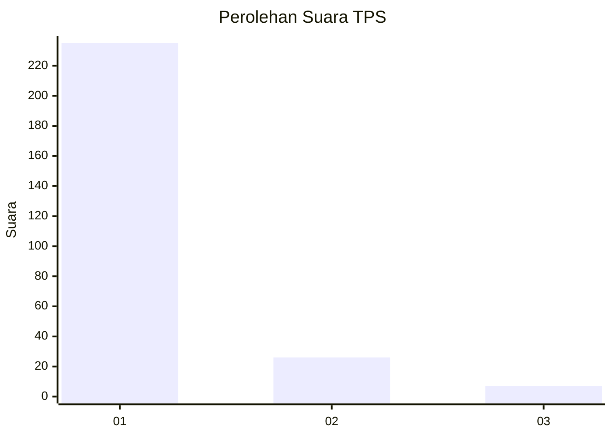
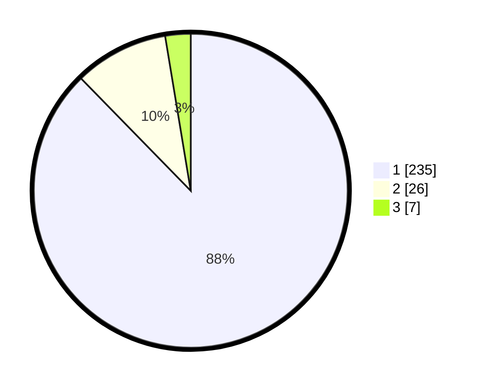

# Hasil

## Grafik

## Tabel

| No. | Nama Paslon    | Suara | Suara (raw) | Persentase |
|:--- |:-------------- | -----:| -----------:| ----------:|
| 1   | ANIES MUHAIMIN | 235   | [235][p-1]  | 87,69      |
| 2   | PRABOWO GIBRAN | 26    | [26][p-2]   | 9,70       |
| 3   | GANJAR MAHFUD  | 7     | [7][p-3]    | 2,61       |

[p-1]: https://github.com/gigit-pemilu/pemilu-2024-11-aceh/blob/main/pilpres/hitung-suara/sub/11-aceh/sub/01-aceh-selatan/sub/01-bakongan/sub/2002-ujong-mangki/sub/002-tps/sub/paslon-1.txt
[p-2]: https://github.com/gigit-pemilu/pemilu-2024-11-aceh/blob/main/pilpres/hitung-suara/sub/11-aceh/sub/01-aceh-selatan/sub/01-bakongan/sub/2002-ujong-mangki/sub/002-tps/sub/paslon-2.txt
[p-3]: https://github.com/gigit-pemilu/pemilu-2024-11-aceh/blob/main/pilpres/hitung-suara/sub/11-aceh/sub/01-aceh-selatan/sub/01-bakongan/sub/2002-ujong-mangki/sub/002-tps/sub/paslon-3.txt

## Foto C Plano

https://sirekap-obj-formc.kpu.go.id/aadc/pemilu/ppwp/11/01/01/20/02/1101012002002-20240214-221422--e52e520f-97e3-4004-b098-cdf7f3174b4c.jpg

https://sirekap-obj-formc.kpu.go.id/aadc/pemilu/ppwp/11/01/01/20/02/1101012002002-20240216-004716--cbfa2908-c765-420f-b6d2-505e86d8ab55.jpg

https://sirekap-obj-formc.kpu.go.id/aadc/pemilu/ppwp/11/01/01/20/02/1101012002002-20240216-004743--d954819c-c9b6-4009-b6b2-0eb95736f1c0.jpg

## Metadata

| Key        | Value               |
| ---------- | ------------------- |
| Time Stamp | 2024-02-17 01:30:00 |

## DATA PEMILIH TETAP

Jumlah pemilih dalam DPT: **294**.
 * L: **155**.
 * P: **139**.

## DATA PENGGUNA HAK PILIH

Jumlah pengguna hak pilih dalam DPT: **268**.
 * L: **138**.
 * P: **130**.

Jumlah pengguna hak pilih dalam DPTb: **4**.
 * L: **4**.
 * P: **0**.

Jumlah pengguna hak pilih dalam DPK: **0**.
 * L: **0**.
 * P: **0**.

Jumlah pengguna hak pilih: **272**.
 * L: **142**.
 * P: **130**.

## JUMLAH SUARA SAH DAN TIDAK SAH

JUMLAH SELURUH SUARA SAH: **268**.

JUMLAH SUARA TIDAK SAH: **4**.

JUMLAH SELURUH SUARA SAH DAN SUARA TIDAK SAH: **272**.

