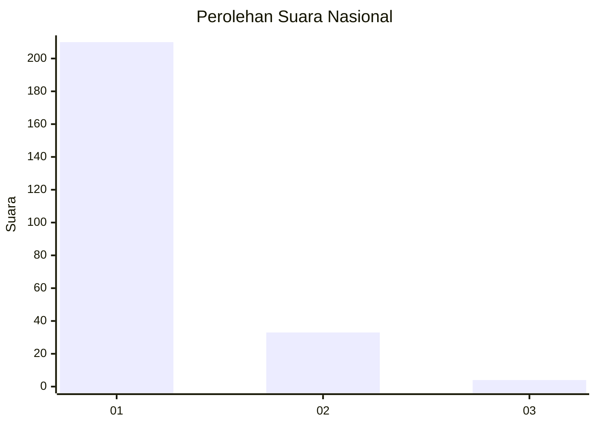
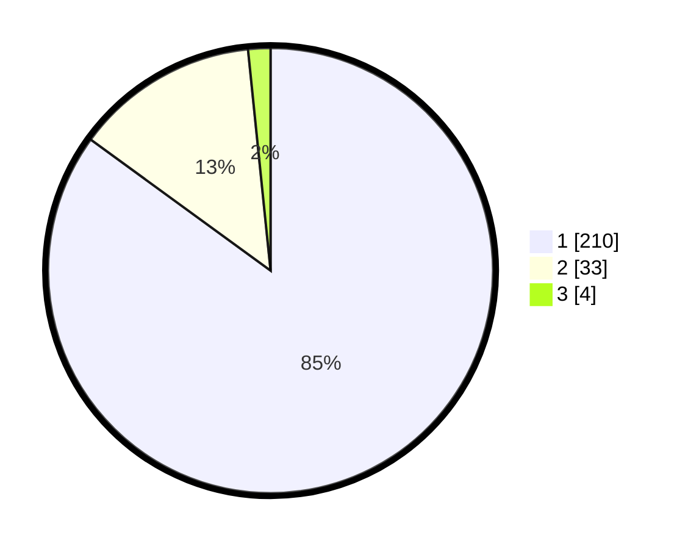

# Hasil

## Grafik

## Tabel

| No. | Nama Paslon    | Suara | Suara (raw) | Persentase |
|:--- |:-------------- | -----:| -----------:| ----------:|
| 1   | ANIES MUHAIMIN | 210   | [210][p-1]  | 85,02      |
| 2   | PRABOWO GIBRAN | 33    | [33][p-2]   | 13,36      |
| 3   | GANJAR MAHFUD  | 4     | [4][p-3]    | 1,62       |

[p-1]: https://github.com/gigit-pemilu/pemilu-2024/blob/main/pilpres/hitung-suara/sub/11-aceh/sub/01-aceh-selatan/sub/01-bakongan/sub/2015-darul-ikhsan/sub/001-tps/sub/paslon-1.txt
[p-2]: https://github.com/gigit-pemilu/pemilu-2024/blob/main/pilpres/hitung-suara/sub/11-aceh/sub/01-aceh-selatan/sub/01-bakongan/sub/2015-darul-ikhsan/sub/001-tps/sub/paslon-2.txt
[p-3]: https://github.com/gigit-pemilu/pemilu-2024/blob/main/pilpres/hitung-suara/sub/11-aceh/sub/01-aceh-selatan/sub/01-bakongan/sub/2015-darul-ikhsan/sub/001-tps/sub/paslon-3.txt

## Foto C Plano

https://sirekap-obj-formc.kpu.go.id/fdf6/pemilu/ppwp/11/01/01/20/15/1101012015001-20240220-220919--32816cd0-1ce0-461f-b0d3-0090f7733532.jpg

https://sirekap-obj-formc.kpu.go.id/fdf6/pemilu/ppwp/11/01/01/20/15/1101012015001-20240220-221039--ff043bc7-2485-4ded-9af7-3f3eed623c74.jpg

https://sirekap-obj-formc.kpu.go.id/fdf6/pemilu/ppwp/11/01/01/20/15/1101012015001-20240220-221116--f370bb6e-4ee6-498a-8112-74421ea9daa4.jpg

## Metadata

| Key        | Value               |
| ---------- | ------------------- |
| Time Stamp | 2024-02-21 12:00:00 |

## DATA PEMILIH TETAP

Jumlah pemilih dalam DPT: **271**.
 * L: **134**.
 * P: **137**.

## DATA PENGGUNA HAK PILIH

Jumlah pengguna hak pilih dalam DPT: **241**.
 * L: **118**.
 * P: **123**.

Jumlah pengguna hak pilih dalam DPTb: **7**.
 * L: **4**.
 * P: **3**.

Jumlah pengguna hak pilih dalam DPK: **3**.
 * L: **2**.
 * P: **1**.

Jumlah pengguna hak pilih: **251**.
 * L: **124**.
 * P: **127**.

## JUMLAH SUARA SAH DAN TIDAK SAH

JUMLAH SELURUH SUARA SAH: **247**.

JUMLAH SUARA TIDAK SAH: **4**.

JUMLAH SELURUH SUARA SAH DAN SUARA TIDAK SAH: **251**.

