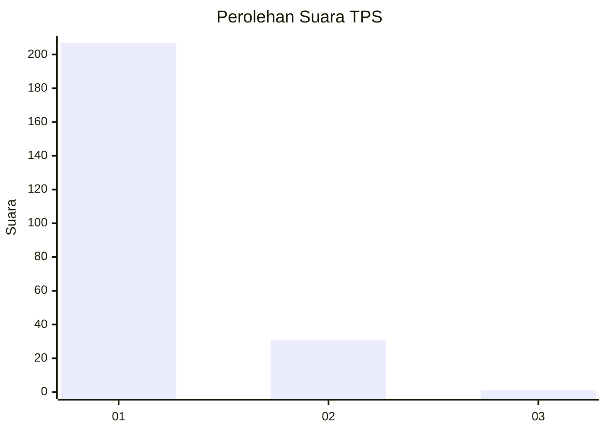
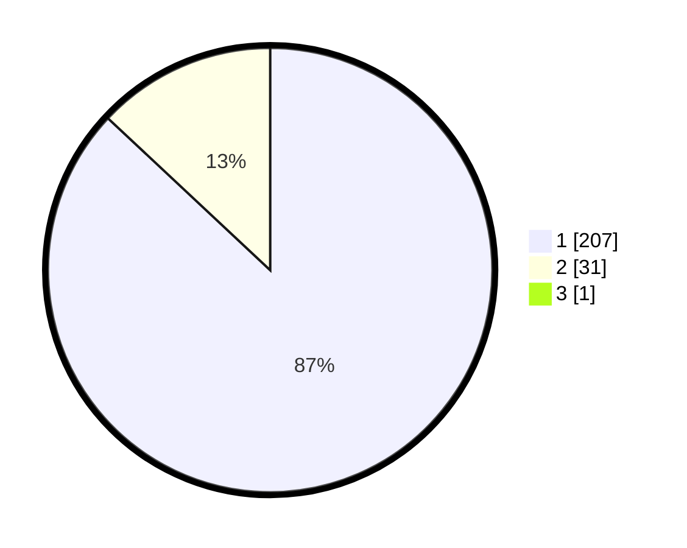

# Hasil

## Grafik

## Tabel

| No. | Nama Paslon    | Suara | Suara (raw) | Persentase |
|:--- |:-------------- | -----:| -----------:| ----------:|
| 1   | ANIES MUHAIMIN | 207   | [207][p-1]  | 86,61      |
| 2   | PRABOWO GIBRAN | 31    | [31][p-2]   | 12,97      |
| 3   | GANJAR MAHFUD  | 1     | [1][p-3]    | 0,42       |

[p-1]: https://github.com/gigit-pemilu/pemilu-2024-11-aceh/blob/main/pilpres/hitung-suara/sub/11-aceh/sub/01-aceh-selatan/sub/01-bakongan/sub/2015-darul-ikhsan/sub/002-tps/sub/paslon-1.txt
[p-2]: https://github.com/gigit-pemilu/pemilu-2024-11-aceh/blob/main/pilpres/hitung-suara/sub/11-aceh/sub/01-aceh-selatan/sub/01-bakongan/sub/2015-darul-ikhsan/sub/002-tps/sub/paslon-2.txt
[p-3]: https://github.com/gigit-pemilu/pemilu-2024-11-aceh/blob/main/pilpres/hitung-suara/sub/11-aceh/sub/01-aceh-selatan/sub/01-bakongan/sub/2015-darul-ikhsan/sub/002-tps/sub/paslon-3.txt

## Foto C Plano

https://sirekap-obj-formc.kpu.go.id/c762/pemilu/ppwp/11/01/01/20/15/1101012015002-20240215-002233--01a66b8c-900f-42fe-8b38-75b6143cca63.jpg

https://sirekap-obj-formc.kpu.go.id/c762/pemilu/ppwp/11/01/01/20/15/1101012015002-20240215-092849--dd63a8d5-c319-442a-b4dd-c2a109992024.jpg

https://sirekap-obj-formc.kpu.go.id/c762/pemilu/ppwp/11/01/01/20/15/1101012015002-20240215-093010--dbab1061-9660-49f0-9edf-1aba43242853.jpg

## Metadata

| Key        | Value               |
| ---------- | ------------------- |
| Time Stamp | 2024-02-16 12:51:22 |

## DATA PEMILIH TETAP

Jumlah pemilih dalam DPT: **265**.
 * L: **132**.
 * P: **133**.

## DATA PENGGUNA HAK PILIH

Jumlah pengguna hak pilih dalam DPT: **233**.
 * L: **116**.
 * P: **117**.

Jumlah pengguna hak pilih dalam DPTb: **3**.
 * L: **0**.
 * P: **3**.

Jumlah pengguna hak pilih dalam DPK: **3**.
 * L: **1**.
 * P: **2**.

Jumlah pengguna hak pilih: **239**.
 * L: **117**.
 * P: **122**.

## JUMLAH SUARA SAH DAN TIDAK SAH

JUMLAH SELURUH SUARA SAH: **239**.

JUMLAH SUARA TIDAK SAH: **0**.

JUMLAH SELURUH SUARA SAH DAN SUARA TIDAK SAH: **239**.

