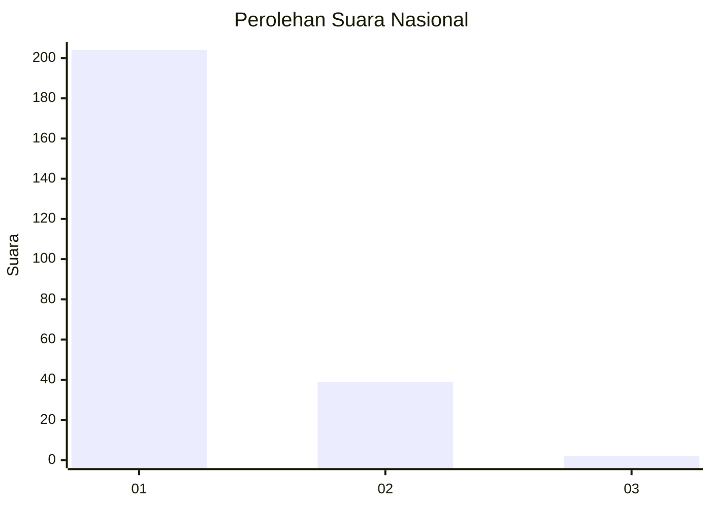
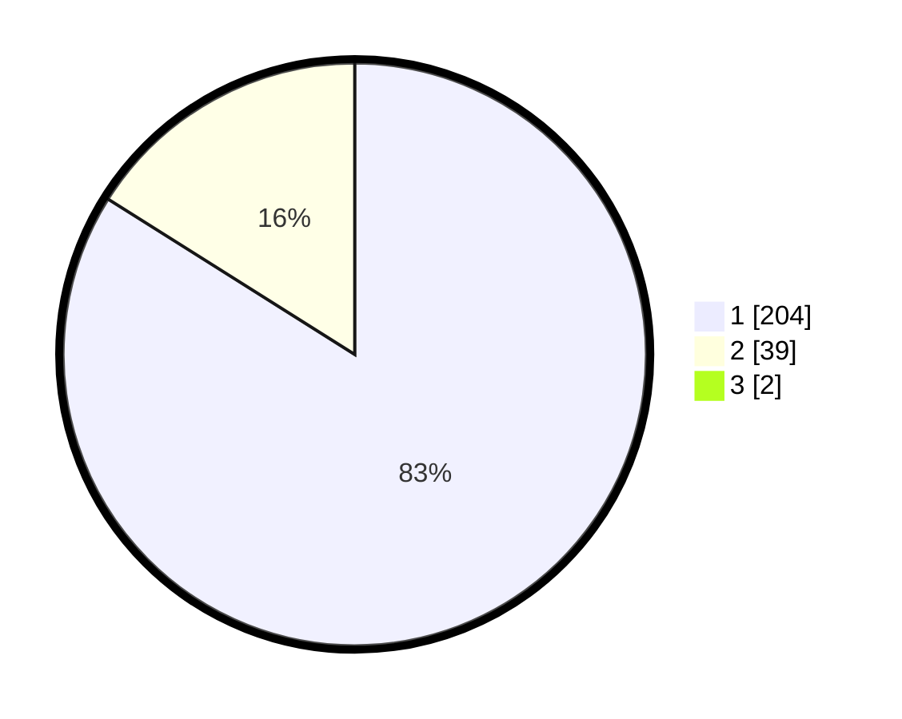

# Hasil

## Grafik

## Tabel

| No. | Nama Paslon    | Suara | Suara (raw) | Persentase |
|:--- |:-------------- | -----:| -----------:| ----------:|
| 1   | ANIES MUHAIMIN | 204   | [204][p-1]  | 83,27      |
| 2   | PRABOWO GIBRAN | 39    | [39][p-2]   | 15,92      |
| 3   | GANJAR MAHFUD  | 2     | [2][p-3]    | 0,82       |

[p-1]: https://github.com/gigit-pemilu/pemilu-2024/blob/main/pilpres/hitung-suara/sub/11-aceh/sub/01-aceh-selatan/sub/01-bakongan/sub/2016-padang-beurahan/sub/001-tps/sub/paslon-1.txt
[p-2]: https://github.com/gigit-pemilu/pemilu-2024/blob/main/pilpres/hitung-suara/sub/11-aceh/sub/01-aceh-selatan/sub/01-bakongan/sub/2016-padang-beurahan/sub/001-tps/sub/paslon-2.txt
[p-3]: https://github.com/gigit-pemilu/pemilu-2024/blob/main/pilpres/hitung-suara/sub/11-aceh/sub/01-aceh-selatan/sub/01-bakongan/sub/2016-padang-beurahan/sub/001-tps/sub/paslon-3.txt

## Foto C Plano

https://sirekap-obj-formc.kpu.go.id/380f/pemilu/ppwp/11/01/01/20/16/1101012016001-20240220-171721--9d9bf87d-c42a-4039-8ca3-ae065b2191ec.jpg

https://sirekap-obj-formc.kpu.go.id/380f/pemilu/ppwp/11/01/01/20/16/1101012016001-20240220-171853--36827d8e-00ac-4463-aef5-0b07a9a0599a.jpg

https://sirekap-obj-formc.kpu.go.id/380f/pemilu/ppwp/11/01/01/20/16/1101012016001-20240220-171935--ee6253ee-7cd2-4654-96c8-74c769ac4bcd.jpg

## Metadata

| Key        | Value               |
| ---------- | ------------------- |
| Time Stamp | 2024-02-20 18:00:00 |

## DATA PEMILIH TETAP

Jumlah pemilih dalam DPT: **278**.
 * L: **140**.
 * P: **138**.

## DATA PENGGUNA HAK PILIH

Jumlah pengguna hak pilih dalam DPT: **247**.
 * L: **124**.
 * P: **123**.

Jumlah pengguna hak pilih dalam DPTb: **4**.
 * L: **3**.
 * P: **1**.

Jumlah pengguna hak pilih dalam DPK: **3**.
 * L: **1**.
 * P: **2**.

Jumlah pengguna hak pilih: **254**.
 * L: **128**.
 * P: **126**.

## JUMLAH SUARA SAH DAN TIDAK SAH

JUMLAH SELURUH SUARA SAH: **245**.

JUMLAH SUARA TIDAK SAH: **9**.

JUMLAH SELURUH SUARA SAH DAN SUARA TIDAK SAH: **254**.

