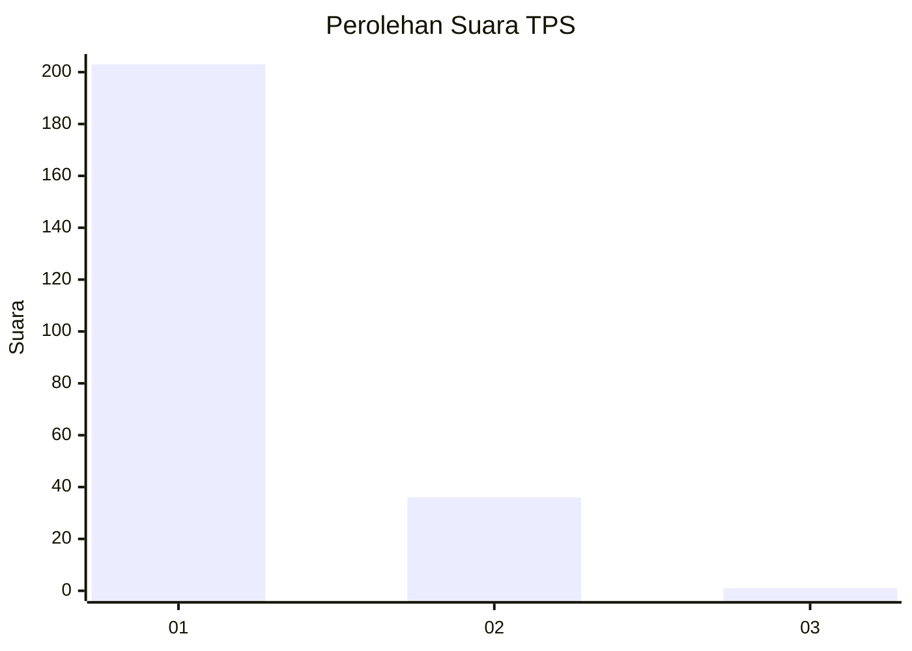
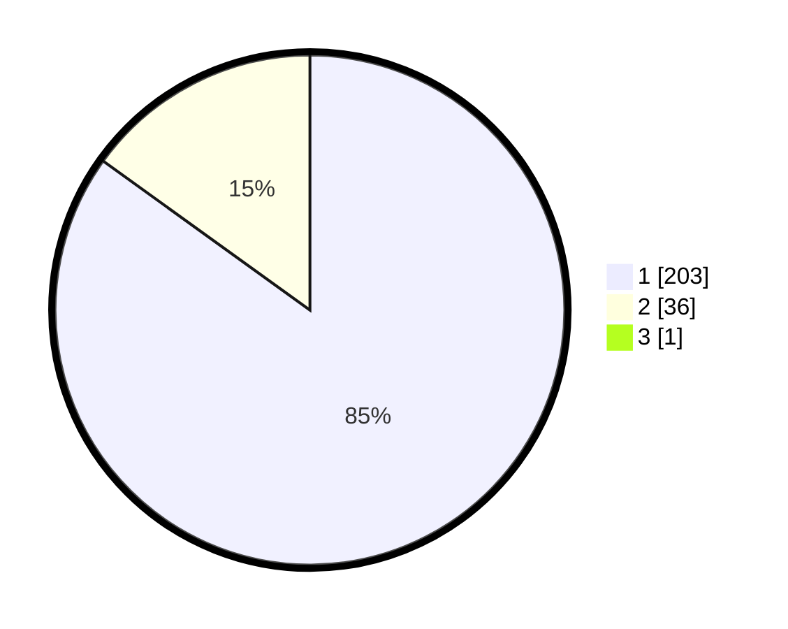

# Hasil

## Grafik

## Tabel

| No. | Nama Paslon    | Suara | Suara (raw) | Persentase |
|:--- |:-------------- | -----:| -----------:| ----------:|
| 1   | ANIES MUHAIMIN | 203   | [203][p-1]  | 84,58      |
| 2   | PRABOWO GIBRAN | 36    | [36][p-2]   | 15,00      |
| 3   | GANJAR MAHFUD  | 1     | [1][p-3]    | 0,42       |

[p-1]: https://github.com/gigit-pemilu/pemilu-2024-11-aceh/blob/main/pilpres/hitung-suara/sub/11-aceh/sub/01-aceh-selatan/sub/01-bakongan/sub/2016-padang-beurahan/sub/002-tps/sub/paslon-1.txt
[p-2]: https://github.com/gigit-pemilu/pemilu-2024-11-aceh/blob/main/pilpres/hitung-suara/sub/11-aceh/sub/01-aceh-selatan/sub/01-bakongan/sub/2016-padang-beurahan/sub/002-tps/sub/paslon-2.txt
[p-3]: https://github.com/gigit-pemilu/pemilu-2024-11-aceh/blob/main/pilpres/hitung-suara/sub/11-aceh/sub/01-aceh-selatan/sub/01-bakongan/sub/2016-padang-beurahan/sub/002-tps/sub/paslon-3.txt

## Foto C Plano

https://sirekap-obj-formc.kpu.go.id/6c9d/pemilu/ppwp/11/01/01/20/16/1101012016002-20240215-141033--9d5bc661-9cce-4047-8975-684a58806ba0.jpg

https://sirekap-obj-formc.kpu.go.id/6c9d/pemilu/ppwp/11/01/01/20/16/1101012016002-20240215-063858--f00bcd4a-db9c-46d9-ac7d-ce5b193fe828.jpg

https://sirekap-obj-formc.kpu.go.id/6c9d/pemilu/ppwp/11/01/01/20/16/1101012016002-20240215-064115--729bba02-010d-4045-9b03-5f0c0ce7d913.jpg

## Metadata

| Key        | Value               |
| ---------- | ------------------- |
| Time Stamp | 2024-02-16 12:51:22 |

## DATA PEMILIH TETAP

Jumlah pemilih dalam DPT: **271**.
 * L: **132**.
 * P: **139**.

## DATA PENGGUNA HAK PILIH

Jumlah pengguna hak pilih dalam DPT: **241**.
 * L: **115**.
 * P: **126**.

Jumlah pengguna hak pilih dalam DPTb: **2**.
 * L: **1**.
 * P: **1**.

Jumlah pengguna hak pilih dalam DPK: **3**.
 * L: **2**.
 * P: **1**.

Jumlah pengguna hak pilih: **246**.
 * L: **118**.
 * P: **128**.

## JUMLAH SUARA SAH DAN TIDAK SAH

JUMLAH SELURUH SUARA SAH: **240**.

JUMLAH SUARA TIDAK SAH: **6**.

JUMLAH SELURUH SUARA SAH DAN SUARA TIDAK SAH: **246**.

