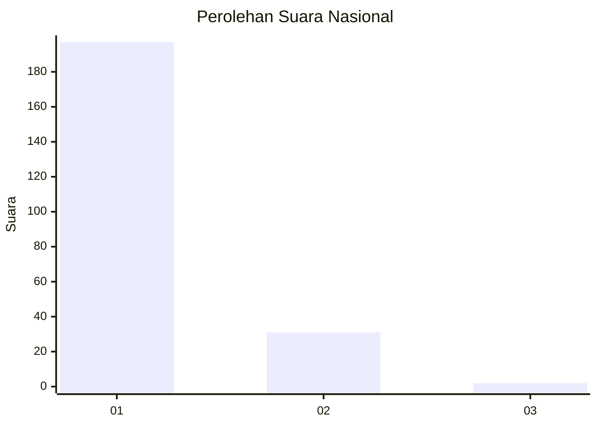
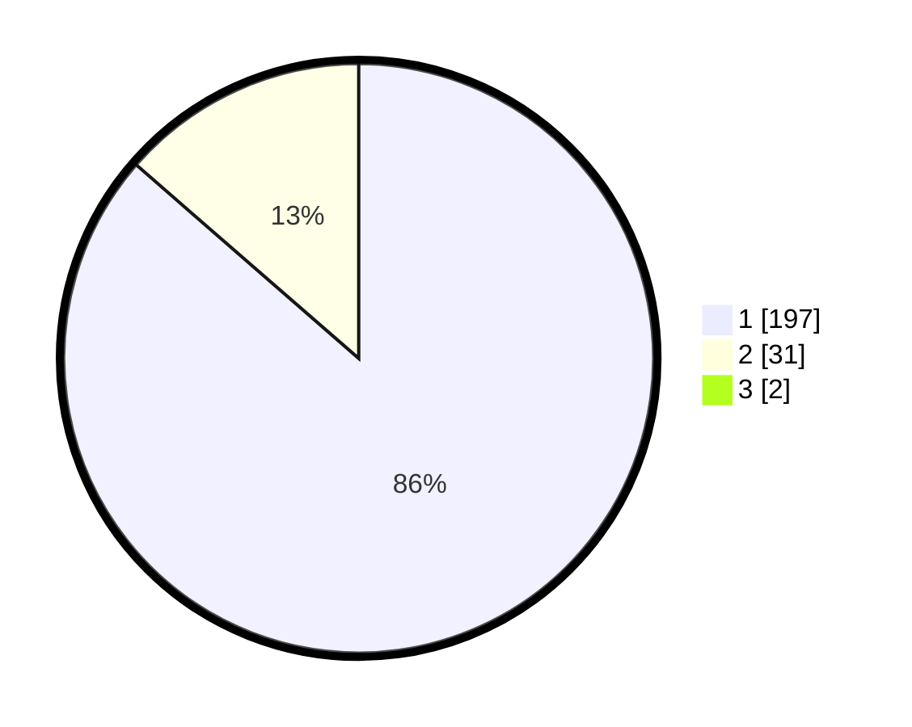

# Hasil

## Grafik

## Tabel

| No. | Nama Paslon    | Suara | Suara (raw) | Persentase |
|:--- |:-------------- | -----:| -----------:| ----------:|
| 1   | ANIES MUHAIMIN | 197   | [197][p-1]  | 85,65      |
| 2   | PRABOWO GIBRAN | 31    | [31][p-2]   | 13,48      |
| 3   | GANJAR MAHFUD  | 2     | [2][p-3]    | 0,87       |

[p-1]: https://github.com/gigit-pemilu/pemilu-2024/blob/main/pilpres/hitung-suara/sub/11-aceh/sub/01-aceh-selatan/sub/02-kluet-utara/sub/2001-fajar-harapan/sub/001-tps/sub/paslon-1.txt
[p-2]: https://github.com/gigit-pemilu/pemilu-2024/blob/main/pilpres/hitung-suara/sub/11-aceh/sub/01-aceh-selatan/sub/02-kluet-utara/sub/2001-fajar-harapan/sub/001-tps/sub/paslon-2.txt
[p-3]: https://github.com/gigit-pemilu/pemilu-2024/blob/main/pilpres/hitung-suara/sub/11-aceh/sub/01-aceh-selatan/sub/02-kluet-utara/sub/2001-fajar-harapan/sub/001-tps/sub/paslon-3.txt

## Foto C Plano

https://sirekap-obj-formc.kpu.go.id/4227/pemilu/ppwp/11/01/02/20/01/1101022001001-20240216-135353--e692ee7a-2202-4ed2-885c-f24d88784586.jpg

https://sirekap-obj-formc.kpu.go.id/4227/pemilu/ppwp/11/01/02/20/01/1101022001001-20240216-135355--419c45b1-7b60-42a5-827f-bd816af2fcd3.jpg

https://sirekap-obj-formc.kpu.go.id/4227/pemilu/ppwp/11/01/02/20/01/1101022001001-20240216-135354--aea50b54-ee48-4ae6-97aa-8c97cafb4fac.jpg

## Metadata

| Key        | Value               |
| ---------- | ------------------- |
| Time Stamp | 2024-02-16 16:25:10 |

## DATA PEMILIH TETAP

Jumlah pemilih dalam DPT: **254**.
 * L: **130**.
 * P: **124**.

## DATA PENGGUNA HAK PILIH

Jumlah pengguna hak pilih dalam DPT: **220**.
 * L: **108**.
 * P: **112**.

Jumlah pengguna hak pilih dalam DPTb: **10**.
 * L: **4**.
 * P: **6**.

Jumlah pengguna hak pilih dalam DPK: **3**.
 * L: **2**.
 * P: **1**.

Jumlah pengguna hak pilih: **233**.
 * L: **114**.
 * P: **119**.

## JUMLAH SUARA SAH DAN TIDAK SAH

JUMLAH SELURUH SUARA SAH: **230**.

JUMLAH SUARA TIDAK SAH: **3**.

JUMLAH SELURUH SUARA SAH DAN SUARA TIDAK SAH: **233**.

