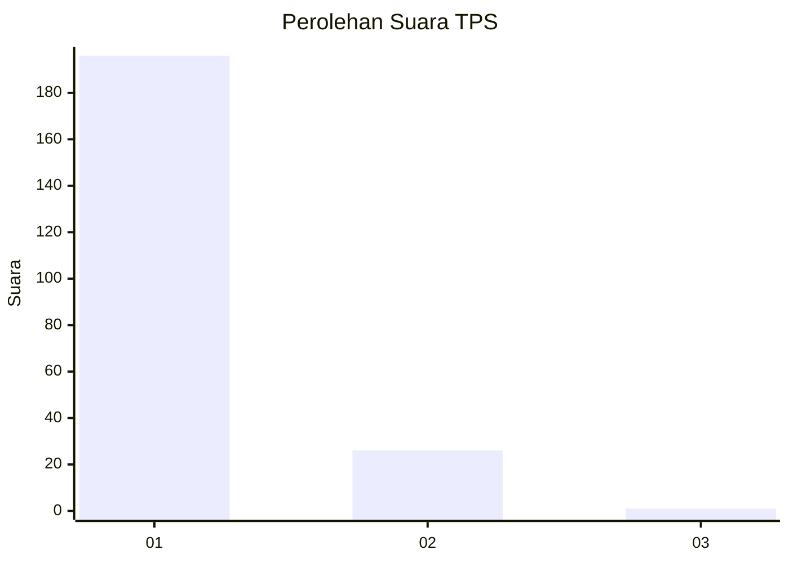
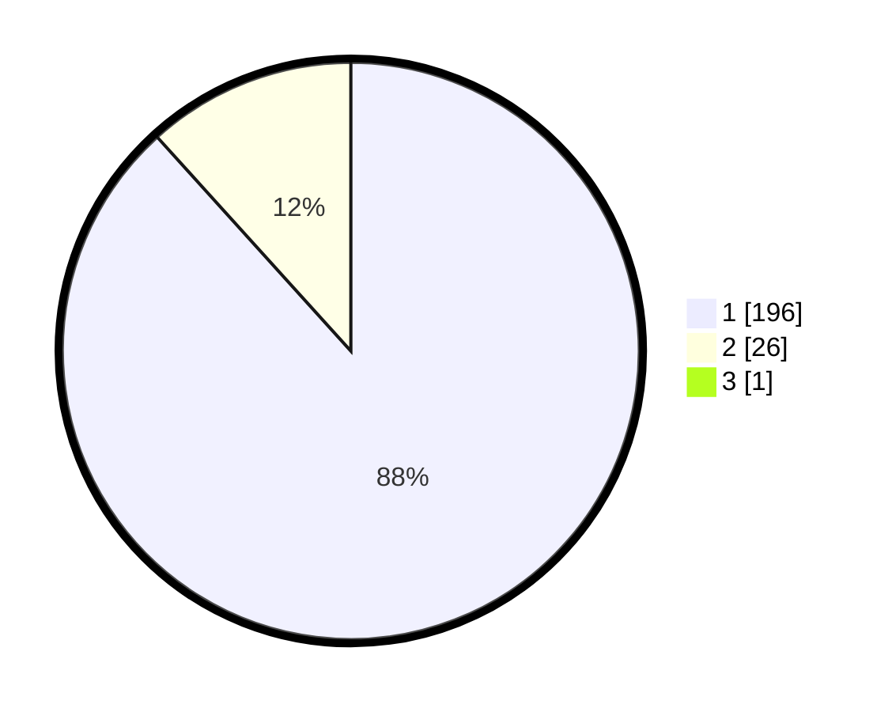

# Hasil

## Grafik

## Tabel

| No. | Nama Paslon    | Suara | Suara (raw) | Persentase |
|:--- |:-------------- | -----:| -----------:| ----------:|
| 1   | ANIES MUHAIMIN | 196   | [196][p-1]  | 87,89      |
| 2   | PRABOWO GIBRAN | 26    | [26][p-2]   | 11,66      |
| 3   | GANJAR MAHFUD  | 1     | [1][p-3]    | 0,45       |

[p-1]: https://github.com/gigit-pemilu/pemilu-2024-11-aceh/blob/main/pilpres/hitung-suara/sub/11-aceh/sub/01-aceh-selatan/sub/02-kluet-utara/sub/2001-fajar-harapan/sub/002-tps/sub/paslon-1.txt
[p-2]: https://github.com/gigit-pemilu/pemilu-2024-11-aceh/blob/main/pilpres/hitung-suara/sub/11-aceh/sub/01-aceh-selatan/sub/02-kluet-utara/sub/2001-fajar-harapan/sub/002-tps/sub/paslon-2.txt
[p-3]: https://github.com/gigit-pemilu/pemilu-2024-11-aceh/blob/main/pilpres/hitung-suara/sub/11-aceh/sub/01-aceh-selatan/sub/02-kluet-utara/sub/2001-fajar-harapan/sub/002-tps/sub/paslon-3.txt

## Foto C Plano

https://sirekap-obj-formc.kpu.go.id/ac54/pemilu/ppwp/11/01/02/20/01/1101022001002-20240214-210851--080fd93d-7daa-4ed8-b347-5925530225c7.jpg

https://sirekap-obj-formc.kpu.go.id/ac54/pemilu/ppwp/11/01/02/20/01/1101022001002-20240214-211032--7e504d9e-2b5a-46c4-b595-0394e5d183c6.jpg

https://sirekap-obj-formc.kpu.go.id/ac54/pemilu/ppwp/11/01/02/20/01/1101022001002-20240216-132816--723d253f-fb8b-4c82-8165-cc524b7e92a6.jpg

## Metadata

| Key        | Value               |
| ---------- | ------------------- |
| Time Stamp | 2024-02-16 13:30:32 |

## DATA PEMILIH TETAP

Jumlah pemilih dalam DPT: **263**.
 * L: **129**.
 * P: **134**.

## DATA PENGGUNA HAK PILIH

Jumlah pengguna hak pilih dalam DPT: **219**.
 * L: **106**.
 * P: **113**.

Jumlah pengguna hak pilih dalam DPTb: **6**.
 * L: **4**.
 * P: **2**.

Jumlah pengguna hak pilih dalam DPK: **1**.
 * L: **1**.
 * P: **0**.

Jumlah pengguna hak pilih: **226**.
 * L: **111**.
 * P: **115**.

## JUMLAH SUARA SAH DAN TIDAK SAH

JUMLAH SELURUH SUARA SAH: **223**.

JUMLAH SUARA TIDAK SAH: **3**.

JUMLAH SELURUH SUARA SAH DAN SUARA TIDAK SAH: **226**.

