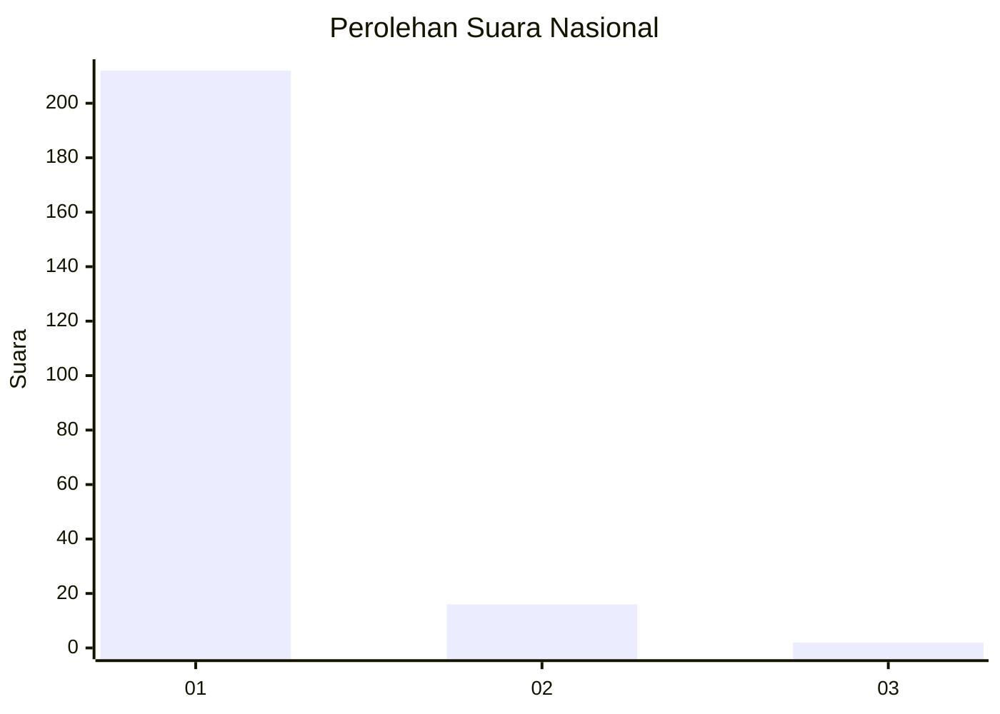
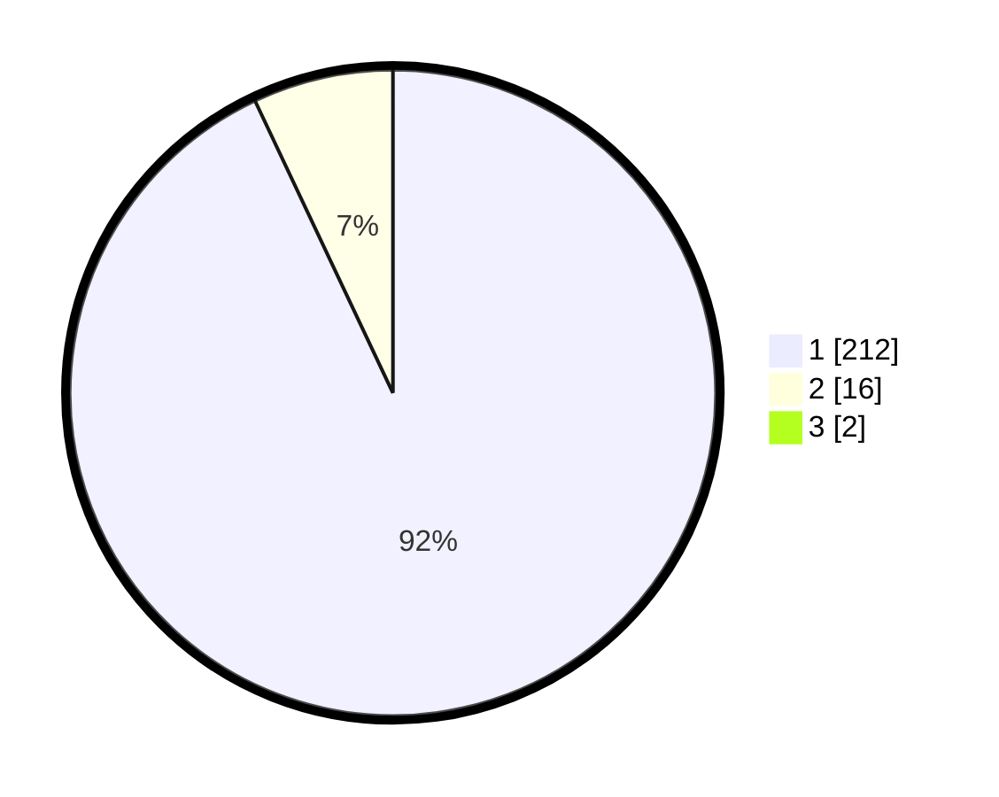

# Hasil

## Grafik

## Tabel

| No. | Nama Paslon    | Suara | Suara (raw) | Persentase |
|:--- |:-------------- | -----:| -----------:| ----------:|
| 1   | ANIES MUHAIMIN | 212   | [212][p-1]  | 92,17      |
| 2   | PRABOWO GIBRAN | 16    | [16][p-2]   | 6,96       |
| 3   | GANJAR MAHFUD  | 2     | [2][p-3]    | 0,87       |

[p-1]: https://github.com/gigit-pemilu/pemilu-2024/blob/main/pilpres/hitung-suara/sub/11-aceh/sub/01-aceh-selatan/sub/02-kluet-utara/sub/2002-krueng-batee/sub/001-tps/sub/paslon-1.txt
[p-2]: https://github.com/gigit-pemilu/pemilu-2024/blob/main/pilpres/hitung-suara/sub/11-aceh/sub/01-aceh-selatan/sub/02-kluet-utara/sub/2002-krueng-batee/sub/001-tps/sub/paslon-2.txt
[p-3]: https://github.com/gigit-pemilu/pemilu-2024/blob/main/pilpres/hitung-suara/sub/11-aceh/sub/01-aceh-selatan/sub/02-kluet-utara/sub/2002-krueng-batee/sub/001-tps/sub/paslon-3.txt

## Foto C Plano

https://sirekap-obj-formc.kpu.go.id/a880/pemilu/ppwp/11/01/02/20/02/1101022002001-20240216-174633--a4931202-c505-4902-8eac-6e971a1d9483.jpg

https://sirekap-obj-formc.kpu.go.id/a880/pemilu/ppwp/11/01/02/20/02/1101022002001-20240216-174634--74107e8a-4c73-4fd7-a81a-5d352038d504.jpg

https://sirekap-obj-formc.kpu.go.id/a880/pemilu/ppwp/11/01/02/20/02/1101022002001-20240216-174634--e04f2227-de75-4e10-baa1-c840043f5ff0.jpg

## Metadata

| Key        | Value               |
| ---------- | ------------------- |
| Time Stamp | 2024-02-16 21:01:00 |

## DATA PEMILIH TETAP

Jumlah pemilih dalam DPT: **271**.
 * L: **143**.
 * P: **128**.

## DATA PENGGUNA HAK PILIH

Jumlah pengguna hak pilih dalam DPT: **230**.
 * L: **115**.
 * P: **115**.

Jumlah pengguna hak pilih dalam DPTb: **0**.
 * L: **0**.
 * P: **0**.

Jumlah pengguna hak pilih dalam DPK: **2**.
 * L: **1**.
 * P: **1**.

Jumlah pengguna hak pilih: **232**.
 * L: **116**.
 * P: **116**.

## JUMLAH SUARA SAH DAN TIDAK SAH

JUMLAH SELURUH SUARA SAH: **230**.

JUMLAH SUARA TIDAK SAH: **2**.

JUMLAH SELURUH SUARA SAH DAN SUARA TIDAK SAH: **232**.

