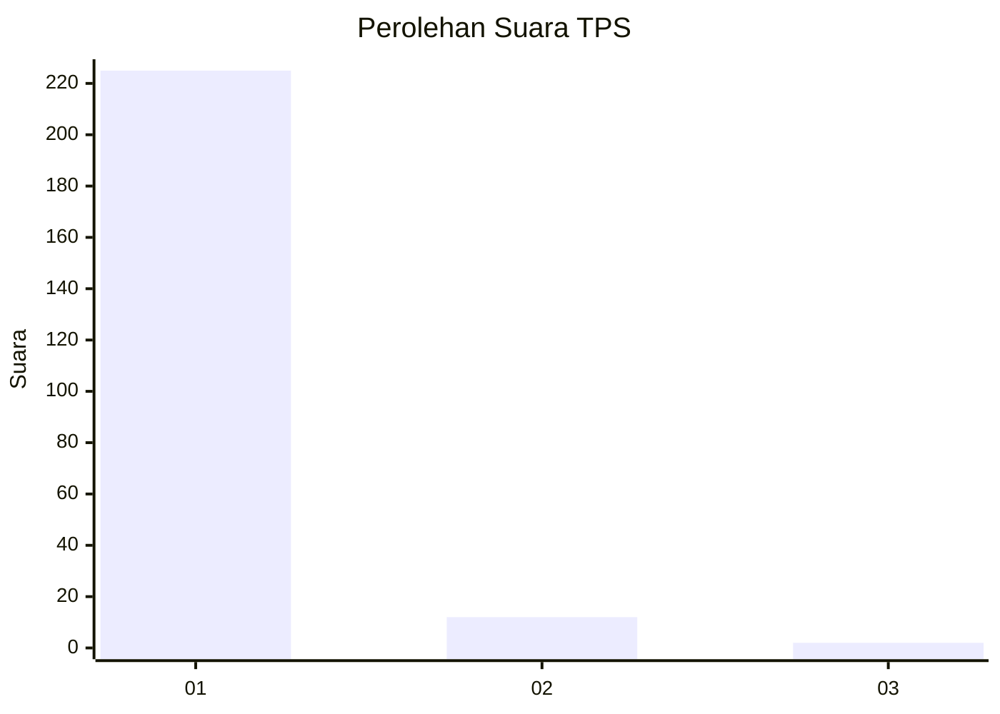
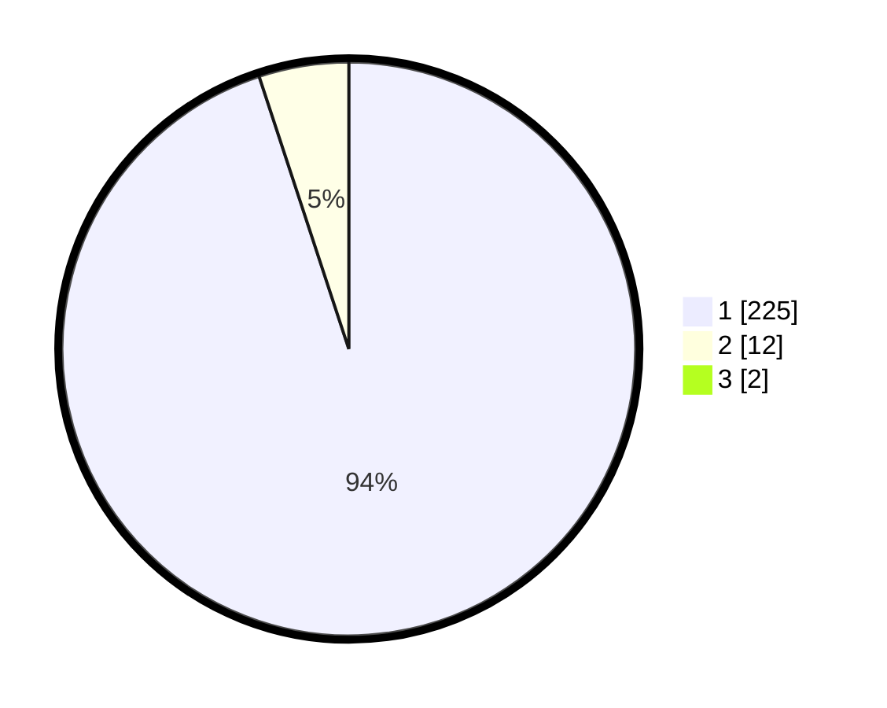

# Hasil

## Grafik

## Tabel

| No. | Nama Paslon    | Suara | Suara (raw) | Persentase |
|:--- |:-------------- | -----:| -----------:| ----------:|
| 1   | ANIES MUHAIMIN | 225   | [225][p-1]  | 94,14      |
| 2   | PRABOWO GIBRAN | 12    | [12][p-2]   | 5,02       |
| 3   | GANJAR MAHFUD  | 2     | [2][p-3]    | 0,84       |

[p-1]: https://github.com/gigit-pemilu/pemilu-2024-11-aceh/blob/main/pilpres/hitung-suara/sub/11-aceh/sub/01-aceh-selatan/sub/02-kluet-utara/sub/2002-krueng-batee/sub/002-tps/sub/paslon-1.txt
[p-2]: https://github.com/gigit-pemilu/pemilu-2024-11-aceh/blob/main/pilpres/hitung-suara/sub/11-aceh/sub/01-aceh-selatan/sub/02-kluet-utara/sub/2002-krueng-batee/sub/002-tps/sub/paslon-2.txt
[p-3]: https://github.com/gigit-pemilu/pemilu-2024-11-aceh/blob/main/pilpres/hitung-suara/sub/11-aceh/sub/01-aceh-selatan/sub/02-kluet-utara/sub/2002-krueng-batee/sub/002-tps/sub/paslon-3.txt

## Foto C Plano

https://sirekap-obj-formc.kpu.go.id/fb69/pemilu/ppwp/11/01/02/20/02/1101022002002-20240216-144816--55c1573a-685a-4d6a-99cd-29cbdb7cec63.jpg

https://sirekap-obj-formc.kpu.go.id/fb69/pemilu/ppwp/11/01/02/20/02/1101022002002-20240216-094829--088ff493-a308-4a93-bb26-8913baf87a93.jpg

https://sirekap-obj-formc.kpu.go.id/fb69/pemilu/ppwp/11/01/02/20/02/1101022002002-20240216-094827--1a720a00-7c4c-4f5a-b506-1230b0693b01.jpg

## Metadata

| Key        | Value               |
| ---------- | ------------------- |
| Time Stamp | 2024-02-16 16:25:10 |

## DATA PEMILIH TETAP

Jumlah pemilih dalam DPT: **277**.
 * L: **146**.
 * P: **131**.

## DATA PENGGUNA HAK PILIH

Jumlah pengguna hak pilih dalam DPT: **242**.
 * L: **117**.
 * P: **125**.

Jumlah pengguna hak pilih dalam DPTb: **0**.
 * L: **0**.
 * P: **0**.

Jumlah pengguna hak pilih dalam DPK: **2**.
 * L: **1**.
 * P: **1**.

Jumlah pengguna hak pilih: **244**.
 * L: **118**.
 * P: **126**.

## JUMLAH SUARA SAH DAN TIDAK SAH

JUMLAH SELURUH SUARA SAH: **239**.

JUMLAH SUARA TIDAK SAH: **5**.

JUMLAH SELURUH SUARA SAH DAN SUARA TIDAK SAH: **244**.

