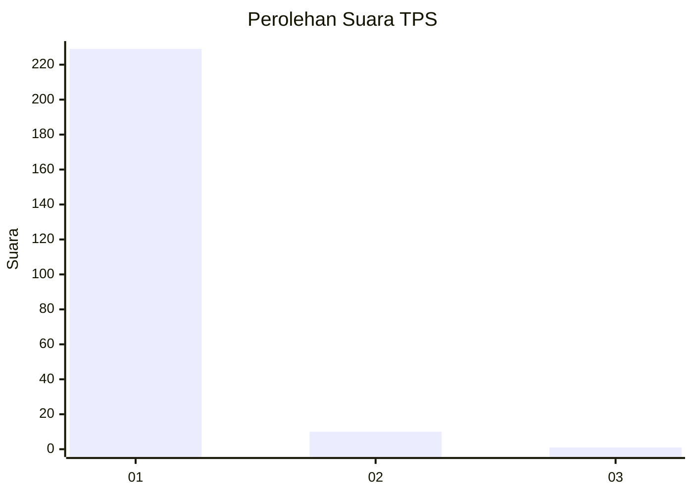
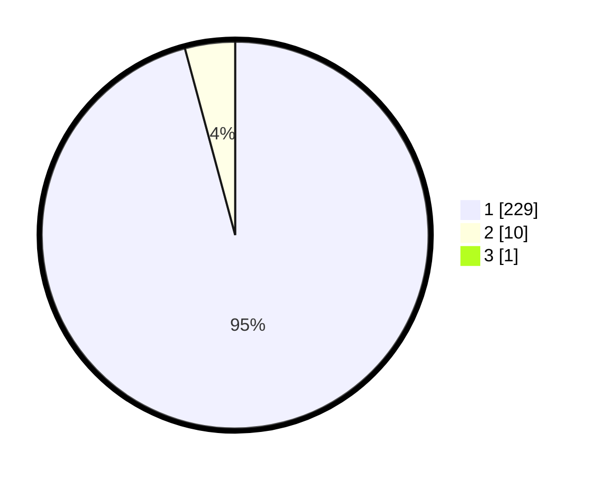

# Hasil

## Grafik

## Tabel

| No. | Nama Paslon    | Suara | Suara (raw) | Persentase |
|:--- |:-------------- | -----:| -----------:| ----------:|
| 1   | ANIES MUHAIMIN | 229   | [229][p-1]  | 95,42      |
| 2   | PRABOWO GIBRAN | 10    | [10][p-2]   | 4,17       |
| 3   | GANJAR MAHFUD  | 1     | [1][p-3]    | 0,42       |

[p-1]: https://github.com/gigit-pemilu/pemilu-2024-11-aceh/blob/main/pilpres/hitung-suara/sub/11-aceh/sub/01-aceh-selatan/sub/02-kluet-utara/sub/2002-krueng-batee/sub/003-tps/sub/paslon-1.txt
[p-2]: https://github.com/gigit-pemilu/pemilu-2024-11-aceh/blob/main/pilpres/hitung-suara/sub/11-aceh/sub/01-aceh-selatan/sub/02-kluet-utara/sub/2002-krueng-batee/sub/003-tps/sub/paslon-2.txt
[p-3]: https://github.com/gigit-pemilu/pemilu-2024-11-aceh/blob/main/pilpres/hitung-suara/sub/11-aceh/sub/01-aceh-selatan/sub/02-kluet-utara/sub/2002-krueng-batee/sub/003-tps/sub/paslon-3.txt

## Foto C Plano

https://sirekap-obj-formc.kpu.go.id/ef08/pemilu/ppwp/11/01/02/20/02/1101022002003-20240216-153011--c374edd8-43a3-483e-8a3d-a33e6b2a7b12.jpg

https://sirekap-obj-formc.kpu.go.id/ef08/pemilu/ppwp/11/01/02/20/02/1101022002003-20240216-153013--624e42f3-44fc-4a82-8152-4a76e930075b.jpg

https://sirekap-obj-formc.kpu.go.id/ef08/pemilu/ppwp/11/01/02/20/02/1101022002003-20240216-153012--59cda77b-ca39-4006-a4cd-9168b14982ad.jpg

## Metadata

| Key        | Value               |
| ---------- | ------------------- |
| Time Stamp | 2024-02-16 16:25:10 |

## DATA PEMILIH TETAP

Jumlah pemilih dalam DPT: **266**.
 * L: **124**.
 * P: **142**.

## DATA PENGGUNA HAK PILIH

Jumlah pengguna hak pilih dalam DPT: **238**.
 * L: **114**.
 * P: **124**.

Jumlah pengguna hak pilih dalam DPTb: **0**.
 * L: **0**.
 * P: **0**.

Jumlah pengguna hak pilih dalam DPK: **7**.
 * L: **5**.
 * P: **2**.

Jumlah pengguna hak pilih: **245**.
 * L: **119**.
 * P: **126**.

## JUMLAH SUARA SAH DAN TIDAK SAH

JUMLAH SELURUH SUARA SAH: **240**.

JUMLAH SUARA TIDAK SAH: **4**.

JUMLAH SELURUH SUARA SAH DAN SUARA TIDAK SAH: **244**.

