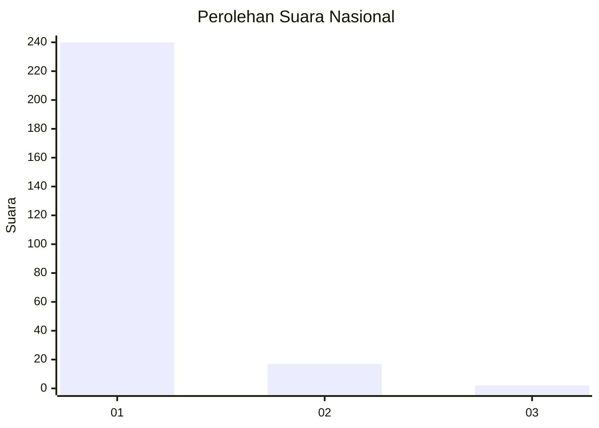
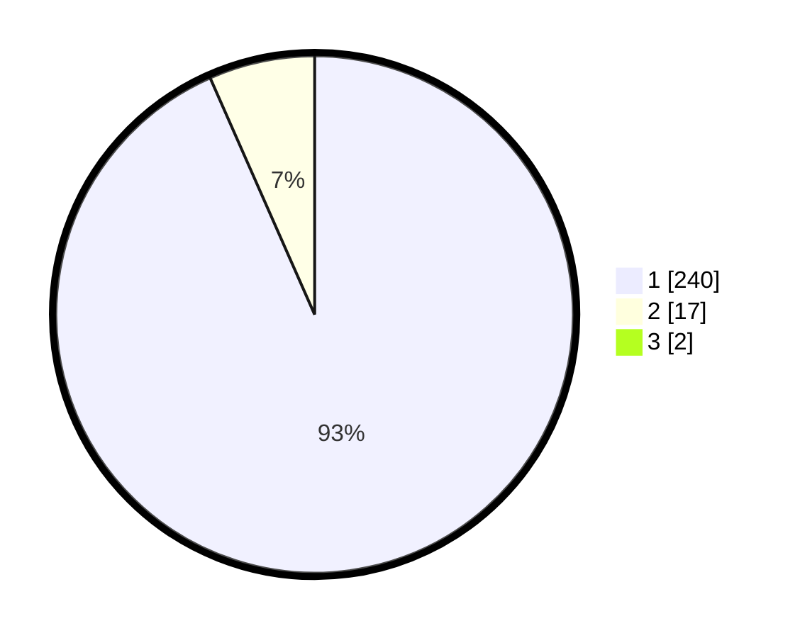

# Hasil

## Grafik

## Tabel

| No. | Nama Paslon    | Suara | Suara (raw) | Persentase |
|:--- |:-------------- | -----:| -----------:| ----------:|
| 1   | ANIES MUHAIMIN | 240   | [240][p-1]  | 92,66      |
| 2   | PRABOWO GIBRAN | 17    | [17][p-2]   | 6,56       |
| 3   | GANJAR MAHFUD  | 2     | [2][p-3]    | 0,77       |

[p-1]: https://github.com/gigit-pemilu/pemilu-2024/blob/main/pilpres/hitung-suara/sub/11-aceh/sub/01-aceh-selatan/sub/02-kluet-utara/sub/2002-krueng-batee/sub/004-tps/sub/paslon-1.txt
[p-2]: https://github.com/gigit-pemilu/pemilu-2024/blob/main/pilpres/hitung-suara/sub/11-aceh/sub/01-aceh-selatan/sub/02-kluet-utara/sub/2002-krueng-batee/sub/004-tps/sub/paslon-2.txt
[p-3]: https://github.com/gigit-pemilu/pemilu-2024/blob/main/pilpres/hitung-suara/sub/11-aceh/sub/01-aceh-selatan/sub/02-kluet-utara/sub/2002-krueng-batee/sub/004-tps/sub/paslon-3.txt

## Foto C Plano

https://sirekap-obj-formc.kpu.go.id/57dd/pemilu/ppwp/11/01/02/20/02/1101022002004-20240216-190452--55ead21f-0efc-4d71-b747-d4f8e3d9b6e6.jpg

https://sirekap-obj-formc.kpu.go.id/57dd/pemilu/ppwp/11/01/02/20/02/1101022002004-20240216-190453--80bb9894-ab21-4397-852d-b873b0aa7754.jpg

https://sirekap-obj-formc.kpu.go.id/57dd/pemilu/ppwp/11/01/02/20/02/1101022002004-20240216-190452--36e0da5b-aac8-460c-b6e4-9ca348a9e17f.jpg

## Metadata

| Key        | Value               |
| ---------- | ------------------- |
| Time Stamp | 2024-02-16 21:01:00 |

## DATA PEMILIH TETAP

Jumlah pemilih dalam DPT: **288**.
 * L: **144**.
 * P: **144**.

## DATA PENGGUNA HAK PILIH

Jumlah pengguna hak pilih dalam DPT: **260**.
 * L: **127**.
 * P: **133**.

Jumlah pengguna hak pilih dalam DPTb: **3**.
 * L: **2**.
 * P: **1**.

Jumlah pengguna hak pilih dalam DPK: **0**.
 * L: **0**.
 * P: **0**.

Jumlah pengguna hak pilih: **263**.
 * L: **129**.
 * P: **134**.

## JUMLAH SUARA SAH DAN TIDAK SAH

JUMLAH SELURUH SUARA SAH: **259**.

JUMLAH SUARA TIDAK SAH: **4**.

JUMLAH SELURUH SUARA SAH DAN SUARA TIDAK SAH: **263**.

