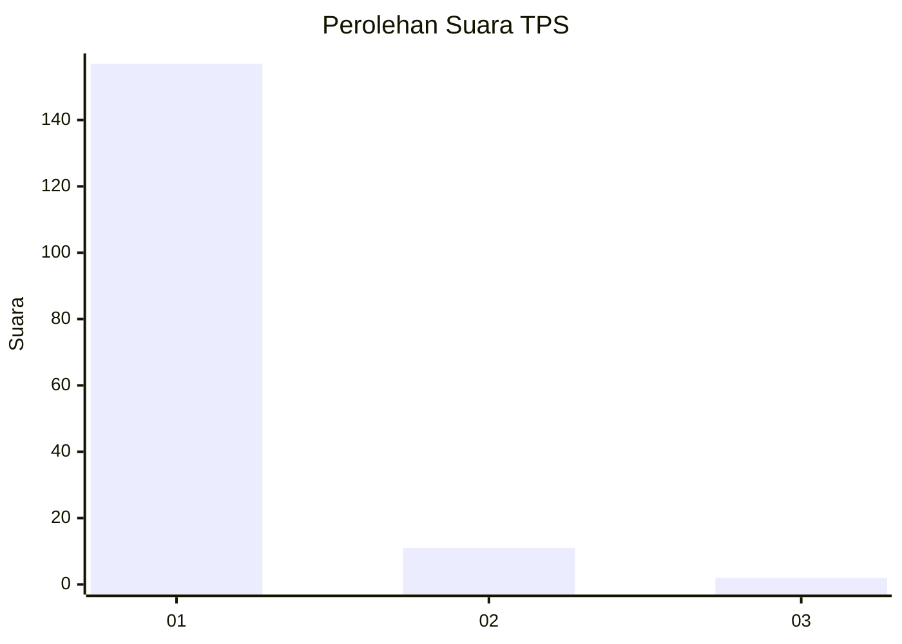
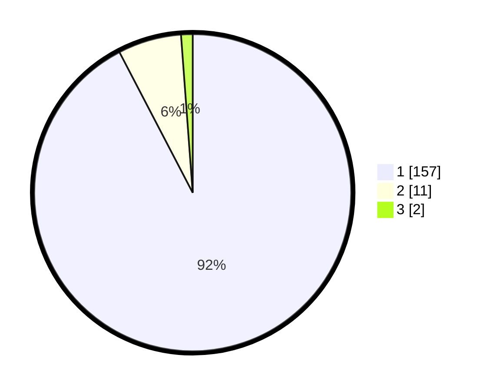

# Hasil

## Grafik

## Tabel

| No. | Nama Paslon    | Suara | Suara (raw) | Persentase |
|:--- |:-------------- | -----:| -----------:| ----------:|
| 1   | ANIES MUHAIMIN | 157   | [157][p-1]  | 92,35      |
| 2   | PRABOWO GIBRAN | 11    | [11][p-2]   | 6,47       |
| 3   | GANJAR MAHFUD  | 2     | [2][p-3]    | 1,18       |

[p-1]: https://github.com/gigit-pemilu/pemilu-2024-11-aceh/blob/main/pilpres/hitung-suara/sub/11-aceh/sub/01-aceh-selatan/sub/02-kluet-utara/sub/2005-pulo-ie-i/sub/003-tps/sub/paslon-1.txt
[p-2]: https://github.com/gigit-pemilu/pemilu-2024-11-aceh/blob/main/pilpres/hitung-suara/sub/11-aceh/sub/01-aceh-selatan/sub/02-kluet-utara/sub/2005-pulo-ie-i/sub/003-tps/sub/paslon-2.txt
[p-3]: https://github.com/gigit-pemilu/pemilu-2024-11-aceh/blob/main/pilpres/hitung-suara/sub/11-aceh/sub/01-aceh-selatan/sub/02-kluet-utara/sub/2005-pulo-ie-i/sub/003-tps/sub/paslon-3.txt

## Foto C Plano

https://sirekap-obj-formc.kpu.go.id/3e6c/pemilu/ppwp/11/01/02/20/05/1101022005003-20240214-215806--d4c40bc3-c3ee-4157-97c3-ab61aecccb99.jpg

https://sirekap-obj-formc.kpu.go.id/3e6c/pemilu/ppwp/11/01/02/20/05/1101022005003-20240214-215916--b83cde5e-c7be-48b7-9b5e-fab69654d541.jpg

https://sirekap-obj-formc.kpu.go.id/3e6c/pemilu/ppwp/11/01/02/20/05/1101022005003-20240214-220000--0bbb507d-5d24-492d-b721-b5cc500f1518.jpg

## Metadata

| Key        | Value               |
| ---------- | ------------------- |
| Time Stamp | 2024-02-16 21:01:00 |

## DATA PEMILIH TETAP

Jumlah pemilih dalam DPT: **191**.
 * L: **93**.
 * P: **98**.

## DATA PENGGUNA HAK PILIH

Jumlah pengguna hak pilih dalam DPT: **164**.
 * L: **71**.
 * P: **93**.

Jumlah pengguna hak pilih dalam DPTb: **0**.
 * L: **0**.
 * P: **0**.

Jumlah pengguna hak pilih dalam DPK: **8**.
 * L: **2**.
 * P: **6**.

Jumlah pengguna hak pilih: **172**.
 * L: **73**.
 * P: **99**.

## JUMLAH SUARA SAH DAN TIDAK SAH

JUMLAH SELURUH SUARA SAH: **170**.

JUMLAH SUARA TIDAK SAH: **2**.

JUMLAH SELURUH SUARA SAH DAN SUARA TIDAK SAH: **172**.

