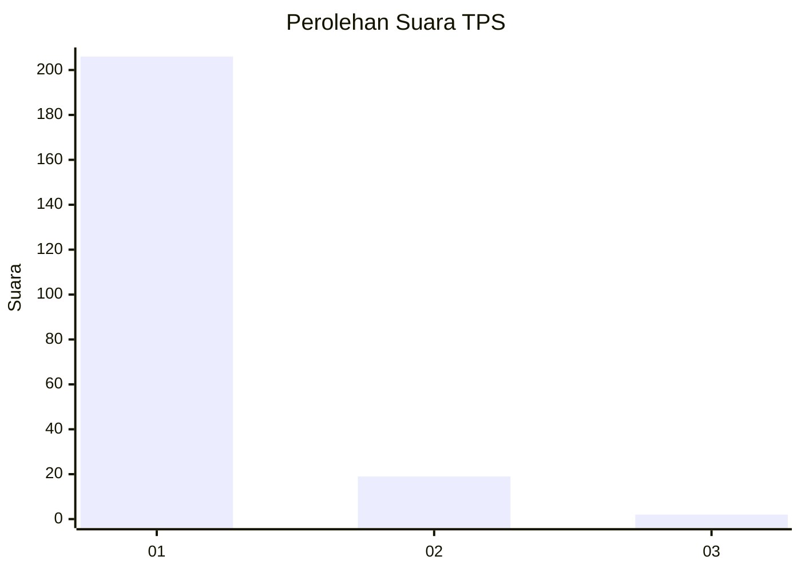
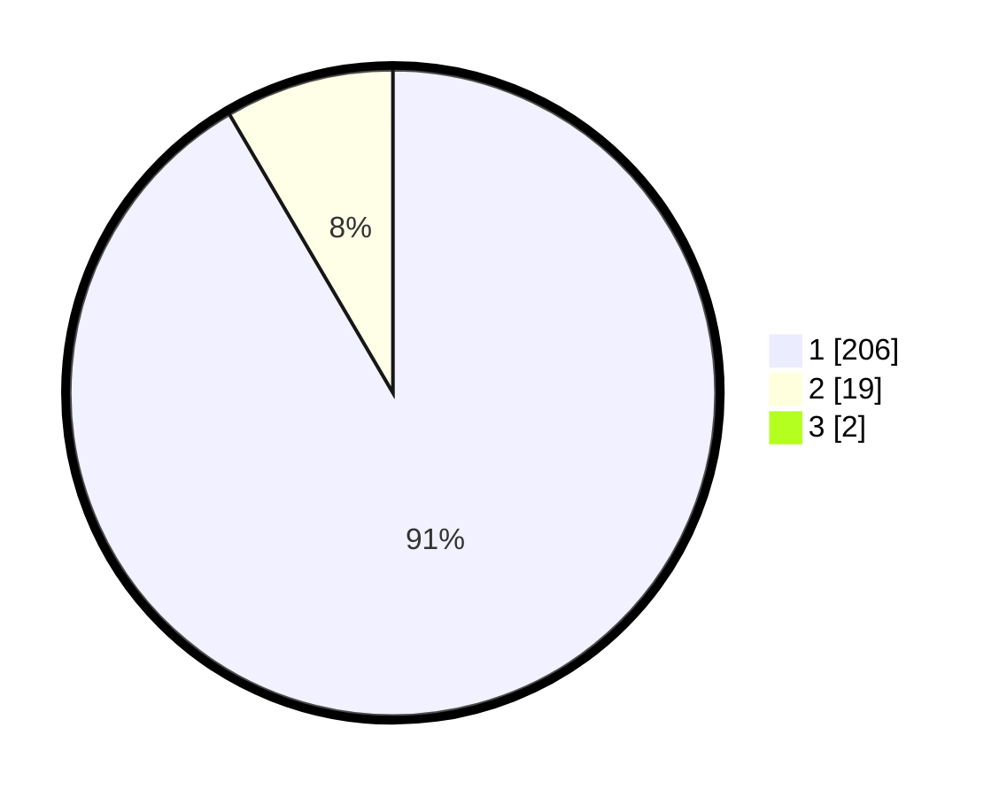

# Hasil

## Grafik

## Tabel

| No. | Nama Paslon    | Suara | Suara (raw) | Persentase |
|:--- |:-------------- | -----:| -----------:| ----------:|
| 1   | ANIES MUHAIMIN | 206   | [206][p-1]  | 90,75      |
| 2   | PRABOWO GIBRAN | 19    | [19][p-2]   | 8,37       |
| 3   | GANJAR MAHFUD  | 2     | [2][p-3]    | 0,88       |

[p-1]: https://github.com/gigit-pemilu/pemilu-2024-11-aceh/blob/main/pilpres/hitung-suara/sub/11-aceh/sub/01-aceh-selatan/sub/02-kluet-utara/sub/2006-jambo-manyang/sub/002-tps/sub/paslon-1.txt
[p-2]: https://github.com/gigit-pemilu/pemilu-2024-11-aceh/blob/main/pilpres/hitung-suara/sub/11-aceh/sub/01-aceh-selatan/sub/02-kluet-utara/sub/2006-jambo-manyang/sub/002-tps/sub/paslon-2.txt
[p-3]: https://github.com/gigit-pemilu/pemilu-2024-11-aceh/blob/main/pilpres/hitung-suara/sub/11-aceh/sub/01-aceh-selatan/sub/02-kluet-utara/sub/2006-jambo-manyang/sub/002-tps/sub/paslon-3.txt

## Foto C Plano

https://sirekap-obj-formc.kpu.go.id/72b4/pemilu/ppwp/11/01/02/20/06/1101022006002-20240214-222823--334e832b-acab-4d65-94a7-e08af074dc8c.jpg

https://sirekap-obj-formc.kpu.go.id/72b4/pemilu/ppwp/11/01/02/20/06/1101022006002-20240214-224934--120491ed-9979-4788-9005-b5424cd6f36e.jpg

https://sirekap-obj-formc.kpu.go.id/72b4/pemilu/ppwp/11/01/02/20/06/1101022006002-20240214-223531--6d0cfb7f-c881-48c4-b9ef-6ed9d1d56e69.jpg

## Metadata

| Key        | Value               |
| ---------- | ------------------- |
| Time Stamp | 2024-02-15 18:00:26 |

## DATA PEMILIH TETAP

Jumlah pemilih dalam DPT: **272**.
 * L: **139**.
 * P: **133**.

## DATA PENGGUNA HAK PILIH

Jumlah pengguna hak pilih dalam DPT: **223**.
 * L: **120**.
 * P: **103**.

Jumlah pengguna hak pilih dalam DPTb: **5**.
 * L: **2**.
 * P: **3**.

Jumlah pengguna hak pilih dalam DPK: **2**.
 * L: **0**.
 * P: **2**.

Jumlah pengguna hak pilih: **230**.
 * L: **122**.
 * P: **108**.

## JUMLAH SUARA SAH DAN TIDAK SAH

JUMLAH SELURUH SUARA SAH: **227**.

JUMLAH SUARA TIDAK SAH: **3**.

JUMLAH SELURUH SUARA SAH DAN SUARA TIDAK SAH: **230**.

