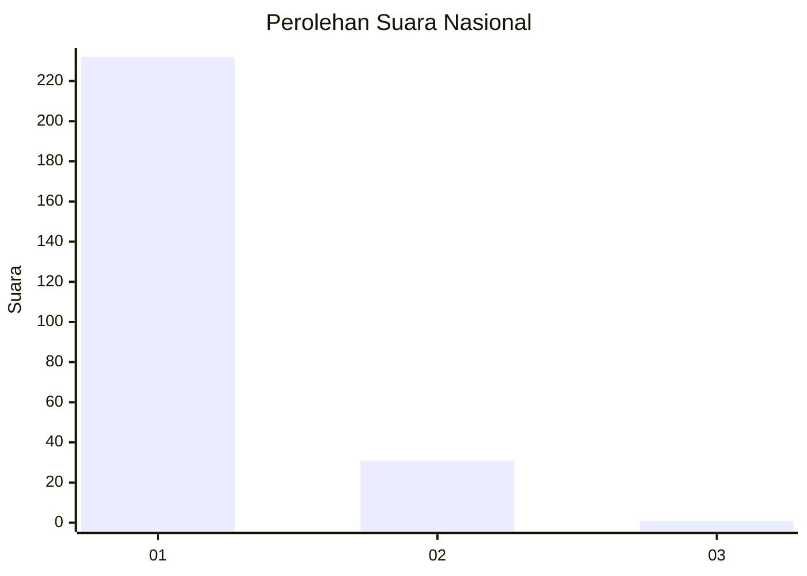
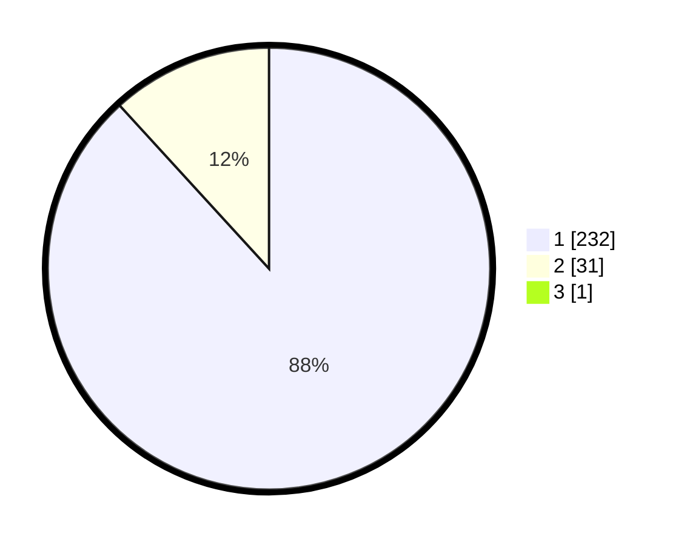

# Hasil

## Grafik

## Tabel

| No. | Nama Paslon    | Suara | Suara (raw) | Persentase |
|:--- |:-------------- | -----:| -----------:| ----------:|
| 1   | ANIES MUHAIMIN | 232   | [232][p-1]  | 87,88      |
| 2   | PRABOWO GIBRAN | 31    | [31][p-2]   | 11,74      |
| 3   | GANJAR MAHFUD  | 1     | [1][p-3]    | 0,38       |

[p-1]: https://github.com/gigit-pemilu/pemilu-2024/blob/main/pilpres/hitung-suara/sub/11-aceh/sub/01-aceh-selatan/sub/02-kluet-utara/sub/2007-simpang-empat/sub/001-tps/sub/paslon-1.txt
[p-2]: https://github.com/gigit-pemilu/pemilu-2024/blob/main/pilpres/hitung-suara/sub/11-aceh/sub/01-aceh-selatan/sub/02-kluet-utara/sub/2007-simpang-empat/sub/001-tps/sub/paslon-2.txt
[p-3]: https://github.com/gigit-pemilu/pemilu-2024/blob/main/pilpres/hitung-suara/sub/11-aceh/sub/01-aceh-selatan/sub/02-kluet-utara/sub/2007-simpang-empat/sub/001-tps/sub/paslon-3.txt

## Foto C Plano

https://sirekap-obj-formc.kpu.go.id/523f/pemilu/ppwp/11/01/02/20/07/1101022007001-20240216-143714--ba55e68b-d918-4f40-b014-72b0757da2d2.jpg

https://sirekap-obj-formc.kpu.go.id/523f/pemilu/ppwp/11/01/02/20/07/1101022007001-20240216-143715--b6af90a1-5f5b-4469-9277-9a3ccda74e4e.jpg

https://sirekap-obj-formc.kpu.go.id/523f/pemilu/ppwp/11/01/02/20/07/1101022007001-20240216-143715--bbbbc5f2-38db-4d6e-86d2-c548df134088.jpg

## Metadata

| Key        | Value               |
| ---------- | ------------------- |
| Time Stamp | 2024-02-16 16:25:10 |

## DATA PEMILIH TETAP

Jumlah pemilih dalam DPT: **279**.
 * L: **145**.
 * P: **134**.

## DATA PENGGUNA HAK PILIH

Jumlah pengguna hak pilih dalam DPT: **254**.
 * L: **132**.
 * P: **122**.

Jumlah pengguna hak pilih dalam DPTb: **6**.
 * L: **3**.
 * P: **3**.

Jumlah pengguna hak pilih dalam DPK: **4**.
 * L: **1**.
 * P: **3**.

Jumlah pengguna hak pilih: **264**.
 * L: **136**.
 * P: **128**.

## JUMLAH SUARA SAH DAN TIDAK SAH

JUMLAH SELURUH SUARA SAH: **264**.

JUMLAH SUARA TIDAK SAH: **0**.

JUMLAH SELURUH SUARA SAH DAN SUARA TIDAK SAH: **264**.

