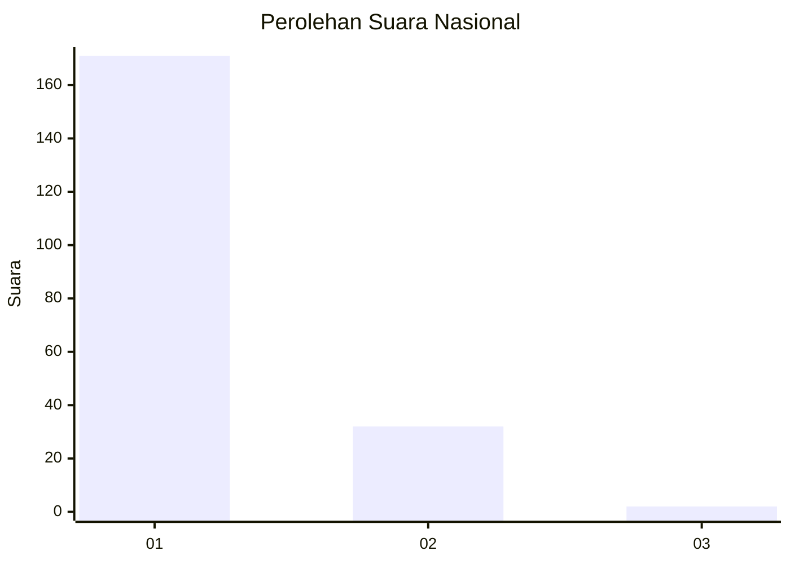
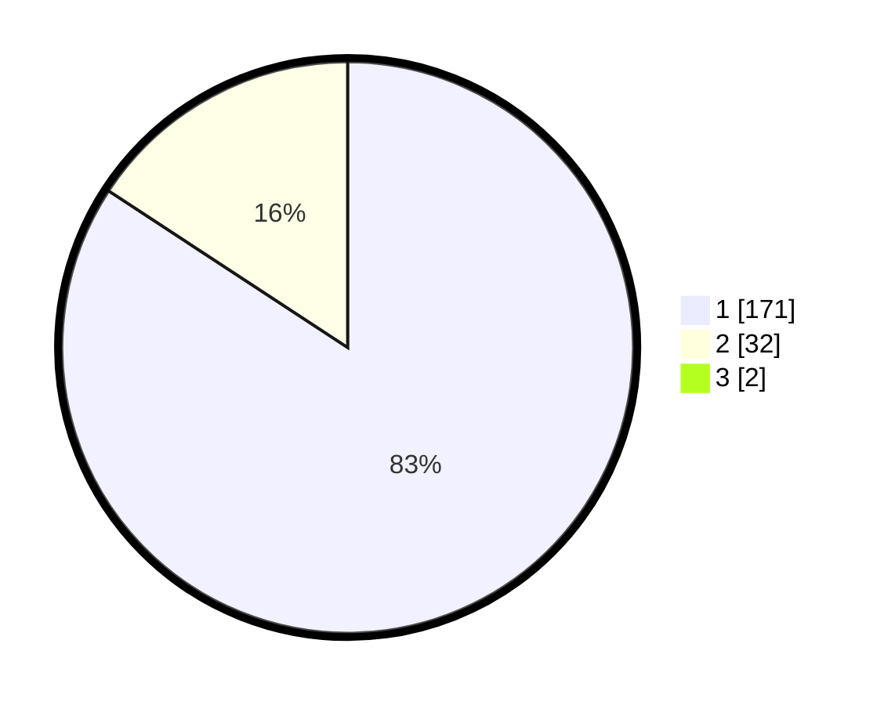

# Hasil

## Grafik

## Tabel

| No. | Nama Paslon    | Suara | Suara (raw) | Persentase |
|:--- |:-------------- | -----:| -----------:| ----------:|
| 1   | ANIES MUHAIMIN | 171   | [171][p-1]  | 83,41      |
| 2   | PRABOWO GIBRAN | 32    | [32][p-2]   | 15,61      |
| 3   | GANJAR MAHFUD  | 2     | [2][p-3]    | 0,98       |

[p-1]: https://github.com/gigit-pemilu/pemilu-2024/blob/main/pilpres/hitung-suara/sub/11-aceh/sub/01-aceh-selatan/sub/02-kluet-utara/sub/2008-limau-purut/sub/001-tps/sub/paslon-1.txt
[p-2]: https://github.com/gigit-pemilu/pemilu-2024/blob/main/pilpres/hitung-suara/sub/11-aceh/sub/01-aceh-selatan/sub/02-kluet-utara/sub/2008-limau-purut/sub/001-tps/sub/paslon-2.txt
[p-3]: https://github.com/gigit-pemilu/pemilu-2024/blob/main/pilpres/hitung-suara/sub/11-aceh/sub/01-aceh-selatan/sub/02-kluet-utara/sub/2008-limau-purut/sub/001-tps/sub/paslon-3.txt

## Foto C Plano

https://sirekap-obj-formc.kpu.go.id/e47a/pemilu/ppwp/11/01/02/20/08/1101022008001-20240214-202415--848eb4a2-4c3c-4723-89a3-baf80b2f739e.jpg

https://sirekap-obj-formc.kpu.go.id/e47a/pemilu/ppwp/11/01/02/20/08/1101022008001-20240214-202545--d9cca733-9b7e-4099-85b1-b507eaa12c14.jpg

https://sirekap-obj-formc.kpu.go.id/e47a/pemilu/ppwp/11/01/02/20/08/1101022008001-20240214-202817--1a589eb5-a2d1-4809-921e-e16dd56f1b06.jpg

## Metadata

| Key        | Value               |
| ---------- | ------------------- |
| Time Stamp | 2024-02-15 23:29:50 |

## DATA PEMILIH TETAP

Jumlah pemilih dalam DPT: **251**.
 * L: **116**.
 * P: **135**.

## DATA PENGGUNA HAK PILIH

Jumlah pengguna hak pilih dalam DPT: **196**.
 * L: **91**.
 * P: **105**.

Jumlah pengguna hak pilih dalam DPTb: **0**.
 * L: **0**.
 * P: **0**.

Jumlah pengguna hak pilih dalam DPK: **12**.
 * L: **3**.
 * P: **9**.

Jumlah pengguna hak pilih: **208**.
 * L: **94**.
 * P: **114**.

## JUMLAH SUARA SAH DAN TIDAK SAH

JUMLAH SELURUH SUARA SAH: **205**.

JUMLAH SUARA TIDAK SAH: **3**.

JUMLAH SELURUH SUARA SAH DAN SUARA TIDAK SAH: **208**.

