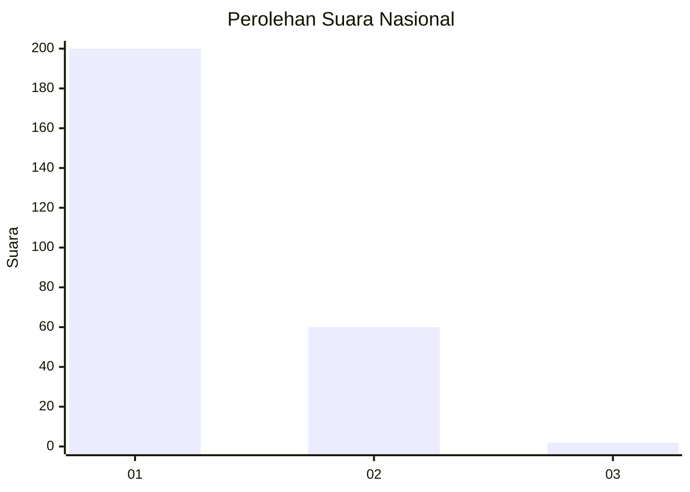
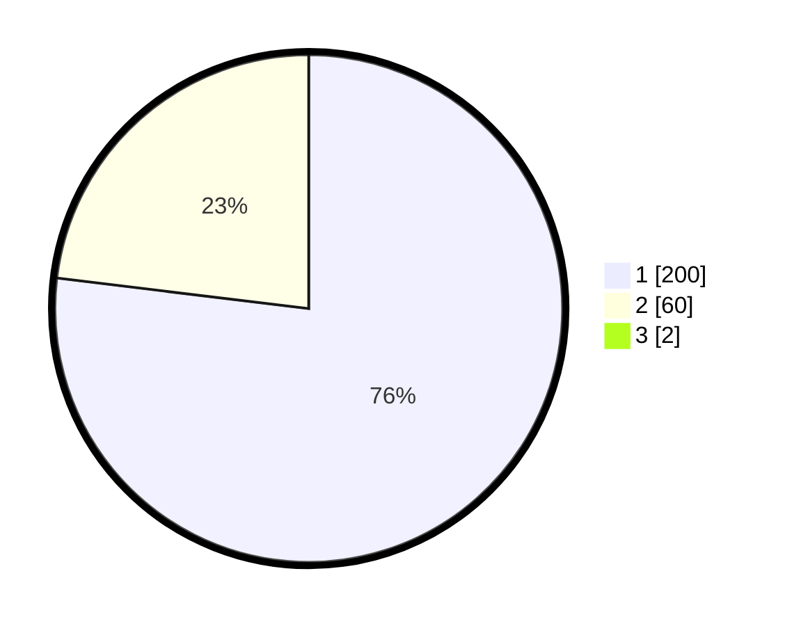

# Hasil

## Grafik

## Tabel

| No. | Nama Paslon    | Suara | Suara (raw) | Persentase |
|:--- |:-------------- | -----:| -----------:| ----------:|
| 1   | ANIES MUHAIMIN | 200   | [200][p-1]  | 76,34      |
| 2   | PRABOWO GIBRAN | 60    | [60][p-2]   | 22,90      |
| 3   | GANJAR MAHFUD  | 2     | [2][p-3]    | 0,76       |

[p-1]: https://github.com/gigit-pemilu/pemilu-2024/blob/main/pilpres/hitung-suara/sub/11-aceh/sub/01-aceh-selatan/sub/02-kluet-utara/sub/2010-kampung-paya/sub/002-tps/sub/paslon-1.txt
[p-2]: https://github.com/gigit-pemilu/pemilu-2024/blob/main/pilpres/hitung-suara/sub/11-aceh/sub/01-aceh-selatan/sub/02-kluet-utara/sub/2010-kampung-paya/sub/002-tps/sub/paslon-2.txt
[p-3]: https://github.com/gigit-pemilu/pemilu-2024/blob/main/pilpres/hitung-suara/sub/11-aceh/sub/01-aceh-selatan/sub/02-kluet-utara/sub/2010-kampung-paya/sub/002-tps/sub/paslon-3.txt

## Foto C Plano

https://sirekap-obj-formc.kpu.go.id/f99c/pemilu/ppwp/11/01/02/20/10/1101022010002-20240214-194106--f9f534eb-3e4f-4062-bb1a-42d6a6e41ac8.jpg

https://sirekap-obj-formc.kpu.go.id/f99c/pemilu/ppwp/11/01/02/20/10/1101022010002-20240214-194136--72b7874f-0c8c-4c22-b80d-9cb6fa0ac872.jpg

https://sirekap-obj-formc.kpu.go.id/f99c/pemilu/ppwp/11/01/02/20/10/1101022010002-20240214-194155--6f6a2c51-ff56-47e7-a48f-965abe4fe898.jpg

## Metadata

| Key        | Value               |
| ---------- | ------------------- |
| Time Stamp | 2024-02-14 21:46:01 |

## DATA PEMILIH TETAP

Jumlah pemilih dalam DPT: **285**.
 * L: **138**.
 * P: **147**.

## DATA PENGGUNA HAK PILIH

Jumlah pengguna hak pilih dalam DPT: **265**.
 * L: **134**.
 * P: **131**.

Jumlah pengguna hak pilih dalam DPTb: **0**.
 * L: **0**.
 * P: **0**.

Jumlah pengguna hak pilih dalam DPK: **4**.
 * L: **2**.
 * P: **2**.

Jumlah pengguna hak pilih: **269**.
 * L: **136**.
 * P: **133**.

## JUMLAH SUARA SAH DAN TIDAK SAH

JUMLAH SELURUH SUARA SAH: **262**.

JUMLAH SUARA TIDAK SAH: **7**.

JUMLAH SELURUH SUARA SAH DAN SUARA TIDAK SAH: **269**.

