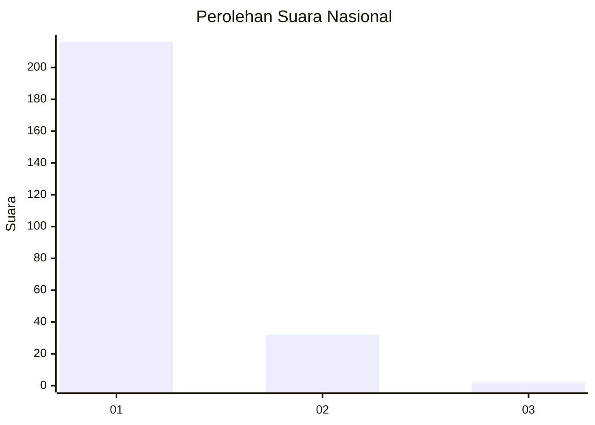
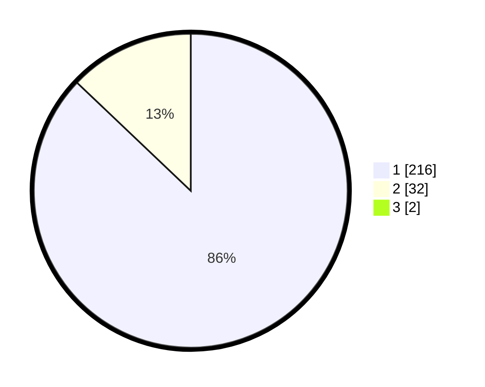

# Hasil

## Grafik

## Tabel

| No. | Nama Paslon    | Suara | Suara (raw) | Persentase |
|:--- |:-------------- | -----:| -----------:| ----------:|
| 1   | ANIES MUHAIMIN | 216   | [216][p-1]  | 86,40      |
| 2   | PRABOWO GIBRAN | 32    | [32][p-2]   | 12,80      |
| 3   | GANJAR MAHFUD  | 2     | [2][p-3]    | 0,80       |

[p-1]: https://github.com/gigit-pemilu/pemilu-2024/blob/main/pilpres/hitung-suara/sub/11-aceh/sub/01-aceh-selatan/sub/02-kluet-utara/sub/2011-krueng-batu/sub/001-tps/sub/paslon-1.txt
[p-2]: https://github.com/gigit-pemilu/pemilu-2024/blob/main/pilpres/hitung-suara/sub/11-aceh/sub/01-aceh-selatan/sub/02-kluet-utara/sub/2011-krueng-batu/sub/001-tps/sub/paslon-2.txt
[p-3]: https://github.com/gigit-pemilu/pemilu-2024/blob/main/pilpres/hitung-suara/sub/11-aceh/sub/01-aceh-selatan/sub/02-kluet-utara/sub/2011-krueng-batu/sub/001-tps/sub/paslon-3.txt

## Foto C Plano

https://sirekap-obj-formc.kpu.go.id/01f6/pemilu/ppwp/11/01/02/20/11/1101022011001-20240216-144832--9e273cd6-8209-462f-a2ba-49bf8aeec97a.jpg

https://sirekap-obj-formc.kpu.go.id/01f6/pemilu/ppwp/11/01/02/20/11/1101022011001-20240216-144833--7b07cfd7-ad19-43a0-89fd-6fed07b40bd4.jpg

https://sirekap-obj-formc.kpu.go.id/01f6/pemilu/ppwp/11/01/02/20/11/1101022011001-20240216-144832--0b0c0942-42d7-4e5e-9317-5c9f1b716a9c.jpg

## Metadata

| Key        | Value               |
| ---------- | ------------------- |
| Time Stamp | 2024-02-16 21:01:00 |

## DATA PEMILIH TETAP

Jumlah pemilih dalam DPT: **254**.
 * L: **132**.
 * P: **122**.

## DATA PENGGUNA HAK PILIH

Jumlah pengguna hak pilih dalam DPT: **247**.
 * L: **128**.
 * P: **119**.

Jumlah pengguna hak pilih dalam DPTb: **1**.
 * L: **1**.
 * P: **0**.

Jumlah pengguna hak pilih dalam DPK: **6**.
 * L: **3**.
 * P: **3**.

Jumlah pengguna hak pilih: **254**.
 * L: **132**.
 * P: **122**.

## JUMLAH SUARA SAH DAN TIDAK SAH

JUMLAH SELURUH SUARA SAH: **250**.

JUMLAH SUARA TIDAK SAH: **4**.

JUMLAH SELURUH SUARA SAH DAN SUARA TIDAK SAH: **254**.

