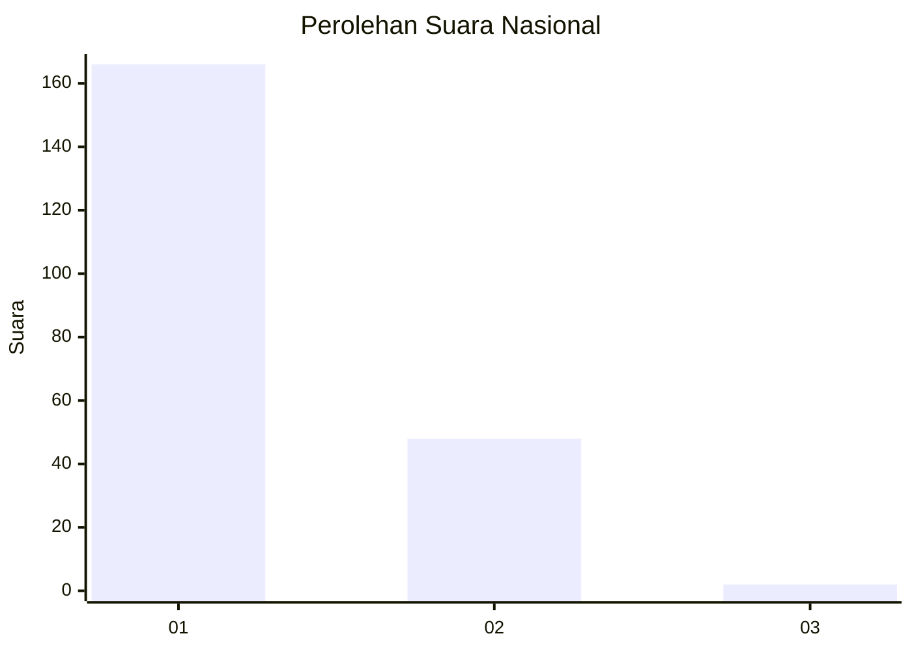
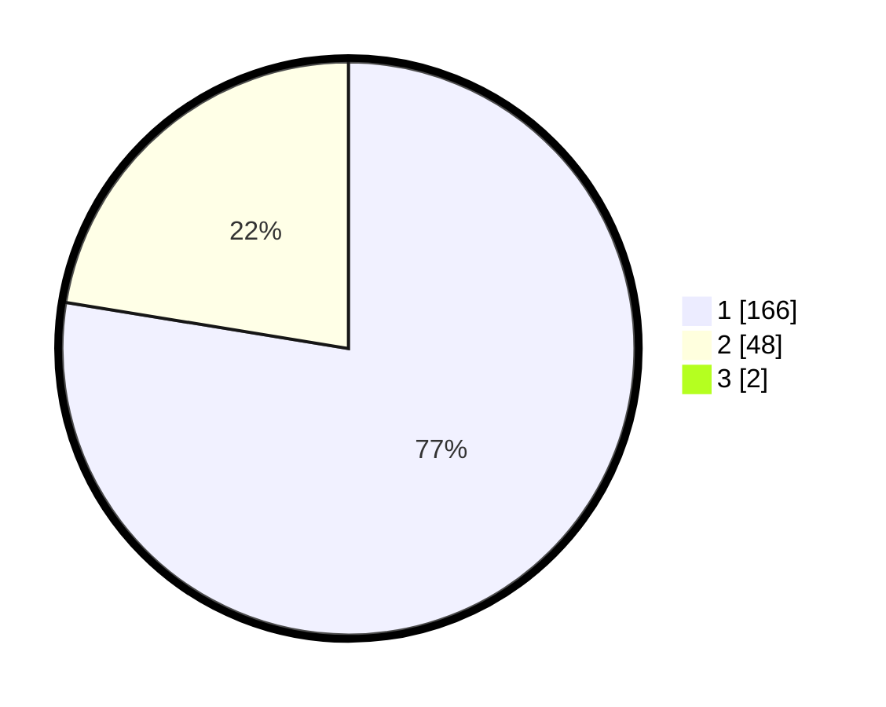

# Hasil

## Grafik

## Tabel

| No. | Nama Paslon    | Suara | Suara (raw) | Persentase |
|:--- |:-------------- | -----:| -----------:| ----------:|
| 1   | ANIES MUHAIMIN | 166   | [166][p-1]  | 76,85      |
| 2   | PRABOWO GIBRAN | 48    | [48][p-2]   | 22,22      |
| 3   | GANJAR MAHFUD  | 2     | [2][p-3]    | 0,93       |

[p-1]: https://github.com/gigit-pemilu/pemilu-2024/blob/main/pilpres/hitung-suara/sub/11-aceh/sub/01-aceh-selatan/sub/02-kluet-utara/sub/2011-krueng-batu/sub/002-tps/sub/paslon-1.txt
[p-2]: https://github.com/gigit-pemilu/pemilu-2024/blob/main/pilpres/hitung-suara/sub/11-aceh/sub/01-aceh-selatan/sub/02-kluet-utara/sub/2011-krueng-batu/sub/002-tps/sub/paslon-2.txt
[p-3]: https://github.com/gigit-pemilu/pemilu-2024/blob/main/pilpres/hitung-suara/sub/11-aceh/sub/01-aceh-selatan/sub/02-kluet-utara/sub/2011-krueng-batu/sub/002-tps/sub/paslon-3.txt

## Foto C Plano

https://sirekap-obj-formc.kpu.go.id/727b/pemilu/ppwp/11/01/02/20/11/1101022011002-20240216-215548--fc1ce0d2-538c-4029-8cfd-ba74daab54d3.jpg

https://sirekap-obj-formc.kpu.go.id/727b/pemilu/ppwp/11/01/02/20/11/1101022011002-20240216-215549--0001711a-5855-4501-8a39-a759f243ccad.jpg

https://sirekap-obj-formc.kpu.go.id/727b/pemilu/ppwp/11/01/02/20/11/1101022011002-20240216-215548--8907633e-452c-475d-afd1-96231f2954e6.jpg

## Metadata

| Key        | Value               |
| ---------- | ------------------- |
| Time Stamp | 2024-02-17 14:45:18 |

## DATA PEMILIH TETAP

Jumlah pemilih dalam DPT: **227**.
 * L: **114**.
 * P: **113**.

## DATA PENGGUNA HAK PILIH

Jumlah pengguna hak pilih dalam DPT: **223**.
 * L: **117**.
 * P: **106**.

Jumlah pengguna hak pilih dalam DPTb: **0**.
 * L: **0**.
 * P: **0**.

Jumlah pengguna hak pilih dalam DPK: **7**.
 * L: **5**.
 * P: **2**.

Jumlah pengguna hak pilih: **230**.
 * L: **122**.
 * P: **108**.

## JUMLAH SUARA SAH DAN TIDAK SAH

JUMLAH SELURUH SUARA SAH: **216**.

JUMLAH SUARA TIDAK SAH: **7**.

JUMLAH SELURUH SUARA SAH DAN SUARA TIDAK SAH: **223**.

