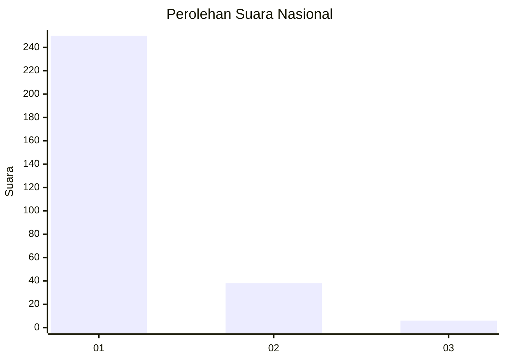
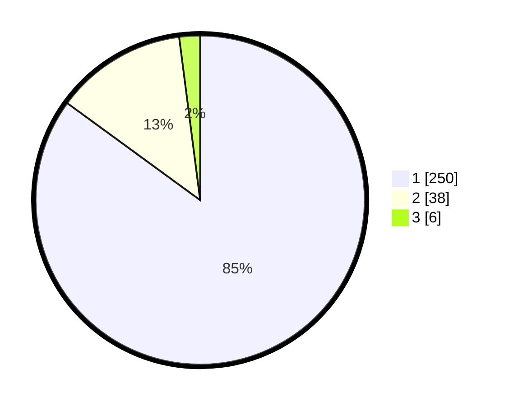

# Hasil

## Grafik

## Tabel

| No. | Nama Paslon    | Suara | Suara (raw) | Persentase |
|:--- |:-------------- | -----:| -----------:| ----------:|
| 1   | ANIES MUHAIMIN | 250   | [250][p-1]  | 85,03      |
| 2   | PRABOWO GIBRAN | 38    | [38][p-2]   | 12,93      |
| 3   | GANJAR MAHFUD  | 6     | [6][p-3]    | 2,04       |

[p-1]: https://github.com/gigit-pemilu/pemilu-2024/blob/main/pilpres/hitung-suara/sub/11-aceh/sub/01-aceh-selatan/sub/02-kluet-utara/sub/2011-krueng-batu/sub/003-tps/sub/paslon-1.txt
[p-2]: https://github.com/gigit-pemilu/pemilu-2024/blob/main/pilpres/hitung-suara/sub/11-aceh/sub/01-aceh-selatan/sub/02-kluet-utara/sub/2011-krueng-batu/sub/003-tps/sub/paslon-2.txt
[p-3]: https://github.com/gigit-pemilu/pemilu-2024/blob/main/pilpres/hitung-suara/sub/11-aceh/sub/01-aceh-selatan/sub/02-kluet-utara/sub/2011-krueng-batu/sub/003-tps/sub/paslon-3.txt

## Foto C Plano

https://sirekap-obj-formc.kpu.go.id/871f/pemilu/ppwp/11/01/02/20/11/1101022011003-20240216-214448--35cea1f4-eb63-4808-9e41-547025165eae.jpg

https://sirekap-obj-formc.kpu.go.id/871f/pemilu/ppwp/11/01/02/20/11/1101022011003-20240216-214449--0fa001bd-24a1-4eec-9dbf-f19d17271c65.jpg

https://sirekap-obj-formc.kpu.go.id/871f/pemilu/ppwp/11/01/02/20/11/1101022011003-20240216-214448--a4817911-f283-4f54-8c65-2b9c5cbcdf1d.jpg

## Metadata

| Key        | Value               |
| ---------- | ------------------- |
| Time Stamp | 2024-02-17 14:45:18 |

## DATA PEMILIH TETAP

Jumlah pemilih dalam DPT: **296**.
 * L: **163**.
 * P: **133**.

## DATA PENGGUNA HAK PILIH

Jumlah pengguna hak pilih dalam DPT: **287**.
 * L: **157**.
 * P: **130**.

Jumlah pengguna hak pilih dalam DPTb: **0**.
 * L: **0**.
 * P: **0**.

Jumlah pengguna hak pilih dalam DPK: **15**.
 * L: **9**.
 * P: **6**.

Jumlah pengguna hak pilih: **302**.
 * L: **166**.
 * P: **136**.

## JUMLAH SUARA SAH DAN TIDAK SAH

JUMLAH SELURUH SUARA SAH: **294**.

JUMLAH SUARA TIDAK SAH: **8**.

JUMLAH SELURUH SUARA SAH DAN SUARA TIDAK SAH: **302**.

