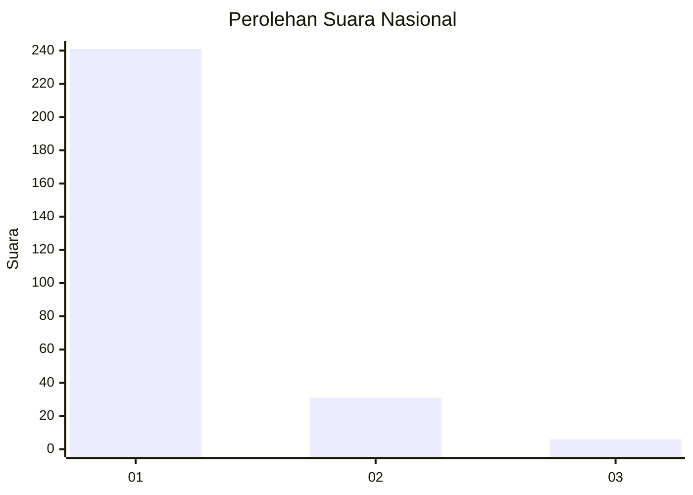
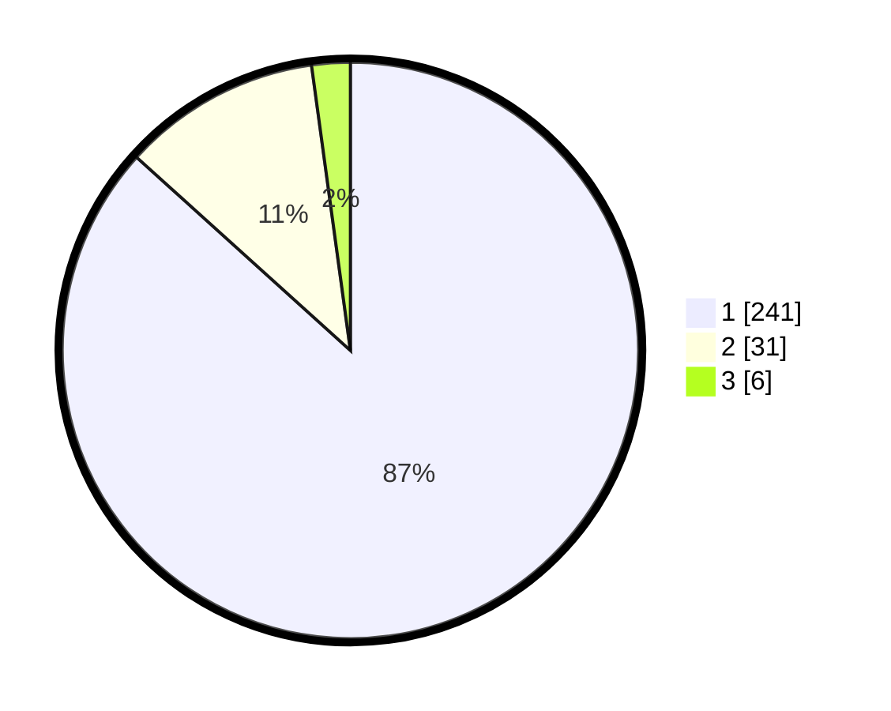

# Hasil

## Grafik

## Tabel

| No. | Nama Paslon    | Suara | Suara (raw) | Persentase |
|:--- |:-------------- | -----:| -----------:| ----------:|
| 1   | ANIES MUHAIMIN | 241   | [241][p-1]  | 86,69      |
| 2   | PRABOWO GIBRAN | 31    | [31][p-2]   | 11,15      |
| 3   | GANJAR MAHFUD  | 6     | [6][p-3]    | 2,16       |

[p-1]: https://github.com/gigit-pemilu/pemilu-2024/blob/main/pilpres/hitung-suara/sub/11-aceh/sub/01-aceh-selatan/sub/02-kluet-utara/sub/2011-krueng-batu/sub/005-tps/sub/paslon-1.txt
[p-2]: https://github.com/gigit-pemilu/pemilu-2024/blob/main/pilpres/hitung-suara/sub/11-aceh/sub/01-aceh-selatan/sub/02-kluet-utara/sub/2011-krueng-batu/sub/005-tps/sub/paslon-2.txt
[p-3]: https://github.com/gigit-pemilu/pemilu-2024/blob/main/pilpres/hitung-suara/sub/11-aceh/sub/01-aceh-selatan/sub/02-kluet-utara/sub/2011-krueng-batu/sub/005-tps/sub/paslon-3.txt

## Foto C Plano

https://sirekap-obj-formc.kpu.go.id/c60b/pemilu/ppwp/11/01/02/20/11/1101022011005-20240216-062319--db4653a4-826c-49d5-b96f-e86c8250f2cc.jpg

https://sirekap-obj-formc.kpu.go.id/c60b/pemilu/ppwp/11/01/02/20/11/1101022011005-20240216-062320--b0b7ba09-42c2-40a0-acd9-f1ad170e8d0c.jpg

https://sirekap-obj-formc.kpu.go.id/c60b/pemilu/ppwp/11/01/02/20/11/1101022011005-20240216-062319--3754bb2a-0c72-47ac-b35d-758ca30a4d92.jpg

## Metadata

| Key        | Value               |
| ---------- | ------------------- |
| Time Stamp | 2024-02-16 11:00:29 |

## DATA PEMILIH TETAP

Jumlah pemilih dalam DPT: **281**.
 * L: **153**.
 * P: **128**.

## DATA PENGGUNA HAK PILIH

Jumlah pengguna hak pilih dalam DPT: **281**.
 * L: **153**.
 * P: **128**.

Jumlah pengguna hak pilih dalam DPTb: **0**.
 * L: **0**.
 * P: **0**.

Jumlah pengguna hak pilih dalam DPK: **6**.
 * L: **6**.
 * P: **0**.

Jumlah pengguna hak pilih: **287**.
 * L: **159**.
 * P: **128**.

## JUMLAH SUARA SAH DAN TIDAK SAH

JUMLAH SELURUH SUARA SAH: **278**.

JUMLAH SUARA TIDAK SAH: **9**.

JUMLAH SELURUH SUARA SAH DAN SUARA TIDAK SAH: **287**.

