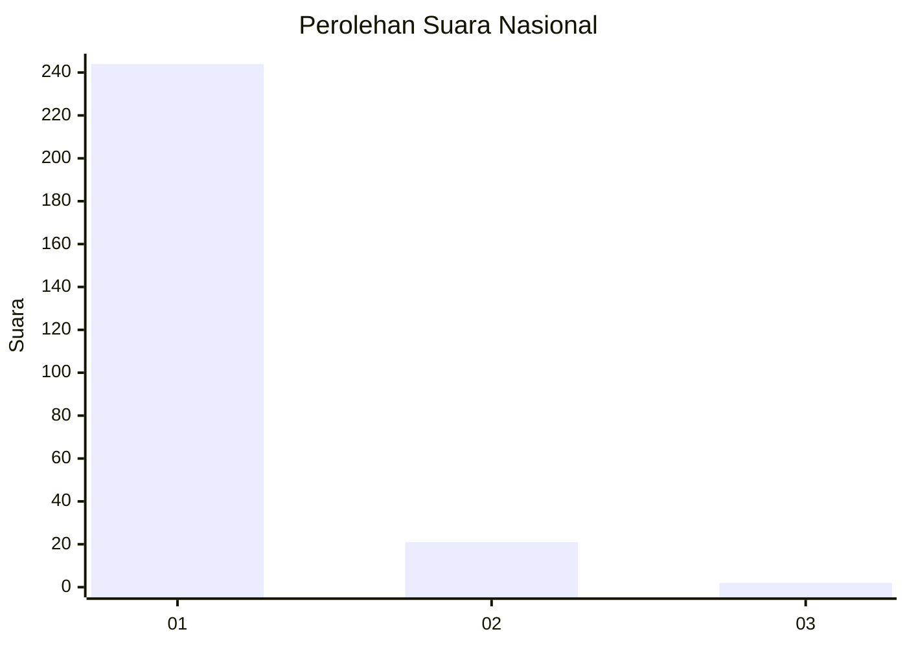
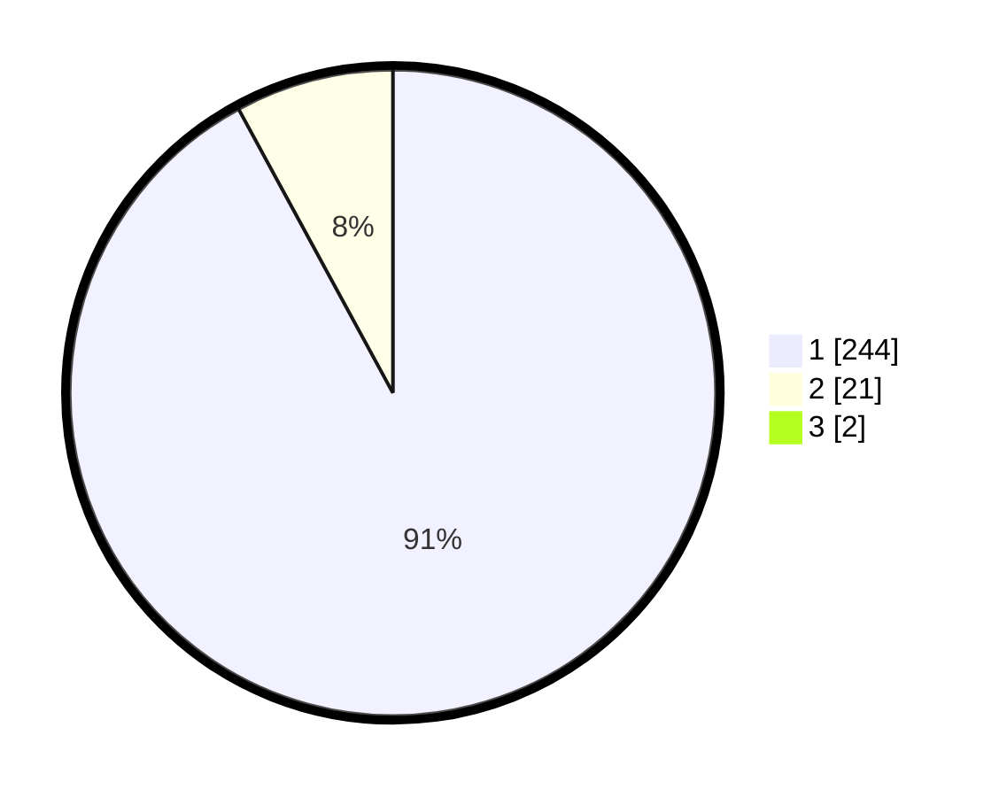

# Hasil

## Grafik

## Tabel

| No. | Nama Paslon    | Suara | Suara (raw) | Persentase |
|:--- |:-------------- | -----:| -----------:| ----------:|
| 1   | ANIES MUHAIMIN | 244   | [244][p-1]  | 91,39      |
| 2   | PRABOWO GIBRAN | 21    | [21][p-2]   | 7,87       |
| 3   | GANJAR MAHFUD  | 2     | [2][p-3]    | 0,75       |

[p-1]: https://github.com/gigit-pemilu/pemilu-2024/blob/main/pilpres/hitung-suara/sub/11-aceh/sub/01-aceh-selatan/sub/02-kluet-utara/sub/2016-simpang-lhee/sub/001-tps/sub/paslon-1.txt
[p-2]: https://github.com/gigit-pemilu/pemilu-2024/blob/main/pilpres/hitung-suara/sub/11-aceh/sub/01-aceh-selatan/sub/02-kluet-utara/sub/2016-simpang-lhee/sub/001-tps/sub/paslon-2.txt
[p-3]: https://github.com/gigit-pemilu/pemilu-2024/blob/main/pilpres/hitung-suara/sub/11-aceh/sub/01-aceh-selatan/sub/02-kluet-utara/sub/2016-simpang-lhee/sub/001-tps/sub/paslon-3.txt

## Foto C Plano

https://sirekap-obj-formc.kpu.go.id/3611/pemilu/ppwp/11/01/02/20/16/1101022016001-20240214-190517--60192512-79eb-4a36-a721-02e5c5d97925.jpg

https://sirekap-obj-formc.kpu.go.id/3611/pemilu/ppwp/11/01/02/20/16/1101022016001-20240217-081834--850cb173-99d6-431c-a08c-fbb776400c43.jpg

https://sirekap-obj-formc.kpu.go.id/3611/pemilu/ppwp/11/01/02/20/16/1101022016001-20240214-192809--baf26f12-f717-482a-80fa-b02594d2acd4.jpg

## Metadata

| Key        | Value               |
| ---------- | ------------------- |
| Time Stamp | 2024-02-17 14:45:18 |

## DATA PEMILIH TETAP

Jumlah pemilih dalam DPT: **267**.
 * L: **131**.
 * P: **136**.

## DATA PENGGUNA HAK PILIH

Jumlah pengguna hak pilih dalam DPT: **261**.
 * L: **127**.
 * P: **134**.

Jumlah pengguna hak pilih dalam DPTb: **0**.
 * L: **0**.
 * P: **0**.

Jumlah pengguna hak pilih dalam DPK: **6**.
 * L: **2**.
 * P: **4**.

Jumlah pengguna hak pilih: **267**.
 * L: **129**.
 * P: **138**.

## JUMLAH SUARA SAH DAN TIDAK SAH

JUMLAH SELURUH SUARA SAH: **267**.

JUMLAH SUARA TIDAK SAH: **0**.

JUMLAH SELURUH SUARA SAH DAN SUARA TIDAK SAH: **267**.

