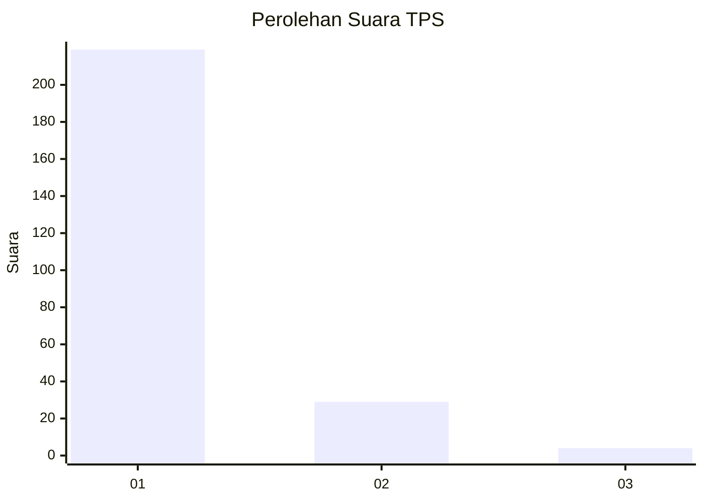
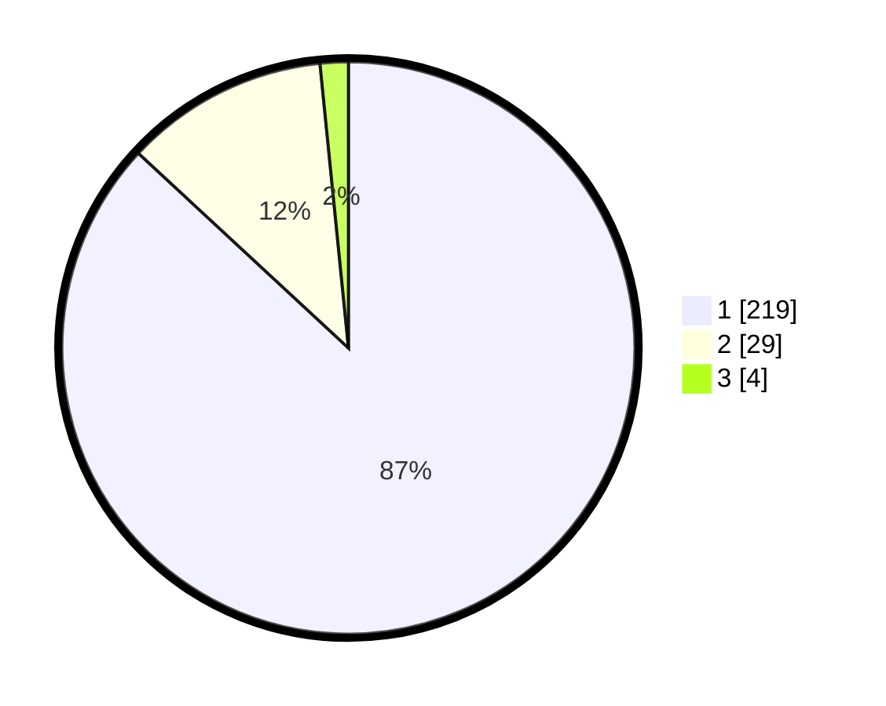

# Hasil

## Grafik

## Tabel

| No. | Nama Paslon    | Suara | Suara (raw) | Persentase |
|:--- |:-------------- | -----:| -----------:| ----------:|
| 1   | ANIES MUHAIMIN | 219   | [219][p-1]  | 86,90      |
| 2   | PRABOWO GIBRAN | 29    | [29][p-2]   | 11,51      |
| 3   | GANJAR MAHFUD  | 4     | [4][p-3]    | 1,59       |

[p-1]: https://github.com/gigit-pemilu/pemilu-2024-11-aceh/blob/main/pilpres/hitung-suara/sub/11-aceh/sub/01-aceh-selatan/sub/02-kluet-utara/sub/2016-simpang-lhee/sub/002-tps/sub/paslon-1.txt
[p-2]: https://github.com/gigit-pemilu/pemilu-2024-11-aceh/blob/main/pilpres/hitung-suara/sub/11-aceh/sub/01-aceh-selatan/sub/02-kluet-utara/sub/2016-simpang-lhee/sub/002-tps/sub/paslon-2.txt
[p-3]: https://github.com/gigit-pemilu/pemilu-2024-11-aceh/blob/main/pilpres/hitung-suara/sub/11-aceh/sub/01-aceh-selatan/sub/02-kluet-utara/sub/2016-simpang-lhee/sub/002-tps/sub/paslon-3.txt

## Foto C Plano

https://sirekap-obj-formc.kpu.go.id/62f4/pemilu/ppwp/11/01/02/20/16/1101022016002-20240216-142817--a0ba10fb-ae60-40fd-b883-2f6a1eaf2cd2.jpg

https://sirekap-obj-formc.kpu.go.id/62f4/pemilu/ppwp/11/01/02/20/16/1101022016002-20240214-200901--a939e079-2be0-4514-a92b-9540929dff39.jpg

https://sirekap-obj-formc.kpu.go.id/62f4/pemilu/ppwp/11/01/02/20/16/1101022016002-20240216-142818--8dd37f0f-5e96-4621-8fdd-273be0142960.jpg

## Metadata

| Key        | Value               |
| ---------- | ------------------- |
| Time Stamp | 2024-02-16 14:30:33 |

## DATA PEMILIH TETAP

Jumlah pemilih dalam DPT: **268**.
 * L: **139**.
 * P: **129**.

## DATA PENGGUNA HAK PILIH

Jumlah pengguna hak pilih dalam DPT: **255**.
 * L: **130**.
 * P: **125**.

Jumlah pengguna hak pilih dalam DPTb: **1**.
 * L: **0**.
 * P: **1**.

Jumlah pengguna hak pilih dalam DPK: **6**.
 * L: **2**.
 * P: **4**.

Jumlah pengguna hak pilih: **262**.
 * L: **132**.
 * P: **130**.

## JUMLAH SUARA SAH DAN TIDAK SAH

JUMLAH SELURUH SUARA SAH: **252**.

JUMLAH SUARA TIDAK SAH: **10**.

JUMLAH SELURUH SUARA SAH DAN SUARA TIDAK SAH: **262**.

