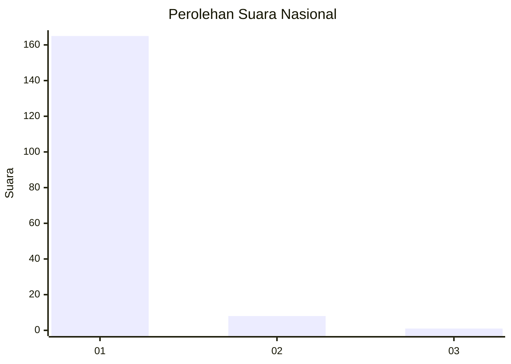
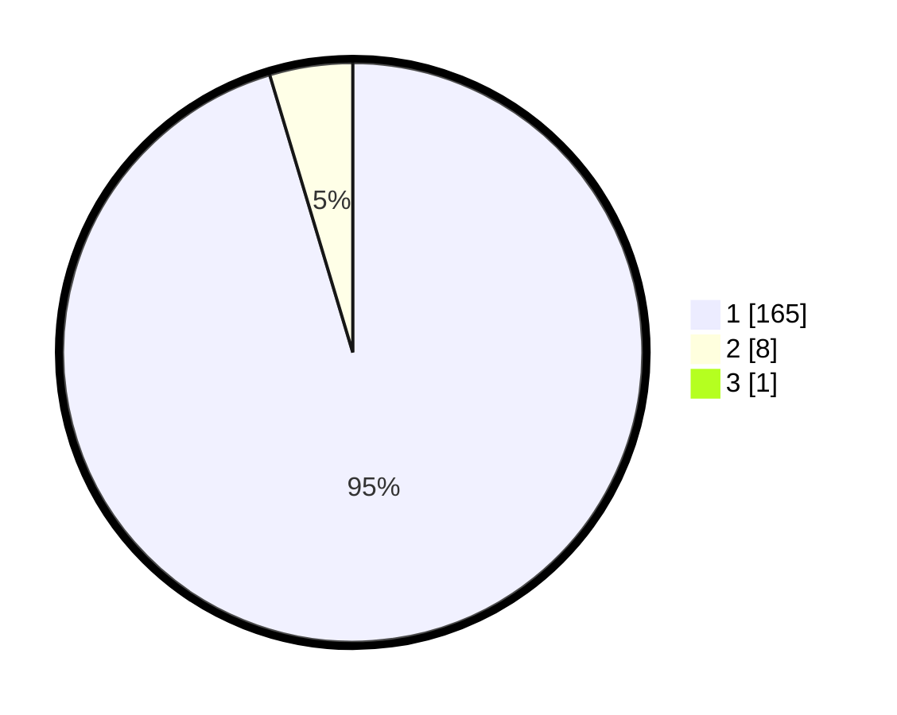

# Hasil

## Grafik

## Tabel

| No. | Nama Paslon    | Suara | Suara (raw) | Persentase |
|:--- |:-------------- | -----:| -----------:| ----------:|
| 1   | ANIES MUHAIMIN | 165   | [165][p-1]  | 94,83      |
| 2   | PRABOWO GIBRAN | 8     | [8][p-2]    | 4,60       |
| 3   | GANJAR MAHFUD  | 1     | [1][p-3]    | 0,57       |

[p-1]: https://github.com/gigit-pemilu/pemilu-2024/blob/main/pilpres/hitung-suara/sub/11-aceh/sub/01-aceh-selatan/sub/02-kluet-utara/sub/2017-suaq-geuringgeng/sub/001-tps/sub/paslon-1.txt
[p-2]: https://github.com/gigit-pemilu/pemilu-2024/blob/main/pilpres/hitung-suara/sub/11-aceh/sub/01-aceh-selatan/sub/02-kluet-utara/sub/2017-suaq-geuringgeng/sub/001-tps/sub/paslon-2.txt
[p-3]: https://github.com/gigit-pemilu/pemilu-2024/blob/main/pilpres/hitung-suara/sub/11-aceh/sub/01-aceh-selatan/sub/02-kluet-utara/sub/2017-suaq-geuringgeng/sub/001-tps/sub/paslon-3.txt

## Foto C Plano

https://sirekap-obj-formc.kpu.go.id/db83/pemilu/ppwp/11/01/02/20/17/1101022017001-20240216-215043--51cd85b3-39df-42a4-86f5-bcb2886b0cdd.jpg

https://sirekap-obj-formc.kpu.go.id/db83/pemilu/ppwp/11/01/02/20/17/1101022017001-20240216-215044--4e40e2bf-9cba-41c9-a88c-41b8797423ca.jpg

https://sirekap-obj-formc.kpu.go.id/db83/pemilu/ppwp/11/01/02/20/17/1101022017001-20240216-215043--d08b592e-53b7-4b61-af02-d71d39bd60c7.jpg

## Metadata

| Key        | Value               |
| ---------- | ------------------- |
| Time Stamp | 2024-02-17 14:45:18 |

## DATA PEMILIH TETAP

Jumlah pemilih dalam DPT: **179**.
 * L: **85**.
 * P: **94**.

## DATA PENGGUNA HAK PILIH

Jumlah pengguna hak pilih dalam DPT: **179**.
 * L: **85**.
 * P: **94**.

Jumlah pengguna hak pilih dalam DPTb: **1**.
 * L: **0**.
 * P: **1**.

Jumlah pengguna hak pilih dalam DPK: **0**.
 * L: **0**.
 * P: **0**.

Jumlah pengguna hak pilih: **174**.
 * L: **81**.
 * P: **93**.

## JUMLAH SUARA SAH DAN TIDAK SAH

JUMLAH SELURUH SUARA SAH: **174**.

JUMLAH SUARA TIDAK SAH: **0**.

JUMLAH SELURUH SUARA SAH DAN SUARA TIDAK SAH: **174**.

