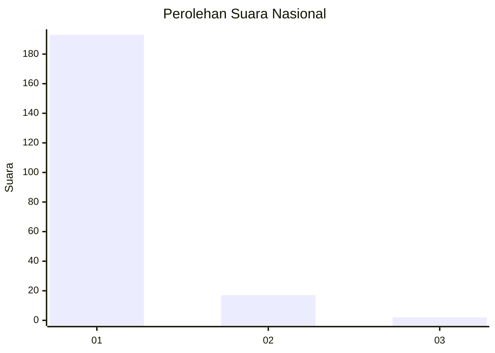
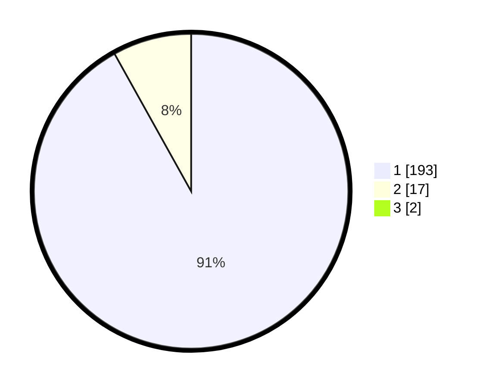

# Hasil

## Grafik

## Tabel

| No. | Nama Paslon    | Suara | Suara (raw) | Persentase |
|:--- |:-------------- | -----:| -----------:| ----------:|
| 1   | ANIES MUHAIMIN | 193   | [193][p-1]  | 91,04      |
| 2   | PRABOWO GIBRAN | 17    | [17][p-2]   | 8,02       |
| 3   | GANJAR MAHFUD  | 2     | [2][p-3]    | 0,94       |

[p-1]: https://github.com/gigit-pemilu/pemilu-2024/blob/main/pilpres/hitung-suara/sub/11-aceh/sub/01-aceh-selatan/sub/02-kluet-utara/sub/2018-pasi-kuala-ba'u/sub/001-tps/sub/paslon-1.txt
[p-2]: https://github.com/gigit-pemilu/pemilu-2024/blob/main/pilpres/hitung-suara/sub/11-aceh/sub/01-aceh-selatan/sub/02-kluet-utara/sub/2018-pasi-kuala-ba'u/sub/001-tps/sub/paslon-2.txt
[p-3]: https://github.com/gigit-pemilu/pemilu-2024/blob/main/pilpres/hitung-suara/sub/11-aceh/sub/01-aceh-selatan/sub/02-kluet-utara/sub/2018-pasi-kuala-ba'u/sub/001-tps/sub/paslon-3.txt

## Foto C Plano

https://sirekap-obj-formc.kpu.go.id/a0f5/pemilu/ppwp/11/01/02/20/18/1101022018001-20240214-202543--1da2a9e0-041c-4bed-b744-7290c8ce2af8.jpg

https://sirekap-obj-formc.kpu.go.id/a0f5/pemilu/ppwp/11/01/02/20/18/1101022018001-20240216-142207--449df944-aa70-4c37-9528-fd7e8601e50d.jpg

https://sirekap-obj-formc.kpu.go.id/a0f5/pemilu/ppwp/11/01/02/20/18/1101022018001-20240214-202910--f4c2cf72-13f1-44f8-98e7-ecd0003ccc17.jpg

## Metadata

| Key        | Value               |
| ---------- | ------------------- |
| Time Stamp | 2024-02-16 21:01:00 |

## DATA PEMILIH TETAP

Jumlah pemilih dalam DPT: **219**.
 * L: **107**.
 * P: **112**.

## DATA PENGGUNA HAK PILIH

Jumlah pengguna hak pilih dalam DPT: **214**.
 * L: **101**.
 * P: **113**.

Jumlah pengguna hak pilih dalam DPTb: **0**.
 * L: **0**.
 * P: **0**.

Jumlah pengguna hak pilih dalam DPK: **0**.
 * L: **0**.
 * P: **0**.

Jumlah pengguna hak pilih: **214**.
 * L: **101**.
 * P: **113**.

## JUMLAH SUARA SAH DAN TIDAK SAH

JUMLAH SELURUH SUARA SAH: **212**.

JUMLAH SUARA TIDAK SAH: **2**.

JUMLAH SELURUH SUARA SAH DAN SUARA TIDAK SAH: **214**.

