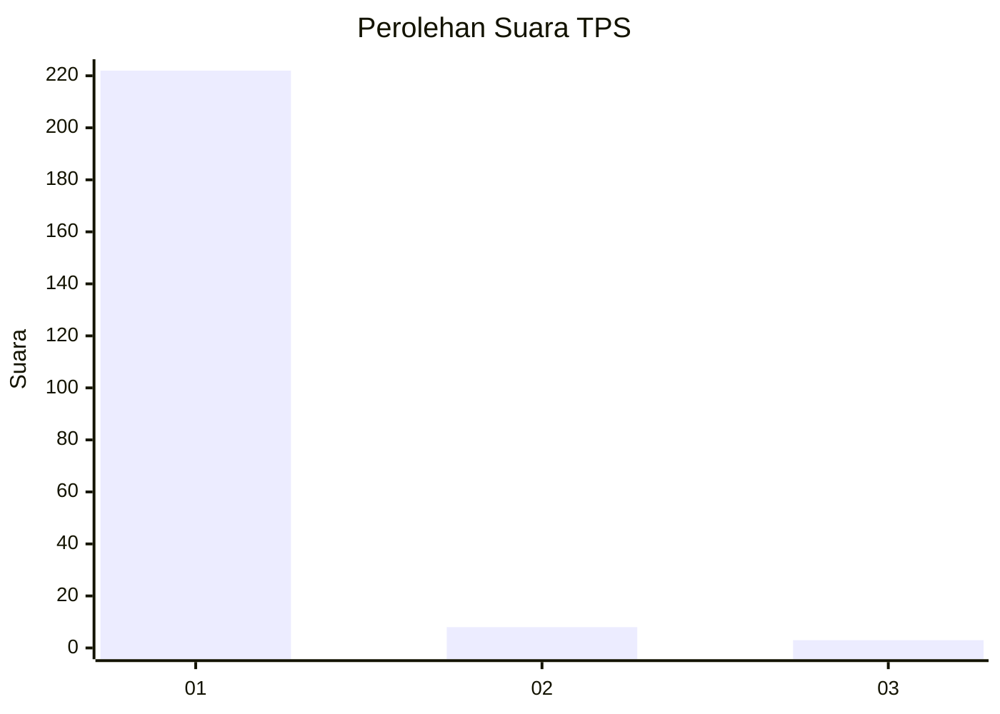
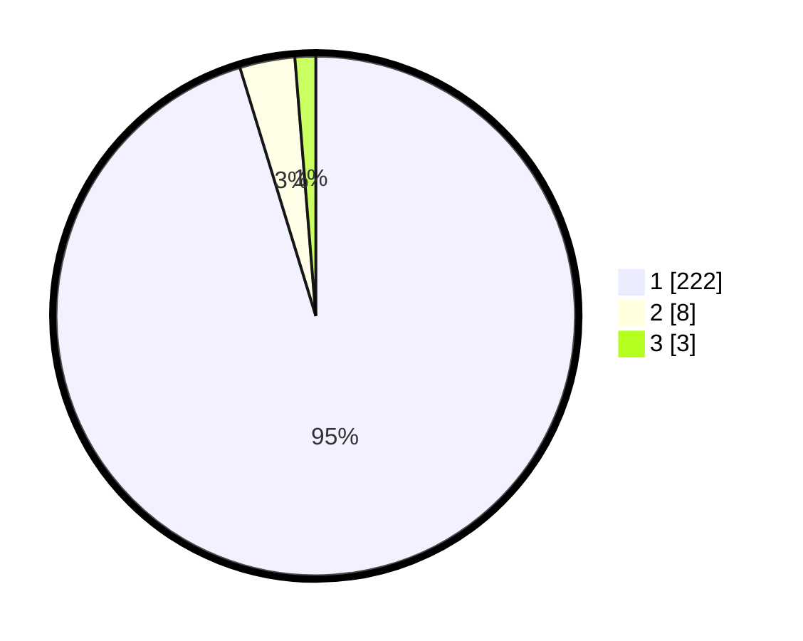

# Hasil

## Grafik

## Tabel

| No. | Nama Paslon    | Suara | Suara (raw) | Persentase |
|:--- |:-------------- | -----:| -----------:| ----------:|
| 1   | ANIES MUHAIMIN | 222   | [222][p-1]  | 95,28      |
| 2   | PRABOWO GIBRAN | 8     | [8][p-2]    | 3,43       |
| 3   | GANJAR MAHFUD  | 3     | [3][p-3]    | 1,29       |

[p-1]: https://github.com/gigit-pemilu/pemilu-2024-11-aceh/blob/main/pilpres/hitung-suara/sub/11-aceh/sub/01-aceh-selatan/sub/02-kluet-utara/sub/2018-pasi-kuala-ba'u/sub/002-tps/sub/paslon-1.txt
[p-2]: https://github.com/gigit-pemilu/pemilu-2024-11-aceh/blob/main/pilpres/hitung-suara/sub/11-aceh/sub/01-aceh-selatan/sub/02-kluet-utara/sub/2018-pasi-kuala-ba'u/sub/002-tps/sub/paslon-2.txt
[p-3]: https://github.com/gigit-pemilu/pemilu-2024-11-aceh/blob/main/pilpres/hitung-suara/sub/11-aceh/sub/01-aceh-selatan/sub/02-kluet-utara/sub/2018-pasi-kuala-ba'u/sub/002-tps/sub/paslon-3.txt

## Foto C Plano

https://sirekap-obj-formc.kpu.go.id/a2c3/pemilu/ppwp/11/01/02/20/18/1101022018002-20240216-010516--e9745dc8-835e-4c69-bfe3-6eed729f80ae.jpg

https://sirekap-obj-formc.kpu.go.id/a2c3/pemilu/ppwp/11/01/02/20/18/1101022018002-20240216-010520--ca9e4b95-8ed6-4b70-b01a-cd588862c9cc.jpg

https://sirekap-obj-formc.kpu.go.id/a2c3/pemilu/ppwp/11/01/02/20/18/1101022018002-20240216-010518--1e615ea1-643c-487c-ba5e-373583de4713.jpg

## Metadata

| Key        | Value               |
| ---------- | ------------------- |
| Time Stamp | 2024-02-16 11:00:29 |

## DATA PEMILIH TETAP

Jumlah pemilih dalam DPT: **257**.
 * L: **118**.
 * P: **139**.

## DATA PENGGUNA HAK PILIH

Jumlah pengguna hak pilih dalam DPT: **240**.
 * L: **110**.
 * P: **130**.

Jumlah pengguna hak pilih dalam DPTb: **0**.
 * L: **0**.
 * P: **0**.

Jumlah pengguna hak pilih dalam DPK: **0**.
 * L: **0**.
 * P: **0**.

Jumlah pengguna hak pilih: **240**.
 * L: **110**.
 * P: **130**.

## JUMLAH SUARA SAH DAN TIDAK SAH

JUMLAH SELURUH SUARA SAH: **233**.

JUMLAH SUARA TIDAK SAH: **7**.

JUMLAH SELURUH SUARA SAH DAN SUARA TIDAK SAH: **240**.

