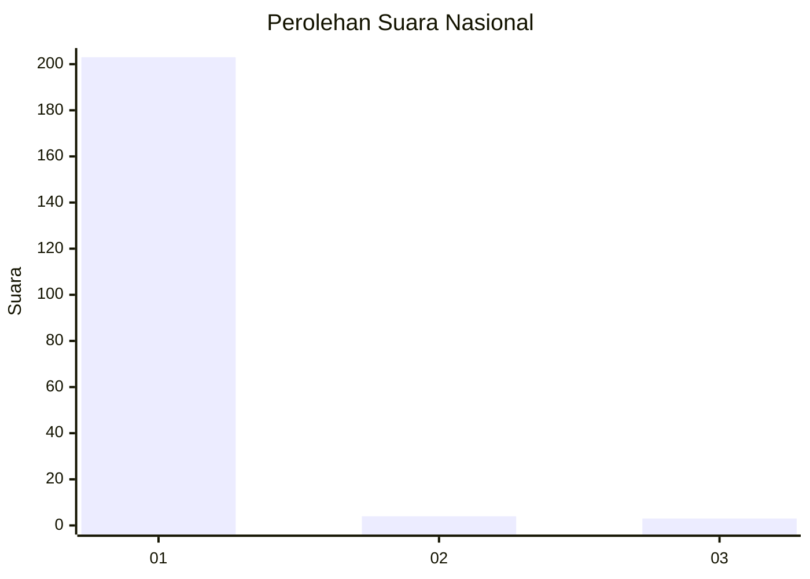
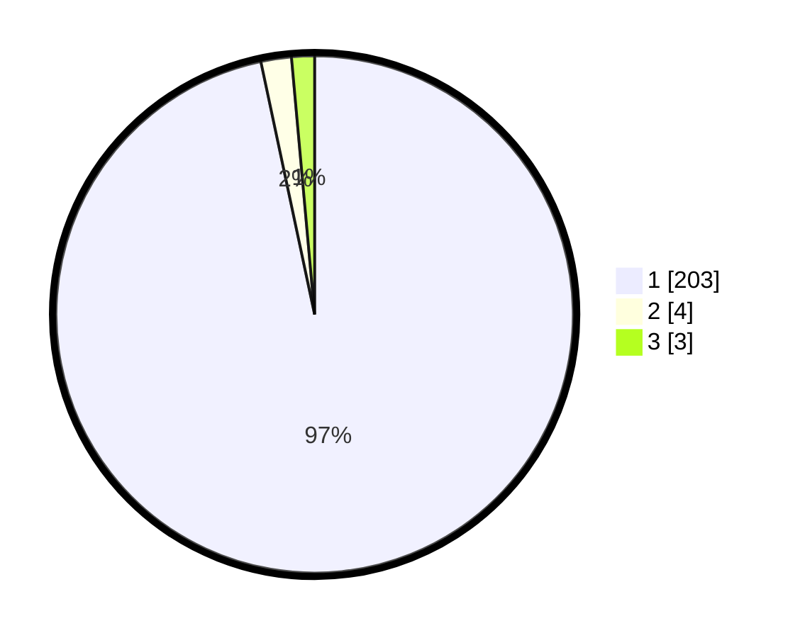

# Hasil

## Grafik

## Tabel

| No. | Nama Paslon    | Suara | Suara (raw) | Persentase |
|:--- |:-------------- | -----:| -----------:| ----------:|
| 1   | ANIES MUHAIMIN | 203   | [203][p-1]  | 96,67      |
| 2   | PRABOWO GIBRAN | 4     | [4][p-2]    | 1,90       |
| 3   | GANJAR MAHFUD  | 3     | [3][p-3]    | 1,43       |

[p-1]: https://github.com/gigit-pemilu/pemilu-2024/blob/main/pilpres/hitung-suara/sub/11-aceh/sub/01-aceh-selatan/sub/02-kluet-utara/sub/2018-pasi-kuala-ba'u/sub/003-tps/sub/paslon-1.txt
[p-2]: https://github.com/gigit-pemilu/pemilu-2024/blob/main/pilpres/hitung-suara/sub/11-aceh/sub/01-aceh-selatan/sub/02-kluet-utara/sub/2018-pasi-kuala-ba'u/sub/003-tps/sub/paslon-2.txt
[p-3]: https://github.com/gigit-pemilu/pemilu-2024/blob/main/pilpres/hitung-suara/sub/11-aceh/sub/01-aceh-selatan/sub/02-kluet-utara/sub/2018-pasi-kuala-ba'u/sub/003-tps/sub/paslon-3.txt

## Foto C Plano

https://sirekap-obj-formc.kpu.go.id/5233/pemilu/ppwp/11/01/02/20/18/1101022018003-20240216-142515--58fdad71-4eb4-42ec-ae80-d2b57907e174.jpg

https://sirekap-obj-formc.kpu.go.id/5233/pemilu/ppwp/11/01/02/20/18/1101022018003-20240216-142516--413ab037-aa04-4ee8-b1c0-2cd699affe11.jpg

https://sirekap-obj-formc.kpu.go.id/5233/pemilu/ppwp/11/01/02/20/18/1101022018003-20240215-022834--444c57d6-3fb4-47db-b466-d56a617f9607.jpg

## Metadata

| Key        | Value               |
| ---------- | ------------------- |
| Time Stamp | 2024-02-16 21:01:00 |

## DATA PEMILIH TETAP

Jumlah pemilih dalam DPT: **231**.
 * L: **107**.
 * P: **124**.

## DATA PENGGUNA HAK PILIH

Jumlah pengguna hak pilih dalam DPT: **222**.
 * L: **103**.
 * P: **119**.

Jumlah pengguna hak pilih dalam DPTb: **0**.
 * L: **0**.
 * P: **0**.

Jumlah pengguna hak pilih dalam DPK: **2**.
 * L: **1**.
 * P: **1**.

Jumlah pengguna hak pilih: **224**.
 * L: **104**.
 * P: **120**.

## JUMLAH SUARA SAH DAN TIDAK SAH

JUMLAH SELURUH SUARA SAH: **220**.

JUMLAH SUARA TIDAK SAH: **4**.

JUMLAH SELURUH SUARA SAH DAN SUARA TIDAK SAH: **224**.

