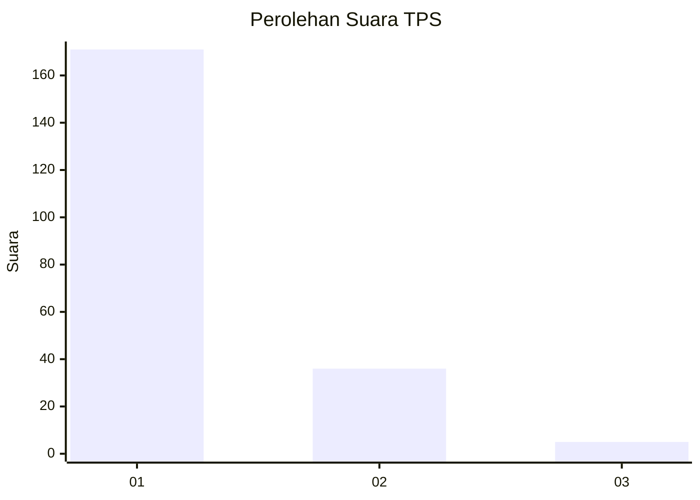
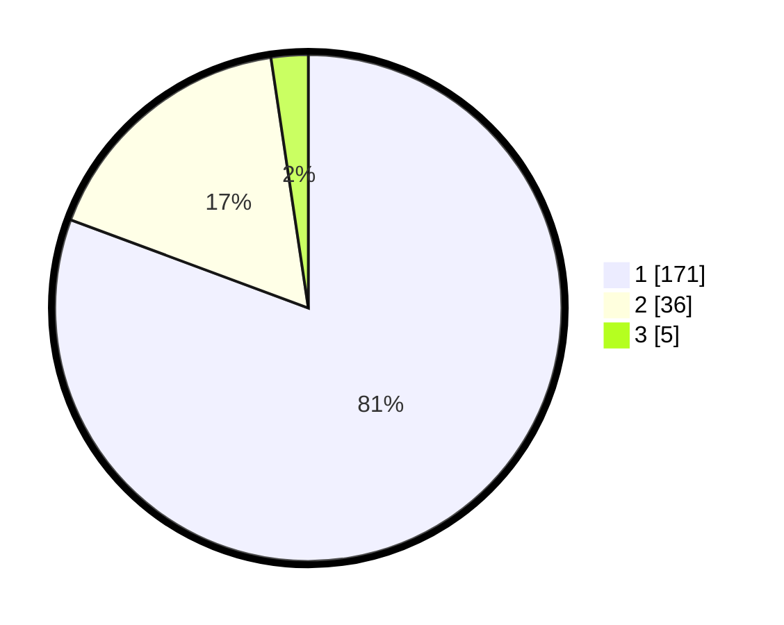

# Hasil

## Grafik

## Tabel

| No. | Nama Paslon    | Suara | Suara (raw) | Persentase |
|:--- |:-------------- | -----:| -----------:| ----------:|
| 1   | ANIES MUHAIMIN | 171   | [171][p-1]  | 80,66      |
| 2   | PRABOWO GIBRAN | 36    | [36][p-2]   | 16,98      |
| 3   | GANJAR MAHFUD  | 5     | [5][p-3]    | 2,36       |

[p-1]: https://github.com/gigit-pemilu/pemilu-2024-11-aceh/blob/main/pilpres/hitung-suara/sub/11-aceh/sub/01-aceh-selatan/sub/02-kluet-utara/sub/2020-kotafajar/sub/002-tps/sub/paslon-1.txt
[p-2]: https://github.com/gigit-pemilu/pemilu-2024-11-aceh/blob/main/pilpres/hitung-suara/sub/11-aceh/sub/01-aceh-selatan/sub/02-kluet-utara/sub/2020-kotafajar/sub/002-tps/sub/paslon-2.txt
[p-3]: https://github.com/gigit-pemilu/pemilu-2024-11-aceh/blob/main/pilpres/hitung-suara/sub/11-aceh/sub/01-aceh-selatan/sub/02-kluet-utara/sub/2020-kotafajar/sub/002-tps/sub/paslon-3.txt

## Foto C Plano

https://sirekap-obj-formc.kpu.go.id/9315/pemilu/ppwp/11/01/02/20/20/1101022020002-20240216-155628--ce62185b-b253-478c-a2ee-e2d7ba5ffa9d.jpg

https://sirekap-obj-formc.kpu.go.id/9315/pemilu/ppwp/11/01/02/20/20/1101022020002-20240216-155629--a586c305-38a9-49cf-99c6-02bf0cc8b8ed.jpg

https://sirekap-obj-formc.kpu.go.id/9315/pemilu/ppwp/11/01/02/20/20/1101022020002-20240216-155628--d6c4019b-26d5-4613-9a5c-ce676d3dc03e.jpg

## Metadata

| Key        | Value               |
| ---------- | ------------------- |
| Time Stamp | 2024-02-16 21:01:00 |

## DATA PEMILIH TETAP

Jumlah pemilih dalam DPT: **253**.
 * L: **130**.
 * P: **123**.

## DATA PENGGUNA HAK PILIH

Jumlah pengguna hak pilih dalam DPT: **208**.
 * L: **111**.
 * P: **97**.

Jumlah pengguna hak pilih dalam DPTb: **1**.
 * L: **1**.
 * P: **0**.

Jumlah pengguna hak pilih dalam DPK: **6**.
 * L: **5**.
 * P: **1**.

Jumlah pengguna hak pilih: **215**.
 * L: **117**.
 * P: **98**.

## JUMLAH SUARA SAH DAN TIDAK SAH

JUMLAH SELURUH SUARA SAH: **212**.

JUMLAH SUARA TIDAK SAH: **3**.

JUMLAH SELURUH SUARA SAH DAN SUARA TIDAK SAH: **215**.

