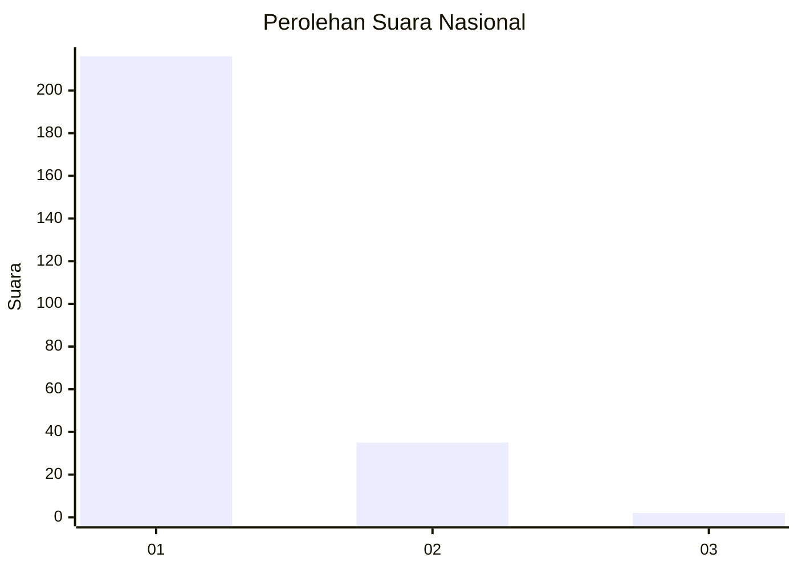
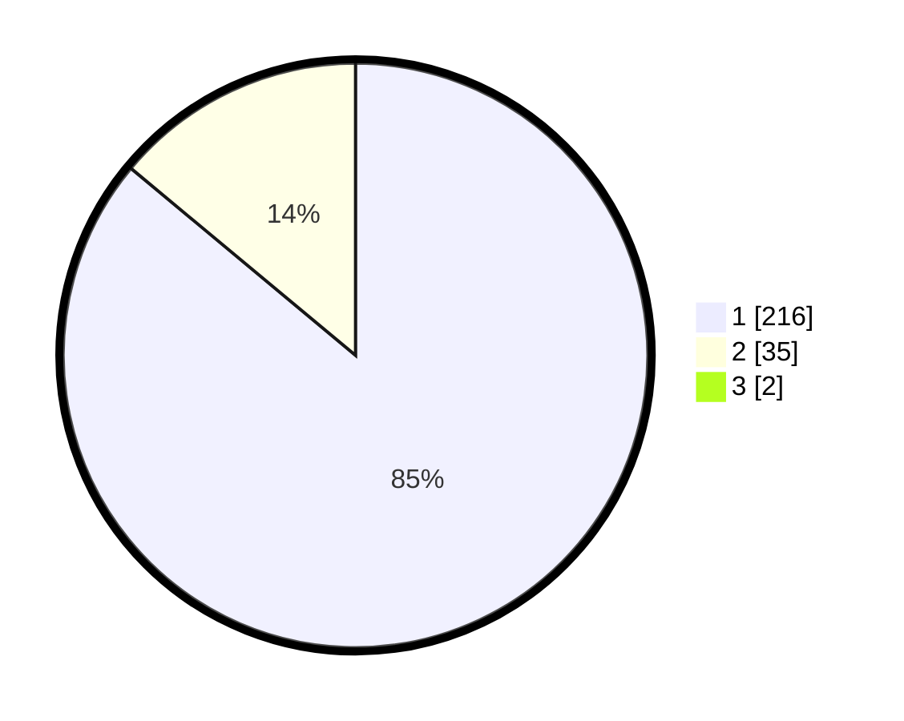

# Hasil

## Grafik

## Tabel

| No. | Nama Paslon    | Suara | Suara (raw) | Persentase |
|:--- |:-------------- | -----:| -----------:| ----------:|
| 1   | ANIES MUHAIMIN | 216   | [216][p-1]  | 85,38      |
| 2   | PRABOWO GIBRAN | 35    | [35][p-2]   | 13,83      |
| 3   | GANJAR MAHFUD  | 2     | [2][p-3]    | 0,79       |

[p-1]: https://github.com/gigit-pemilu/pemilu-2024/blob/main/pilpres/hitung-suara/sub/11-aceh/sub/01-aceh-selatan/sub/02-kluet-utara/sub/2020-kotafajar/sub/005-tps/sub/paslon-1.txt
[p-2]: https://github.com/gigit-pemilu/pemilu-2024/blob/main/pilpres/hitung-suara/sub/11-aceh/sub/01-aceh-selatan/sub/02-kluet-utara/sub/2020-kotafajar/sub/005-tps/sub/paslon-2.txt
[p-3]: https://github.com/gigit-pemilu/pemilu-2024/blob/main/pilpres/hitung-suara/sub/11-aceh/sub/01-aceh-selatan/sub/02-kluet-utara/sub/2020-kotafajar/sub/005-tps/sub/paslon-3.txt

## Foto C Plano

https://sirekap-obj-formc.kpu.go.id/8969/pemilu/ppwp/11/01/02/20/20/1101022020005-20240224-155553--1b5426f2-6487-443a-8e80-d2eb8c9f5927.jpg

https://sirekap-obj-formc.kpu.go.id/8969/pemilu/ppwp/11/01/02/20/20/1101022020005-20240224-155555--cb277e69-c95f-4073-be3b-29faf34f7b0f.jpg

https://sirekap-obj-formc.kpu.go.id/8969/pemilu/ppwp/11/01/02/20/20/1101022020005-20240224-155554--6c421875-443a-4584-a3cb-0e8a86b10a24.jpg

## Metadata

| Key        | Value               |
| ---------- | ------------------- |
| Time Stamp | 2024-02-25 13:00:00 |

## DATA PEMILIH TETAP

Jumlah pemilih dalam DPT: **294**.
 * L: **146**.
 * P: **148**.

## DATA PENGGUNA HAK PILIH

Jumlah pengguna hak pilih dalam DPT: **243**.
 * L: **115**.
 * P: **128**.

Jumlah pengguna hak pilih dalam DPTb: **0**.
 * L: **0**.
 * P: **0**.

Jumlah pengguna hak pilih dalam DPK: **12**.
 * L: **4**.
 * P: **8**.

Jumlah pengguna hak pilih: **255**.
 * L: **119**.
 * P: **136**.

## JUMLAH SUARA SAH DAN TIDAK SAH

JUMLAH SELURUH SUARA SAH: **253**.

JUMLAH SUARA TIDAK SAH: **2**.

JUMLAH SELURUH SUARA SAH DAN SUARA TIDAK SAH: **255**.

