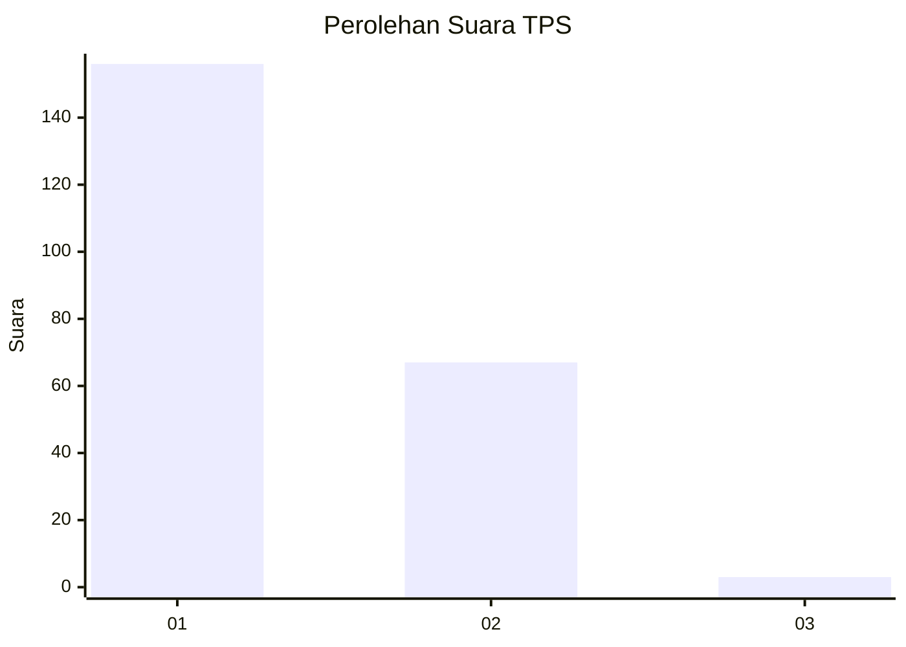
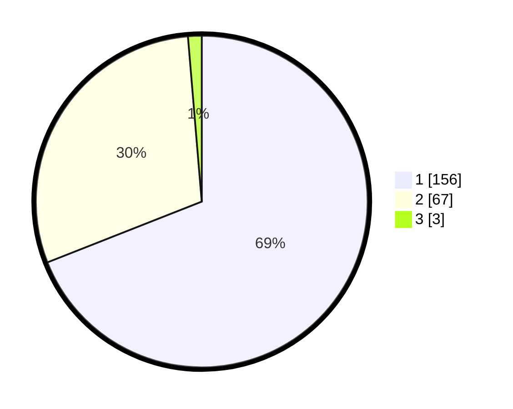

# Hasil

## Grafik

## Tabel

| No. | Nama Paslon    | Suara | Suara (raw) | Persentase |
|:--- |:-------------- | -----:| -----------:| ----------:|
| 1   | ANIES MUHAIMIN | 156   | [156][p-1]  | 69,03      |
| 2   | PRABOWO GIBRAN | 67    | [67][p-2]   | 29,65      |
| 3   | GANJAR MAHFUD  | 3     | [3][p-3]    | 1,33       |

[p-1]: https://github.com/gigit-pemilu/pemilu-2024-11-aceh/blob/main/pilpres/hitung-suara/sub/11-aceh/sub/01-aceh-selatan/sub/03-kluet-selatan/sub/2001-suaq-bakung/sub/001-tps/sub/paslon-1.txt
[p-2]: https://github.com/gigit-pemilu/pemilu-2024-11-aceh/blob/main/pilpres/hitung-suara/sub/11-aceh/sub/01-aceh-selatan/sub/03-kluet-selatan/sub/2001-suaq-bakung/sub/001-tps/sub/paslon-2.txt
[p-3]: https://github.com/gigit-pemilu/pemilu-2024-11-aceh/blob/main/pilpres/hitung-suara/sub/11-aceh/sub/01-aceh-selatan/sub/03-kluet-selatan/sub/2001-suaq-bakung/sub/001-tps/sub/paslon-3.txt

## Foto C Plano

https://sirekap-obj-formc.kpu.go.id/5ba5/pemilu/ppwp/11/01/03/20/01/1101032001001-20240216-190405--24d15d9c-ad16-4132-b0bf-1705aecb7763.jpg

https://sirekap-obj-formc.kpu.go.id/5ba5/pemilu/ppwp/11/01/03/20/01/1101032001001-20240216-190406--eac3fa00-2925-4fd9-9190-0f13265dfb37.jpg

https://sirekap-obj-formc.kpu.go.id/5ba5/pemilu/ppwp/11/01/03/20/01/1101032001001-20240216-190405--f3a18381-1a76-4a2f-aae7-f446611c5c97.jpg

## Metadata

| Key        | Value               |
| ---------- | ------------------- |
| Time Stamp | 2024-02-16 21:01:00 |

## DATA PEMILIH TETAP

Jumlah pemilih dalam DPT: **263**.
 * L: **117**.
 * P: **146**.

## DATA PENGGUNA HAK PILIH

Jumlah pengguna hak pilih dalam DPT: **227**.
 * L: **100**.
 * P: **127**.

Jumlah pengguna hak pilih dalam DPTb: **0**.
 * L: **0**.
 * P: **0**.

Jumlah pengguna hak pilih dalam DPK: **3**.
 * L: **2**.
 * P: **1**.

Jumlah pengguna hak pilih: **230**.
 * L: **102**.
 * P: **128**.

## JUMLAH SUARA SAH DAN TIDAK SAH

JUMLAH SELURUH SUARA SAH: **226**.

JUMLAH SUARA TIDAK SAH: **4**.

JUMLAH SELURUH SUARA SAH DAN SUARA TIDAK SAH: **230**.

