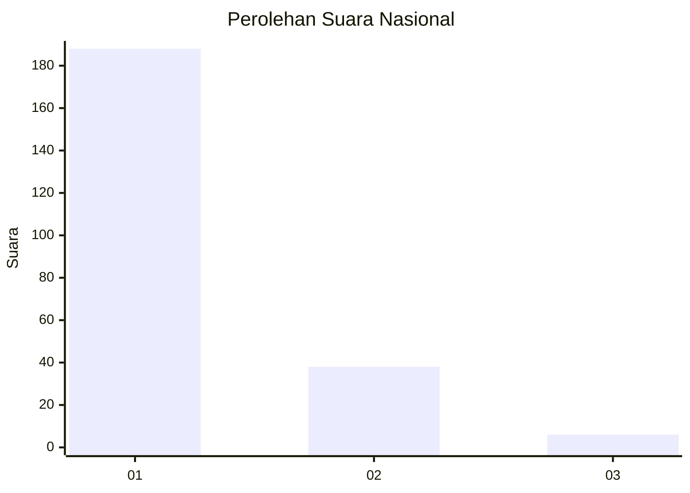
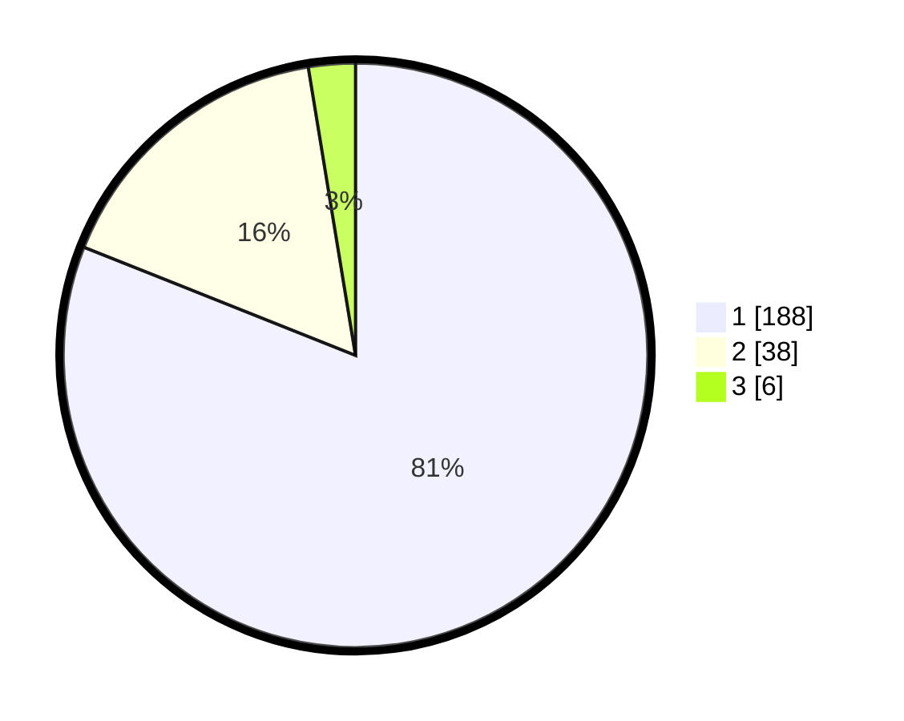

# Hasil

## Grafik

## Tabel

| No. | Nama Paslon    | Suara | Suara (raw) | Persentase |
|:--- |:-------------- | -----:| -----------:| ----------:|
| 1   | ANIES MUHAIMIN | 188   | [188][p-1]  | 81,03      |
| 2   | PRABOWO GIBRAN | 38    | [38][p-2]   | 16,38      |
| 3   | GANJAR MAHFUD  | 6     | [6][p-3]    | 2,59       |

[p-1]: https://github.com/gigit-pemilu/pemilu-2024/blob/main/pilpres/hitung-suara/sub/11-aceh/sub/01-aceh-selatan/sub/03-kluet-selatan/sub/2001-suaq-bakung/sub/002-tps/sub/paslon-1.txt
[p-2]: https://github.com/gigit-pemilu/pemilu-2024/blob/main/pilpres/hitung-suara/sub/11-aceh/sub/01-aceh-selatan/sub/03-kluet-selatan/sub/2001-suaq-bakung/sub/002-tps/sub/paslon-2.txt
[p-3]: https://github.com/gigit-pemilu/pemilu-2024/blob/main/pilpres/hitung-suara/sub/11-aceh/sub/01-aceh-selatan/sub/03-kluet-selatan/sub/2001-suaq-bakung/sub/002-tps/sub/paslon-3.txt

## Foto C Plano

https://sirekap-obj-formc.kpu.go.id/4352/pemilu/ppwp/11/01/03/20/01/1101032001002-20240216-142031--ea624810-a722-41b3-88a3-a560d317d69c.jpg

https://sirekap-obj-formc.kpu.go.id/4352/pemilu/ppwp/11/01/03/20/01/1101032001002-20240216-142033--cb5c92dc-abb7-4e57-889b-27dc680f8c8e.jpg

https://sirekap-obj-formc.kpu.go.id/4352/pemilu/ppwp/11/01/03/20/01/1101032001002-20240216-142032--016f7107-23a2-45e3-81a2-ce55b28616f9.jpg

## Metadata

| Key        | Value               |
| ---------- | ------------------- |
| Time Stamp | 2024-02-16 21:01:00 |

## DATA PEMILIH TETAP

Jumlah pemilih dalam DPT: **264**.
 * L: **115**.
 * P: **149**.

## DATA PENGGUNA HAK PILIH

Jumlah pengguna hak pilih dalam DPT: **232**.
 * L: **99**.
 * P: **133**.

Jumlah pengguna hak pilih dalam DPTb: **0**.
 * L: **0**.
 * P: **0**.

Jumlah pengguna hak pilih dalam DPK: **2**.
 * L: **1**.
 * P: **1**.

Jumlah pengguna hak pilih: **234**.
 * L: **100**.
 * P: **134**.

## JUMLAH SUARA SAH DAN TIDAK SAH

JUMLAH SELURUH SUARA SAH: **232**.

JUMLAH SUARA TIDAK SAH: **2**.

JUMLAH SELURUH SUARA SAH DAN SUARA TIDAK SAH: **234**.

