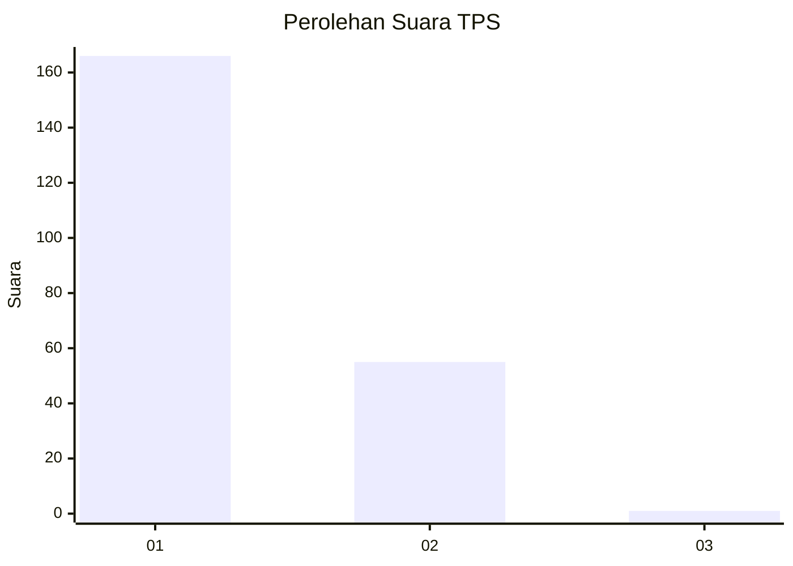
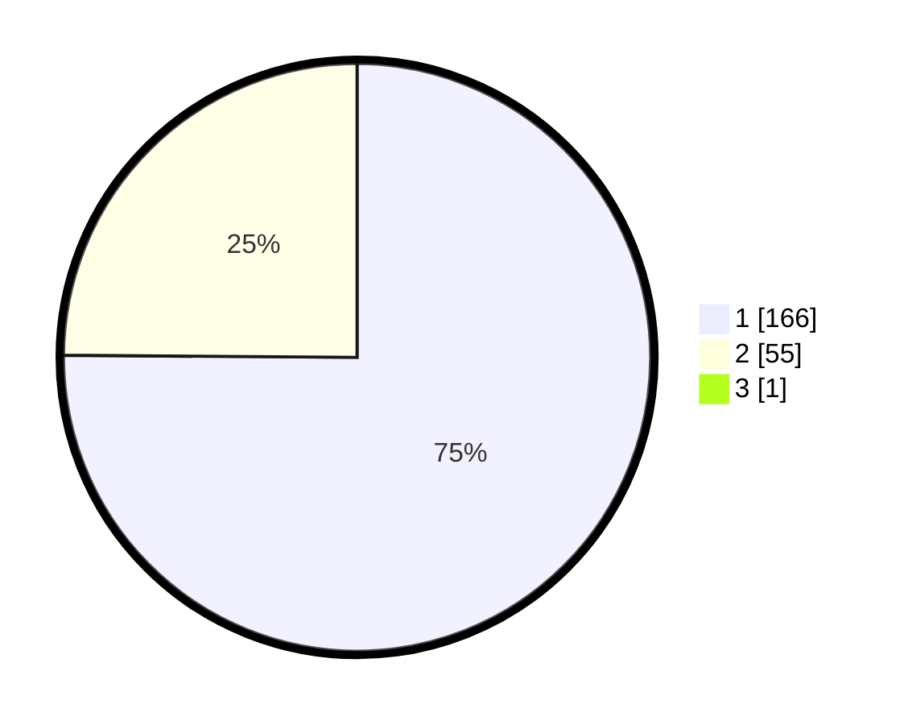

# Hasil

## Grafik

## Tabel

| No. | Nama Paslon    | Suara | Suara (raw) | Persentase |
|:--- |:-------------- | -----:| -----------:| ----------:|
| 1   | ANIES MUHAIMIN | 166   | [166][p-1]  | 74,77      |
| 2   | PRABOWO GIBRAN | 55    | [55][p-2]   | 24,77      |
| 3   | GANJAR MAHFUD  | 1     | [1][p-3]    | 0,45       |

[p-1]: https://github.com/gigit-pemilu/pemilu-2024-11-aceh/blob/main/pilpres/hitung-suara/sub/11-aceh/sub/01-aceh-selatan/sub/03-kluet-selatan/sub/2001-suaq-bakung/sub/003-tps/sub/paslon-1.txt
[p-2]: https://github.com/gigit-pemilu/pemilu-2024-11-aceh/blob/main/pilpres/hitung-suara/sub/11-aceh/sub/01-aceh-selatan/sub/03-kluet-selatan/sub/2001-suaq-bakung/sub/003-tps/sub/paslon-2.txt
[p-3]: https://github.com/gigit-pemilu/pemilu-2024-11-aceh/blob/main/pilpres/hitung-suara/sub/11-aceh/sub/01-aceh-selatan/sub/03-kluet-selatan/sub/2001-suaq-bakung/sub/003-tps/sub/paslon-3.txt

## Foto C Plano

https://sirekap-obj-formc.kpu.go.id/d587/pemilu/ppwp/11/01/03/20/01/1101032001003-20240216-154953--96635965-80d1-4f88-9b77-00dc2b0ac675.jpg

https://sirekap-obj-formc.kpu.go.id/d587/pemilu/ppwp/11/01/03/20/01/1101032001003-20240216-154955--bf15dc60-93b8-46b3-ade4-e89c8a441c5d.jpg

https://sirekap-obj-formc.kpu.go.id/d587/pemilu/ppwp/11/01/03/20/01/1101032001003-20240216-154954--260cd8ac-7ba8-4286-becf-e98143ec8214.jpg

## Metadata

| Key        | Value               |
| ---------- | ------------------- |
| Time Stamp | 2024-02-16 21:01:00 |

## DATA PEMILIH TETAP

Jumlah pemilih dalam DPT: **254**.
 * L: **124**.
 * P: **130**.

## DATA PENGGUNA HAK PILIH

Jumlah pengguna hak pilih dalam DPT: **226**.
 * L: **108**.
 * P: **118**.

Jumlah pengguna hak pilih dalam DPTb: **1**.
 * L: **1**.
 * P: **0**.

Jumlah pengguna hak pilih dalam DPK: **1**.
 * L: **0**.
 * P: **1**.

Jumlah pengguna hak pilih: **228**.
 * L: **109**.
 * P: **119**.

## JUMLAH SUARA SAH DAN TIDAK SAH

JUMLAH SELURUH SUARA SAH: **222**.

JUMLAH SUARA TIDAK SAH: **6**.

JUMLAH SELURUH SUARA SAH DAN SUARA TIDAK SAH: **228**.

