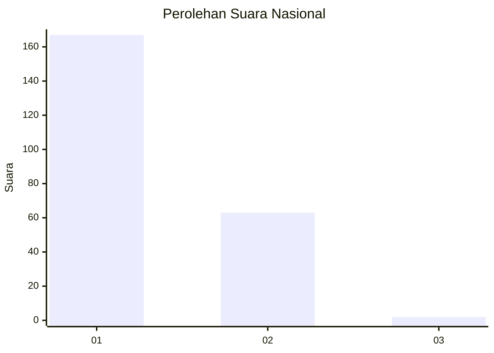
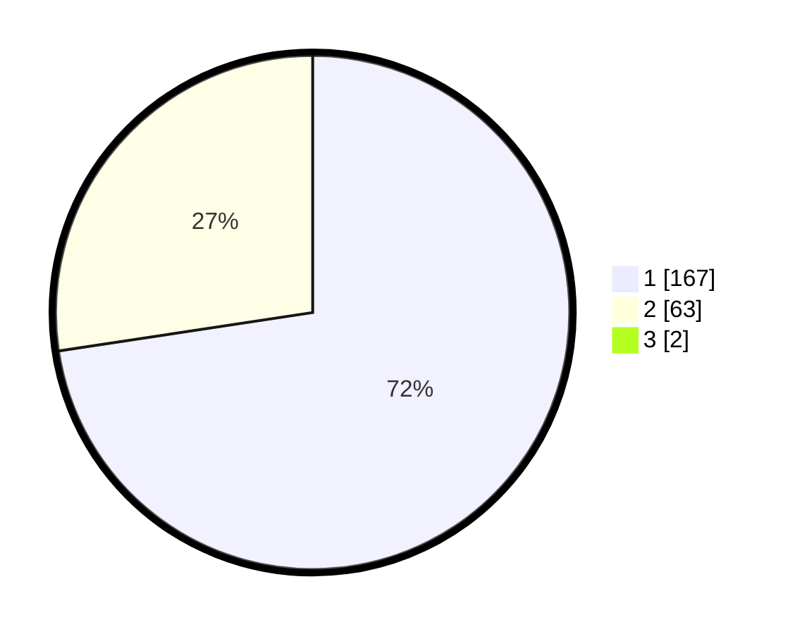

# Hasil

## Grafik

## Tabel

| No. | Nama Paslon    | Suara | Suara (raw) | Persentase |
|:--- |:-------------- | -----:| -----------:| ----------:|
| 1   | ANIES MUHAIMIN | 167   | [167][p-1]  | 71,98      |
| 2   | PRABOWO GIBRAN | 63    | [63][p-2]   | 27,16      |
| 3   | GANJAR MAHFUD  | 2     | [2][p-3]    | 0,86       |

[p-1]: https://github.com/gigit-pemilu/pemilu-2024/blob/main/pilpres/hitung-suara/sub/11-aceh/sub/01-aceh-selatan/sub/03-kluet-selatan/sub/2001-suaq-bakung/sub/004-tps/sub/paslon-1.txt
[p-2]: https://github.com/gigit-pemilu/pemilu-2024/blob/main/pilpres/hitung-suara/sub/11-aceh/sub/01-aceh-selatan/sub/03-kluet-selatan/sub/2001-suaq-bakung/sub/004-tps/sub/paslon-2.txt
[p-3]: https://github.com/gigit-pemilu/pemilu-2024/blob/main/pilpres/hitung-suara/sub/11-aceh/sub/01-aceh-selatan/sub/03-kluet-selatan/sub/2001-suaq-bakung/sub/004-tps/sub/paslon-3.txt

## Foto C Plano

https://sirekap-obj-formc.kpu.go.id/ba8d/pemilu/ppwp/11/01/03/20/01/1101032001004-20240216-141437--d1e0cbfe-fee8-46cd-ad7d-759fa9f15708.jpg

https://sirekap-obj-formc.kpu.go.id/ba8d/pemilu/ppwp/11/01/03/20/01/1101032001004-20240216-141439--ad3332de-d84a-424a-9c5c-4650d5390df0.jpg

https://sirekap-obj-formc.kpu.go.id/ba8d/pemilu/ppwp/11/01/03/20/01/1101032001004-20240216-141438--58818584-a106-4e39-9816-138cd75bc291.jpg

## Metadata

| Key        | Value               |
| ---------- | ------------------- |
| Time Stamp | 2024-02-16 21:01:00 |

## DATA PEMILIH TETAP

Jumlah pemilih dalam DPT: **263**.
 * L: **122**.
 * P: **141**.

## DATA PENGGUNA HAK PILIH

Jumlah pengguna hak pilih dalam DPT: **236**.
 * L: **106**.
 * P: **130**.

Jumlah pengguna hak pilih dalam DPTb: **0**.
 * L: **0**.
 * P: **0**.

Jumlah pengguna hak pilih dalam DPK: **0**.
 * L: **0**.
 * P: **0**.

Jumlah pengguna hak pilih: **236**.
 * L: **106**.
 * P: **130**.

## JUMLAH SUARA SAH DAN TIDAK SAH

JUMLAH SELURUH SUARA SAH: **232**.

JUMLAH SUARA TIDAK SAH: **4**.

JUMLAH SELURUH SUARA SAH DAN SUARA TIDAK SAH: **236**.

