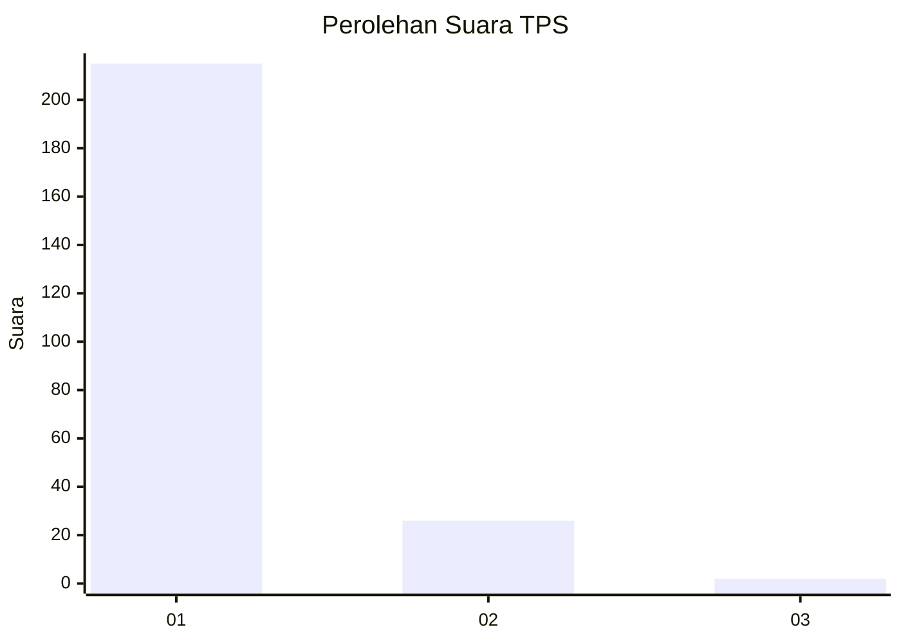
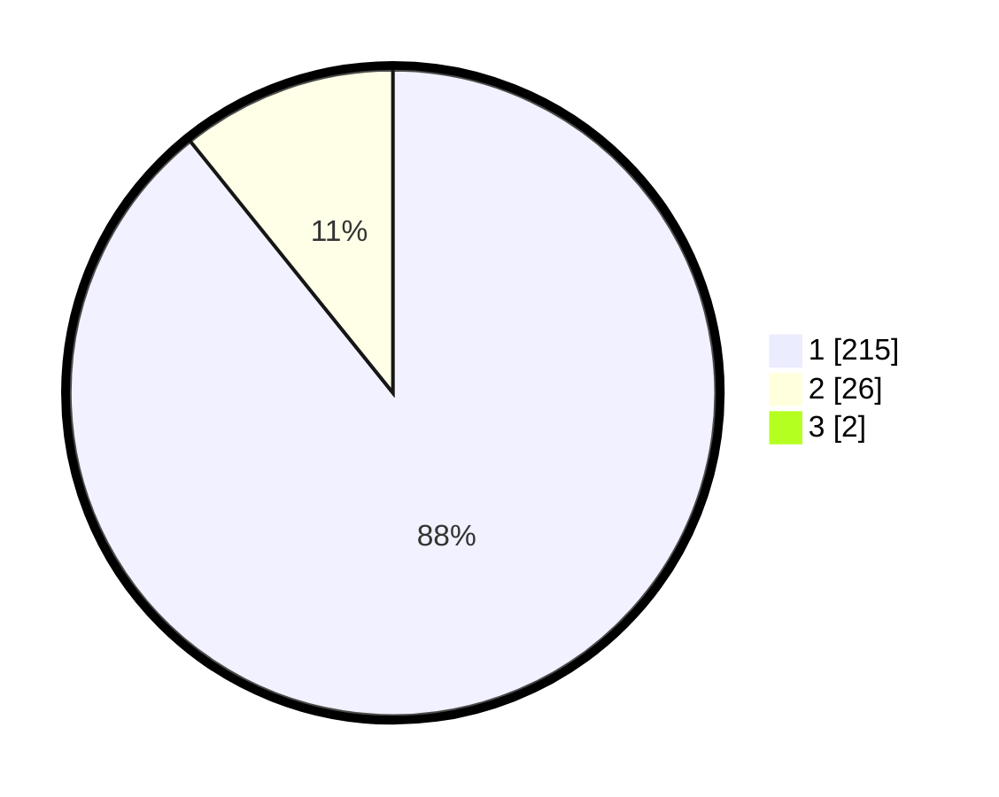

# Hasil

## Grafik

## Tabel

| No. | Nama Paslon    | Suara | Suara (raw) | Persentase |
|:--- |:-------------- | -----:| -----------:| ----------:|
| 1   | ANIES MUHAIMIN | 215   | [215][p-1]  | 88,48      |
| 2   | PRABOWO GIBRAN | 26    | [26][p-2]   | 10,70      |
| 3   | GANJAR MAHFUD  | 2     | [2][p-3]    | 0,82       |

[p-1]: https://github.com/gigit-pemilu/pemilu-2024-11-aceh/blob/main/pilpres/hitung-suara/sub/11-aceh/sub/01-aceh-selatan/sub/03-kluet-selatan/sub/2002-rantau-binuang/sub/001-tps/sub/paslon-1.txt
[p-2]: https://github.com/gigit-pemilu/pemilu-2024-11-aceh/blob/main/pilpres/hitung-suara/sub/11-aceh/sub/01-aceh-selatan/sub/03-kluet-selatan/sub/2002-rantau-binuang/sub/001-tps/sub/paslon-2.txt
[p-3]: https://github.com/gigit-pemilu/pemilu-2024-11-aceh/blob/main/pilpres/hitung-suara/sub/11-aceh/sub/01-aceh-selatan/sub/03-kluet-selatan/sub/2002-rantau-binuang/sub/001-tps/sub/paslon-3.txt

## Foto C Plano

https://sirekap-obj-formc.kpu.go.id/23de/pemilu/ppwp/11/01/03/20/02/1101032002001-20240216-083941--8399f53b-974a-404b-8b40-a5fc42c76024.jpg

https://sirekap-obj-formc.kpu.go.id/23de/pemilu/ppwp/11/01/03/20/02/1101032002001-20240216-083943--1518a53f-f319-4913-abc9-152af662b463.jpg

https://sirekap-obj-formc.kpu.go.id/23de/pemilu/ppwp/11/01/03/20/02/1101032002001-20240216-083942--a3a55939-8ae4-4730-868d-249c3057acde.jpg

## Metadata

| Key        | Value               |
| ---------- | ------------------- |
| Time Stamp | 2024-02-16 11:00:29 |

## DATA PEMILIH TETAP

Jumlah pemilih dalam DPT: **297**.
 * L: **148**.
 * P: **149**.

## DATA PENGGUNA HAK PILIH

Jumlah pengguna hak pilih dalam DPT: **237**.
 * L: **114**.
 * P: **123**.

Jumlah pengguna hak pilih dalam DPTb: **3**.
 * L: **1**.
 * P: **2**.

Jumlah pengguna hak pilih dalam DPK: **5**.
 * L: **0**.
 * P: **5**.

Jumlah pengguna hak pilih: **245**.
 * L: **115**.
 * P: **130**.

## JUMLAH SUARA SAH DAN TIDAK SAH

JUMLAH SELURUH SUARA SAH: **243**.

JUMLAH SUARA TIDAK SAH: **2**.

JUMLAH SELURUH SUARA SAH DAN SUARA TIDAK SAH: **245**.

