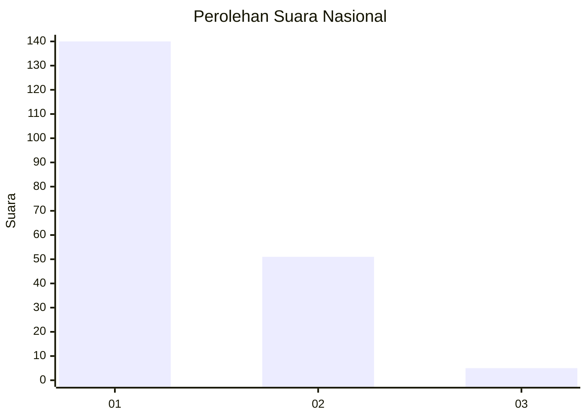
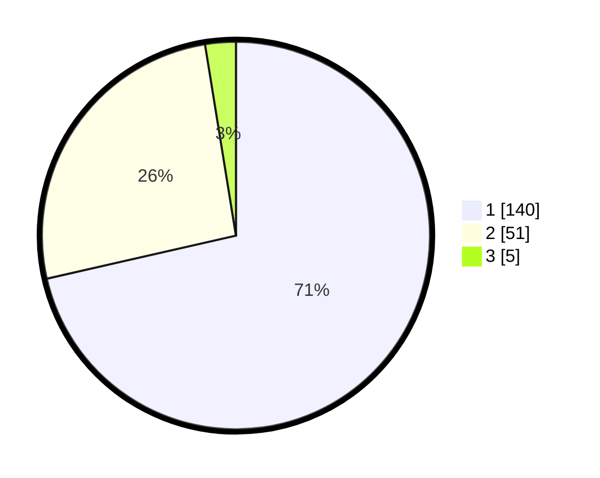

# Hasil

## Grafik

## Tabel

| No. | Nama Paslon    | Suara | Suara (raw) | Persentase |
|:--- |:-------------- | -----:| -----------:| ----------:|
| 1   | ANIES MUHAIMIN | 140   | [140][p-1]  | 71,43      |
| 2   | PRABOWO GIBRAN | 51    | [51][p-2]   | 26,02      |
| 3   | GANJAR MAHFUD  | 5     | [5][p-3]    | 2,55       |

[p-1]: https://github.com/gigit-pemilu/pemilu-2024/blob/main/pilpres/hitung-suara/sub/11-aceh/sub/01-aceh-selatan/sub/03-kluet-selatan/sub/2006-pulo-ie/sub/001-tps/sub/paslon-1.txt
[p-2]: https://github.com/gigit-pemilu/pemilu-2024/blob/main/pilpres/hitung-suara/sub/11-aceh/sub/01-aceh-selatan/sub/03-kluet-selatan/sub/2006-pulo-ie/sub/001-tps/sub/paslon-2.txt
[p-3]: https://github.com/gigit-pemilu/pemilu-2024/blob/main/pilpres/hitung-suara/sub/11-aceh/sub/01-aceh-selatan/sub/03-kluet-selatan/sub/2006-pulo-ie/sub/001-tps/sub/paslon-3.txt

## Foto C Plano

https://sirekap-obj-formc.kpu.go.id/5f5c/pemilu/ppwp/11/01/03/20/06/1101032006001-20240215-082811--1c9afc97-fbe4-4c5c-b01d-185bca77fb41.jpg

https://sirekap-obj-formc.kpu.go.id/5f5c/pemilu/ppwp/11/01/03/20/06/1101032006001-20240215-082531--755d508d-18aa-48c8-9a32-8a2d48a3dda3.jpg

https://sirekap-obj-formc.kpu.go.id/5f5c/pemilu/ppwp/11/01/03/20/06/1101032006001-20240215-082851--60a6d93d-28bc-413d-8c80-a6165c18d32e.jpg

## Metadata

| Key        | Value               |
| ---------- | ------------------- |
| Time Stamp | 2024-02-16 21:01:00 |

## DATA PEMILIH TETAP

Jumlah pemilih dalam DPT: **207**.
 * L: **114**.
 * P: **93**.

## DATA PENGGUNA HAK PILIH

Jumlah pengguna hak pilih dalam DPT: **195**.
 * L: **105**.
 * P: **90**.

Jumlah pengguna hak pilih dalam DPTb: **3**.
 * L: **2**.
 * P: **1**.

Jumlah pengguna hak pilih dalam DPK: **0**.
 * L: **0**.
 * P: **0**.

Jumlah pengguna hak pilih: **198**.
 * L: **107**.
 * P: **91**.

## JUMLAH SUARA SAH DAN TIDAK SAH

JUMLAH SELURUH SUARA SAH: **196**.

JUMLAH SUARA TIDAK SAH: **2**.

JUMLAH SELURUH SUARA SAH DAN SUARA TIDAK SAH: **198**.

