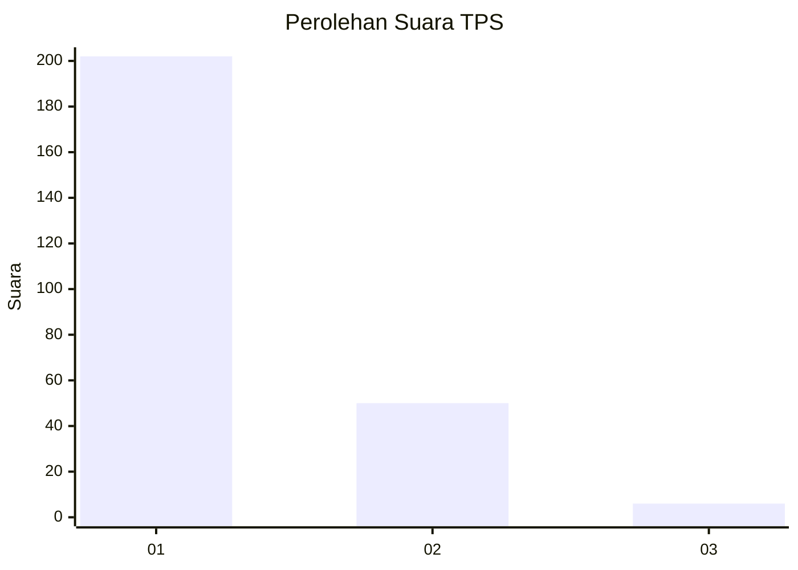
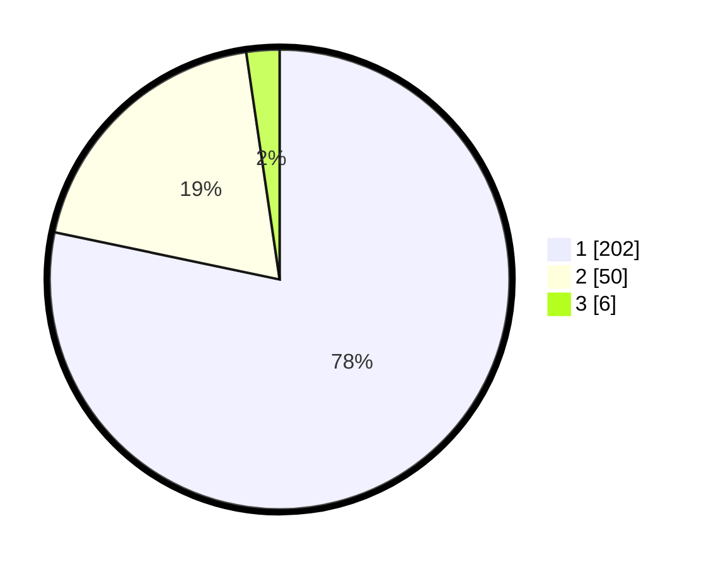

# Hasil

## Grafik

## Tabel

| No. | Nama Paslon    | Suara | Suara (raw) | Persentase |
|:--- |:-------------- | -----:| -----------:| ----------:|
| 1   | ANIES MUHAIMIN | 202   | [202][p-1]  | 78,29      |
| 2   | PRABOWO GIBRAN | 50    | [50][p-2]   | 19,38      |
| 3   | GANJAR MAHFUD  | 6     | [6][p-3]    | 2,33       |

[p-1]: https://github.com/gigit-pemilu/pemilu-2024-11-aceh/blob/main/pilpres/hitung-suara/sub/11-aceh/sub/01-aceh-selatan/sub/03-kluet-selatan/sub/2007-kedai-runding/sub/001-tps/sub/paslon-1.txt
[p-2]: https://github.com/gigit-pemilu/pemilu-2024-11-aceh/blob/main/pilpres/hitung-suara/sub/11-aceh/sub/01-aceh-selatan/sub/03-kluet-selatan/sub/2007-kedai-runding/sub/001-tps/sub/paslon-2.txt
[p-3]: https://github.com/gigit-pemilu/pemilu-2024-11-aceh/blob/main/pilpres/hitung-suara/sub/11-aceh/sub/01-aceh-selatan/sub/03-kluet-selatan/sub/2007-kedai-runding/sub/001-tps/sub/paslon-3.txt

## Foto C Plano

https://sirekap-obj-formc.kpu.go.id/2e8f/pemilu/ppwp/11/01/03/20/07/1101032007001-20240216-142808--b9680758-77e3-4cdd-aa4a-1f8905e4a839.jpg

https://sirekap-obj-formc.kpu.go.id/2e8f/pemilu/ppwp/11/01/03/20/07/1101032007001-20240216-142810--3d365223-0eaf-4b4e-905d-d8bfc7857fb1.jpg

https://sirekap-obj-formc.kpu.go.id/2e8f/pemilu/ppwp/11/01/03/20/07/1101032007001-20240216-142809--be42b663-68dc-44e3-ae8d-54fe9ea706b1.jpg

## Metadata

| Key        | Value               |
| ---------- | ------------------- |
| Time Stamp | 2024-02-16 21:01:00 |

## DATA PEMILIH TETAP

Jumlah pemilih dalam DPT: **294**.
 * L: **151**.
 * P: **143**.

## DATA PENGGUNA HAK PILIH

Jumlah pengguna hak pilih dalam DPT: **257**.
 * L: **130**.
 * P: **127**.

Jumlah pengguna hak pilih dalam DPTb: **5**.
 * L: **2**.
 * P: **3**.

Jumlah pengguna hak pilih dalam DPK: **6**.
 * L: **2**.
 * P: **4**.

Jumlah pengguna hak pilih: **268**.
 * L: **134**.
 * P: **134**.

## JUMLAH SUARA SAH DAN TIDAK SAH

JUMLAH SELURUH SUARA SAH: **258**.

JUMLAH SUARA TIDAK SAH: **10**.

JUMLAH SELURUH SUARA SAH DAN SUARA TIDAK SAH: **268**.

