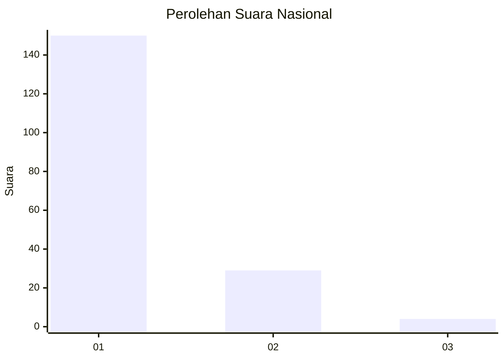
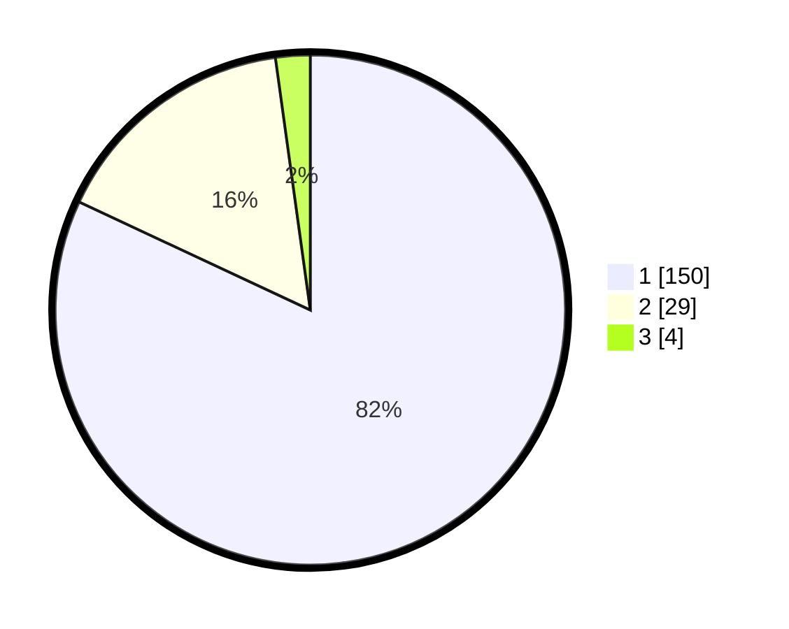

# Hasil

## Grafik

## Tabel

| No. | Nama Paslon    | Suara | Suara (raw) | Persentase |
|:--- |:-------------- | -----:| -----------:| ----------:|
| 1   | ANIES MUHAIMIN | 150   | [150][p-1]  | 81,97      |
| 2   | PRABOWO GIBRAN | 29    | [29][p-2]   | 15,85      |
| 3   | GANJAR MAHFUD  | 4     | [4][p-3]    | 2,19       |

[p-1]: https://github.com/gigit-pemilu/pemilu-2024/blob/main/pilpres/hitung-suara/sub/11-aceh/sub/01-aceh-selatan/sub/03-kluet-selatan/sub/2008-kedai-kandang/sub/001-tps/sub/paslon-1.txt
[p-2]: https://github.com/gigit-pemilu/pemilu-2024/blob/main/pilpres/hitung-suara/sub/11-aceh/sub/01-aceh-selatan/sub/03-kluet-selatan/sub/2008-kedai-kandang/sub/001-tps/sub/paslon-2.txt
[p-3]: https://github.com/gigit-pemilu/pemilu-2024/blob/main/pilpres/hitung-suara/sub/11-aceh/sub/01-aceh-selatan/sub/03-kluet-selatan/sub/2008-kedai-kandang/sub/001-tps/sub/paslon-3.txt

## Foto C Plano

https://sirekap-obj-formc.kpu.go.id/8bbd/pemilu/ppwp/11/01/03/20/08/1101032008001-20240215-082157--13728ba7-4d2b-406a-b5ea-42571e52ae83.jpg

https://sirekap-obj-formc.kpu.go.id/8bbd/pemilu/ppwp/11/01/03/20/08/1101032008001-20240215-082637--d7fb5edb-a7bc-46c0-8910-16d7bcdcccd7.jpg

https://sirekap-obj-formc.kpu.go.id/8bbd/pemilu/ppwp/11/01/03/20/08/1101032008001-20240215-082812--369c4431-8c88-4f94-b979-0644e022ecb2.jpg

## Metadata

| Key        | Value               |
| ---------- | ------------------- |
| Time Stamp | 2024-02-16 21:01:00 |

## DATA PEMILIH TETAP

Jumlah pemilih dalam DPT: **202**.
 * L: **107**.
 * P: **95**.

## DATA PENGGUNA HAK PILIH

Jumlah pengguna hak pilih dalam DPT: **180**.
 * L: **93**.
 * P: **87**.

Jumlah pengguna hak pilih dalam DPTb: **5**.
 * L: **3**.
 * P: **2**.

Jumlah pengguna hak pilih dalam DPK: **3**.
 * L: **2**.
 * P: **1**.

Jumlah pengguna hak pilih: **188**.
 * L: **98**.
 * P: **90**.

## JUMLAH SUARA SAH DAN TIDAK SAH

JUMLAH SELURUH SUARA SAH: **183**.

JUMLAH SUARA TIDAK SAH: **5**.

JUMLAH SELURUH SUARA SAH DAN SUARA TIDAK SAH: **188**.

