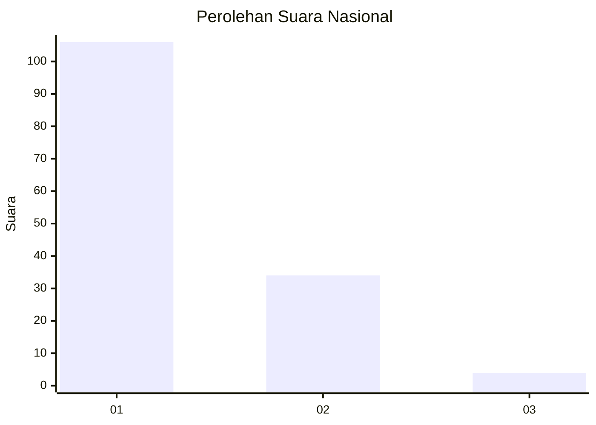
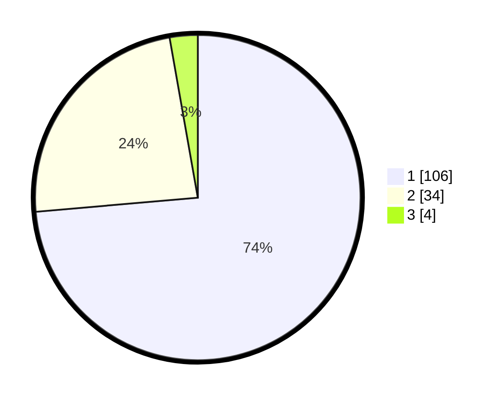

# Hasil

## Grafik

## Tabel

| No. | Nama Paslon    | Suara | Suara (raw) | Persentase |
|:--- |:-------------- | -----:| -----------:| ----------:|
| 1   | ANIES MUHAIMIN | 106   | [106][p-1]  | 73,61      |
| 2   | PRABOWO GIBRAN | 34    | [34][p-2]   | 23,61      |
| 3   | GANJAR MAHFUD  | 4     | [4][p-3]    | 2,78       |

[p-1]: https://github.com/gigit-pemilu/pemilu-2024/blob/main/pilpres/hitung-suara/sub/11-aceh/sub/01-aceh-selatan/sub/03-kluet-selatan/sub/2012-pasi-meurapat/sub/001-tps/sub/paslon-1.txt
[p-2]: https://github.com/gigit-pemilu/pemilu-2024/blob/main/pilpres/hitung-suara/sub/11-aceh/sub/01-aceh-selatan/sub/03-kluet-selatan/sub/2012-pasi-meurapat/sub/001-tps/sub/paslon-2.txt
[p-3]: https://github.com/gigit-pemilu/pemilu-2024/blob/main/pilpres/hitung-suara/sub/11-aceh/sub/01-aceh-selatan/sub/03-kluet-selatan/sub/2012-pasi-meurapat/sub/001-tps/sub/paslon-3.txt

## Foto C Plano

https://sirekap-obj-formc.kpu.go.id/b55a/pemilu/ppwp/11/01/03/20/12/1101032012001-20240216-132546--3852f6bf-bc5d-424f-a91a-41b9af2f15d4.jpg

https://sirekap-obj-formc.kpu.go.id/b55a/pemilu/ppwp/11/01/03/20/12/1101032012001-20240214-185628--6e67ff57-bc93-4ee7-b3ae-94140e8ddf85.jpg

https://sirekap-obj-formc.kpu.go.id/b55a/pemilu/ppwp/11/01/03/20/12/1101032012001-20240216-132546--f29742df-9b78-4704-ad99-2d3d08f8cbde.jpg

## Metadata

| Key        | Value               |
| ---------- | ------------------- |
| Time Stamp | 2024-02-16 13:30:32 |

## DATA PEMILIH TETAP

Jumlah pemilih dalam DPT: **165**.
 * L: **79**.
 * P: **86**.

## DATA PENGGUNA HAK PILIH

Jumlah pengguna hak pilih dalam DPT: **147**.
 * L: **70**.
 * P: **77**.

Jumlah pengguna hak pilih dalam DPTb: **3**.
 * L: **2**.
 * P: **1**.

Jumlah pengguna hak pilih dalam DPK: **0**.
 * L: **0**.
 * P: **0**.

Jumlah pengguna hak pilih: **150**.
 * L: **72**.
 * P: **78**.

## JUMLAH SUARA SAH DAN TIDAK SAH

JUMLAH SELURUH SUARA SAH: **144**.

JUMLAH SUARA TIDAK SAH: **6**.

JUMLAH SELURUH SUARA SAH DAN SUARA TIDAK SAH: **150**.

