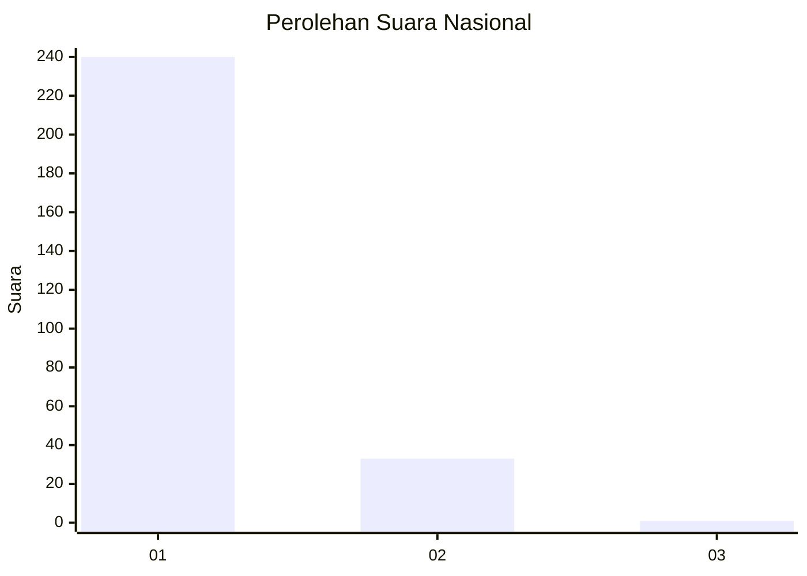
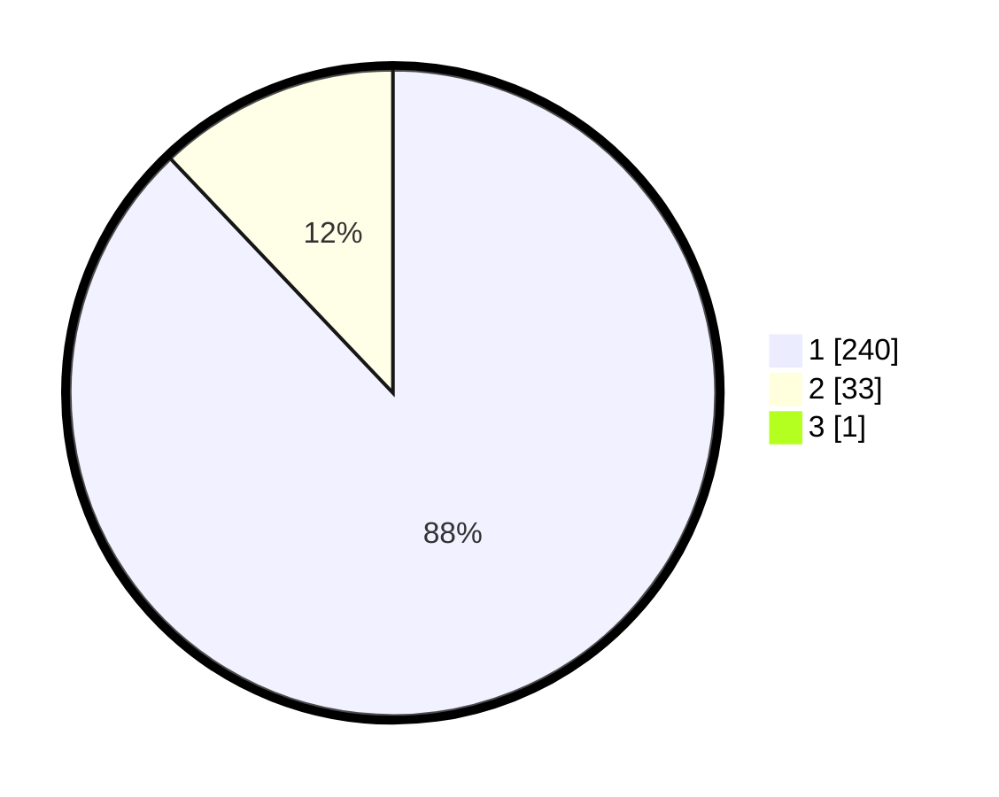

# Hasil

## Grafik

## Tabel

| No. | Nama Paslon    | Suara | Suara (raw) | Persentase |
|:--- |:-------------- | -----:| -----------:| ----------:|
| 1   | ANIES MUHAIMIN | 240   | [240][p-1]  | 87,59      |
| 2   | PRABOWO GIBRAN | 33    | [33][p-2]   | 12,04      |
| 3   | GANJAR MAHFUD  | 1     | [1][p-3]    | 0,36       |

[p-1]: https://github.com/gigit-pemilu/pemilu-2024/blob/main/pilpres/hitung-suara/sub/11-aceh/sub/01-aceh-selatan/sub/03-kluet-selatan/sub/2014-geulumbuk/sub/003-tps/sub/paslon-1.txt
[p-2]: https://github.com/gigit-pemilu/pemilu-2024/blob/main/pilpres/hitung-suara/sub/11-aceh/sub/01-aceh-selatan/sub/03-kluet-selatan/sub/2014-geulumbuk/sub/003-tps/sub/paslon-2.txt
[p-3]: https://github.com/gigit-pemilu/pemilu-2024/blob/main/pilpres/hitung-suara/sub/11-aceh/sub/01-aceh-selatan/sub/03-kluet-selatan/sub/2014-geulumbuk/sub/003-tps/sub/paslon-3.txt

## Foto C Plano

https://sirekap-obj-formc.kpu.go.id/0311/pemilu/ppwp/11/01/03/20/14/1101032014003-20240215-225521--a2391382-550f-406b-9168-190c3bf55ad4.jpg

https://sirekap-obj-formc.kpu.go.id/0311/pemilu/ppwp/11/01/03/20/14/1101032014003-20240215-225523--71ff72c6-2d42-490b-99aa-c8836645c356.jpg

https://sirekap-obj-formc.kpu.go.id/0311/pemilu/ppwp/11/01/03/20/14/1101032014003-20240215-225522--4ded03a3-6db5-48e8-9ba4-048d754c9a71.jpg

## Metadata

| Key        | Value               |
| ---------- | ------------------- |
| Time Stamp | 2024-02-15 23:29:50 |

## DATA PEMILIH TETAP

Jumlah pemilih dalam DPT: **299**.
 * L: **143**.
 * P: **156**.

## DATA PENGGUNA HAK PILIH

Jumlah pengguna hak pilih dalam DPT: **271**.
 * L: **120**.
 * P: **151**.

Jumlah pengguna hak pilih dalam DPTb: **0**.
 * L: **0**.
 * P: **0**.

Jumlah pengguna hak pilih dalam DPK: **4**.
 * L: **2**.
 * P: **2**.

Jumlah pengguna hak pilih: **275**.
 * L: **122**.
 * P: **153**.

## JUMLAH SUARA SAH DAN TIDAK SAH

JUMLAH SELURUH SUARA SAH: **274**.

JUMLAH SUARA TIDAK SAH: **1**.

JUMLAH SELURUH SUARA SAH DAN SUARA TIDAK SAH: **275**.

