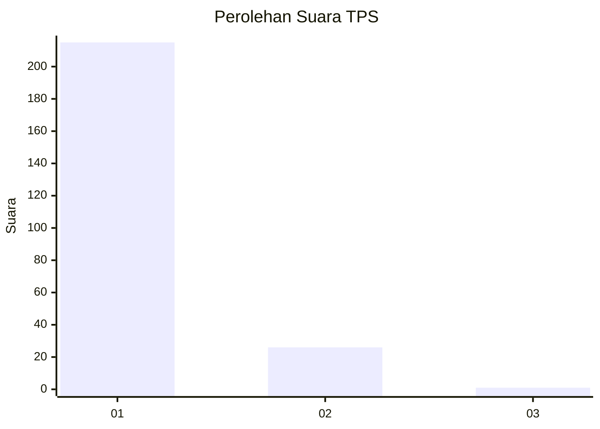
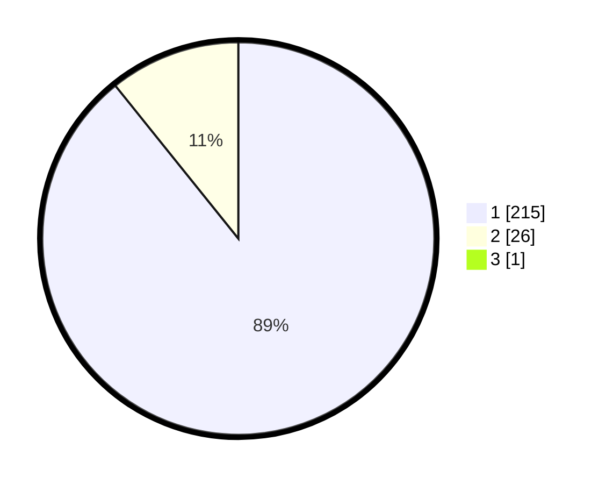

# Hasil

## Grafik

## Tabel

| No. | Nama Paslon    | Suara | Suara (raw) | Persentase |
|:--- |:-------------- | -----:| -----------:| ----------:|
| 1   | ANIES MUHAIMIN | 215   | [215][p-1]  | 88,84      |
| 2   | PRABOWO GIBRAN | 26    | [26][p-2]   | 10,74      |
| 3   | GANJAR MAHFUD  | 1     | [1][p-3]    | 0,41       |

[p-1]: https://github.com/gigit-pemilu/pemilu-2024-11-aceh/blob/main/pilpres/hitung-suara/sub/11-aceh/sub/01-aceh-selatan/sub/04-labuhanhaji/sub/2001-bakau-hulu/sub/002-tps/sub/paslon-1.txt
[p-2]: https://github.com/gigit-pemilu/pemilu-2024-11-aceh/blob/main/pilpres/hitung-suara/sub/11-aceh/sub/01-aceh-selatan/sub/04-labuhanhaji/sub/2001-bakau-hulu/sub/002-tps/sub/paslon-2.txt
[p-3]: https://github.com/gigit-pemilu/pemilu-2024-11-aceh/blob/main/pilpres/hitung-suara/sub/11-aceh/sub/01-aceh-selatan/sub/04-labuhanhaji/sub/2001-bakau-hulu/sub/002-tps/sub/paslon-3.txt

## Foto C Plano

https://sirekap-obj-formc.kpu.go.id/6e8b/pemilu/ppwp/11/01/04/20/01/1101042001002-20240216-133118--992e45bb-ab0b-4f0f-83b0-43bb60fe7754.jpg

https://sirekap-obj-formc.kpu.go.id/6e8b/pemilu/ppwp/11/01/04/20/01/1101042001002-20240216-133119--3677b2fb-0f64-47b8-bba1-49cd429cd3cb.jpg

https://sirekap-obj-formc.kpu.go.id/6e8b/pemilu/ppwp/11/01/04/20/01/1101042001002-20240216-133119--a7b863cb-bc68-45cb-845e-ded928ee28a7.jpg

## Metadata

| Key        | Value               |
| ---------- | ------------------- |
| Time Stamp | 2024-02-16 21:01:00 |

## DATA PEMILIH TETAP

Jumlah pemilih dalam DPT: **283**.
 * L: **132**.
 * P: **151**.

## DATA PENGGUNA HAK PILIH

Jumlah pengguna hak pilih dalam DPT: **245**.
 * L: **109**.
 * P: **136**.

Jumlah pengguna hak pilih dalam DPTb: **1**.
 * L: **1**.
 * P: **0**.

Jumlah pengguna hak pilih dalam DPK: **0**.
 * L: **0**.
 * P: **0**.

Jumlah pengguna hak pilih: **246**.
 * L: **110**.
 * P: **136**.

## JUMLAH SUARA SAH DAN TIDAK SAH

JUMLAH SELURUH SUARA SAH: **242**.

JUMLAH SUARA TIDAK SAH: **4**.

JUMLAH SELURUH SUARA SAH DAN SUARA TIDAK SAH: **246**.

