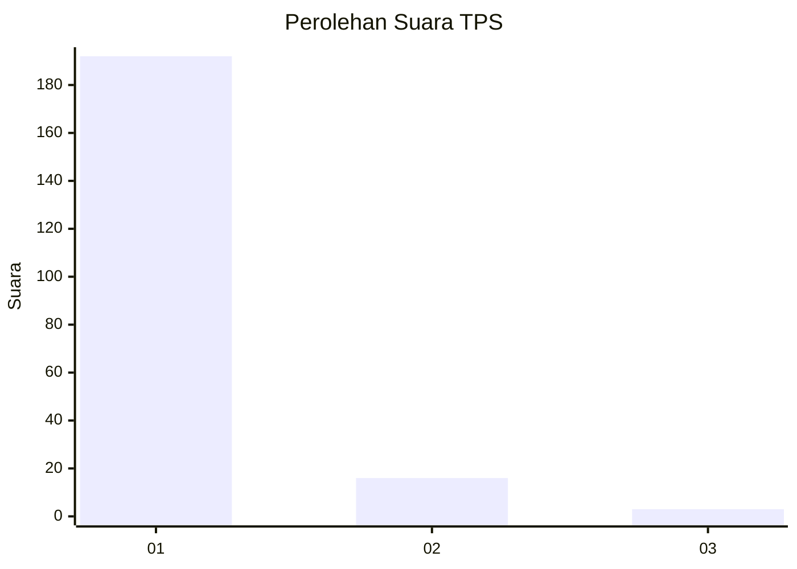
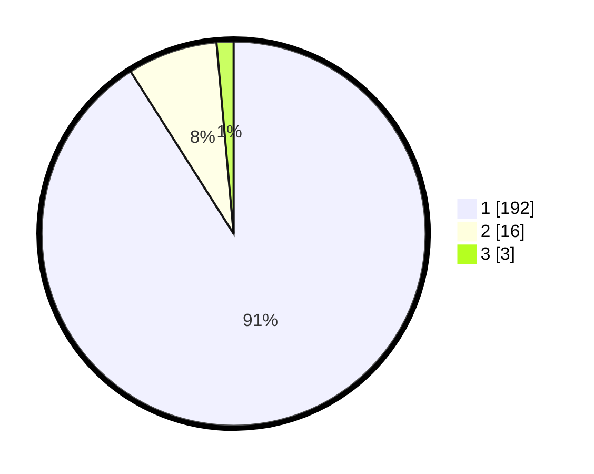

# Hasil

## Grafik

## Tabel

| No. | Nama Paslon    | Suara | Suara (raw) | Persentase |
|:--- |:-------------- | -----:| -----------:| ----------:|
| 1   | ANIES MUHAIMIN | 192   | [192][p-1]  | 91,00      |
| 2   | PRABOWO GIBRAN | 16    | [16][p-2]   | 7,58       |
| 3   | GANJAR MAHFUD  | 3     | [3][p-3]    | 1,42       |

[p-1]: https://github.com/gigit-pemilu/pemilu-2024-11-aceh/blob/main/pilpres/hitung-suara/sub/11-aceh/sub/01-aceh-selatan/sub/04-labuhanhaji/sub/2001-bakau-hulu/sub/003-tps/sub/paslon-1.txt
[p-2]: https://github.com/gigit-pemilu/pemilu-2024-11-aceh/blob/main/pilpres/hitung-suara/sub/11-aceh/sub/01-aceh-selatan/sub/04-labuhanhaji/sub/2001-bakau-hulu/sub/003-tps/sub/paslon-2.txt
[p-3]: https://github.com/gigit-pemilu/pemilu-2024-11-aceh/blob/main/pilpres/hitung-suara/sub/11-aceh/sub/01-aceh-selatan/sub/04-labuhanhaji/sub/2001-bakau-hulu/sub/003-tps/sub/paslon-3.txt

## Foto C Plano

https://sirekap-obj-formc.kpu.go.id/cb11/pemilu/ppwp/11/01/04/20/01/1101042001003-20240216-132145--ad47d0d2-da5b-4931-abe7-e79b3a3c2950.jpg

https://sirekap-obj-formc.kpu.go.id/cb11/pemilu/ppwp/11/01/04/20/01/1101042001003-20240216-132147--52ae857e-1f92-4ff5-8002-8465b136056b.jpg

https://sirekap-obj-formc.kpu.go.id/cb11/pemilu/ppwp/11/01/04/20/01/1101042001003-20240216-132146--914846f6-1e3a-453b-984a-dafbafff3ff2.jpg

## Metadata

| Key        | Value               |
| ---------- | ------------------- |
| Time Stamp | 2024-02-16 21:01:00 |

## DATA PEMILIH TETAP

Jumlah pemilih dalam DPT: **248**.
 * L: **120**.
 * P: **128**.

## DATA PENGGUNA HAK PILIH

Jumlah pengguna hak pilih dalam DPT: **209**.
 * L: **94**.
 * P: **115**.

Jumlah pengguna hak pilih dalam DPTb: **2**.
 * L: **1**.
 * P: **1**.

Jumlah pengguna hak pilih dalam DPK: **4**.
 * L: **2**.
 * P: **2**.

Jumlah pengguna hak pilih: **215**.
 * L: **97**.
 * P: **118**.

## JUMLAH SUARA SAH DAN TIDAK SAH

JUMLAH SELURUH SUARA SAH: **211**.

JUMLAH SUARA TIDAK SAH: **4**.

JUMLAH SELURUH SUARA SAH DAN SUARA TIDAK SAH: **215**.

