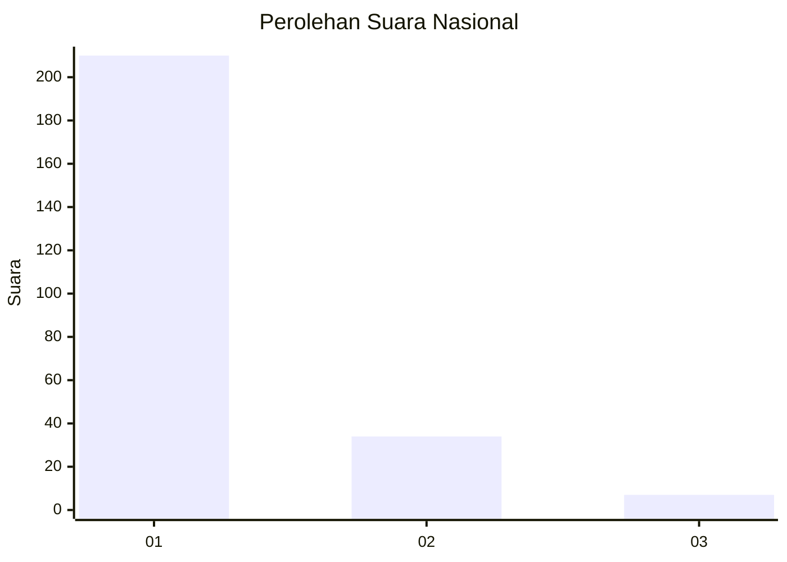
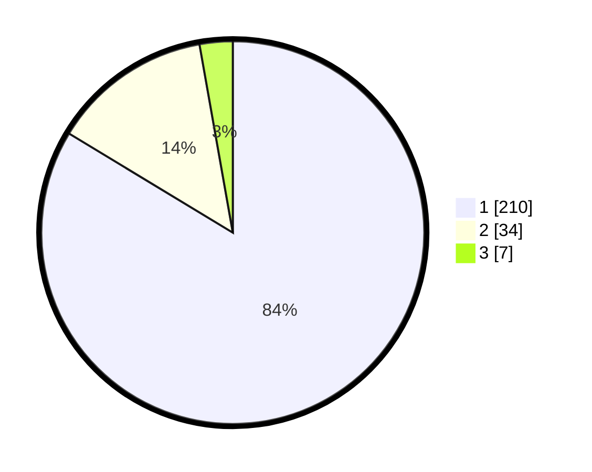

# Hasil

## Grafik

## Tabel

| No. | Nama Paslon    | Suara | Suara (raw) | Persentase |
|:--- |:-------------- | -----:| -----------:| ----------:|
| 1   | ANIES MUHAIMIN | 210   | [210][p-1]  | 83,67      |
| 2   | PRABOWO GIBRAN | 34    | [34][p-2]   | 13,55      |
| 3   | GANJAR MAHFUD  | 7     | [7][p-3]    | 2,79       |

[p-1]: https://github.com/gigit-pemilu/pemilu-2024/blob/main/pilpres/hitung-suara/sub/11-aceh/sub/01-aceh-selatan/sub/04-labuhanhaji/sub/2002-padang-bakau/sub/001-tps/sub/paslon-1.txt
[p-2]: https://github.com/gigit-pemilu/pemilu-2024/blob/main/pilpres/hitung-suara/sub/11-aceh/sub/01-aceh-selatan/sub/04-labuhanhaji/sub/2002-padang-bakau/sub/001-tps/sub/paslon-2.txt
[p-3]: https://github.com/gigit-pemilu/pemilu-2024/blob/main/pilpres/hitung-suara/sub/11-aceh/sub/01-aceh-selatan/sub/04-labuhanhaji/sub/2002-padang-bakau/sub/001-tps/sub/paslon-3.txt

## Foto C Plano

https://sirekap-obj-formc.kpu.go.id/da06/pemilu/ppwp/11/01/04/20/02/1101042002001-20240215-042233--fff9c3c1-ba0c-4b71-9265-95e3a6a22291.jpg

https://sirekap-obj-formc.kpu.go.id/da06/pemilu/ppwp/11/01/04/20/02/1101042002001-20240215-142959--712091ee-b660-48b1-9277-ad531f031d62.jpg

https://sirekap-obj-formc.kpu.go.id/da06/pemilu/ppwp/11/01/04/20/02/1101042002001-20240215-045549--6ec932d9-483d-4a25-bfdf-8e91f6fb6d34.jpg

## Metadata

| Key        | Value               |
| ---------- | ------------------- |
| Time Stamp | 2024-02-16 16:25:10 |

