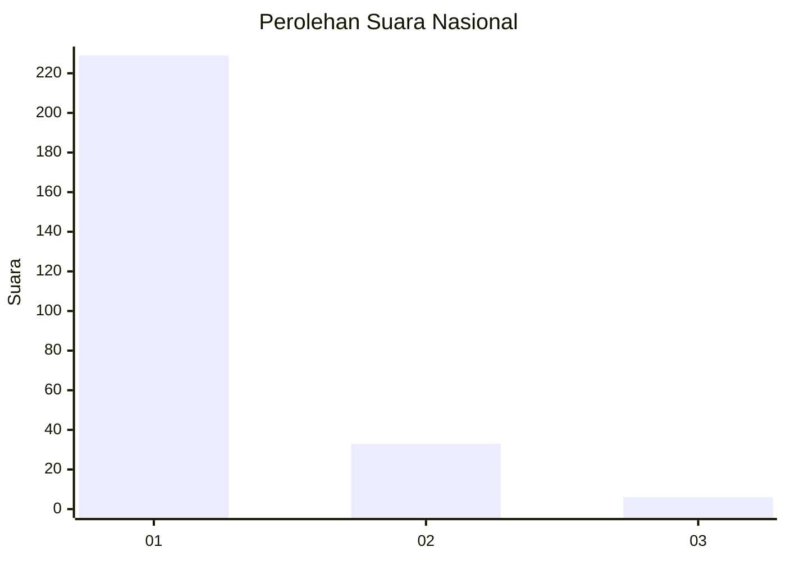
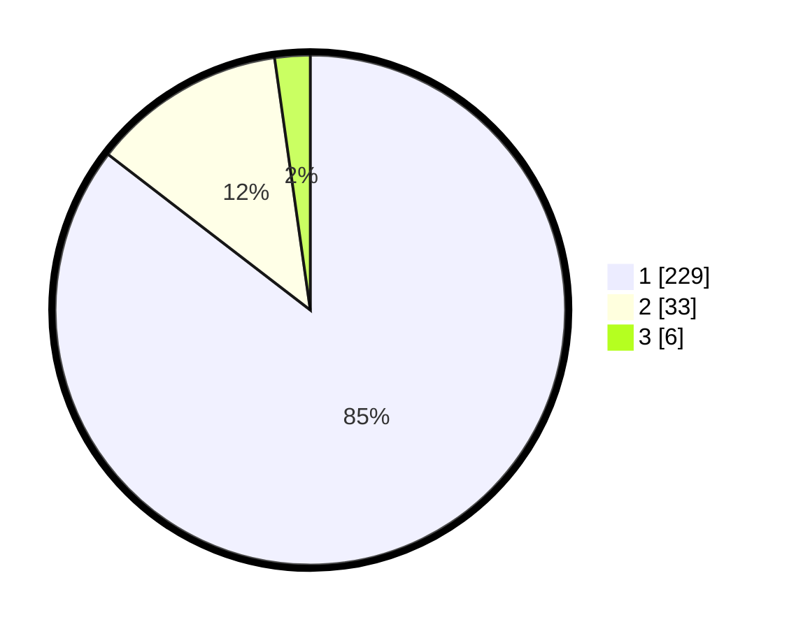

# Hasil

## Grafik

## Tabel

| No. | Nama Paslon    | Suara | Suara (raw) | Persentase |
|:--- |:-------------- | -----:| -----------:| ----------:|
| 1   | ANIES MUHAIMIN | 229   | [229][p-1]  | 85,45      |
| 2   | PRABOWO GIBRAN | 33    | [33][p-2]   | 12,31      |
| 3   | GANJAR MAHFUD  | 6     | [6][p-3]    | 2,24       |

[p-1]: https://github.com/gigit-pemilu/pemilu-2024/blob/main/pilpres/hitung-suara/sub/11-aceh/sub/01-aceh-selatan/sub/04-labuhanhaji/sub/2002-padang-bakau/sub/002-tps/sub/paslon-1.txt
[p-2]: https://github.com/gigit-pemilu/pemilu-2024/blob/main/pilpres/hitung-suara/sub/11-aceh/sub/01-aceh-selatan/sub/04-labuhanhaji/sub/2002-padang-bakau/sub/002-tps/sub/paslon-2.txt
[p-3]: https://github.com/gigit-pemilu/pemilu-2024/blob/main/pilpres/hitung-suara/sub/11-aceh/sub/01-aceh-selatan/sub/04-labuhanhaji/sub/2002-padang-bakau/sub/002-tps/sub/paslon-3.txt

## Foto C Plano

https://sirekap-obj-formc.kpu.go.id/a3d4/pemilu/ppwp/11/01/04/20/02/1101042002002-20240216-144322--c90909e0-afdc-4691-901a-6f49dc1ac6ba.jpg

https://sirekap-obj-formc.kpu.go.id/a3d4/pemilu/ppwp/11/01/04/20/02/1101042002002-20240216-144324--2b44cada-1543-43cd-9e2a-e6bb0cbd4b56.jpg

https://sirekap-obj-formc.kpu.go.id/a3d4/pemilu/ppwp/11/01/04/20/02/1101042002002-20240216-144323--f7c1b47e-e1c8-4118-a2df-aa949d169c8a.jpg

## Metadata

| Key        | Value               |
| ---------- | ------------------- |
| Time Stamp | 2024-02-16 21:01:00 |

## DATA PEMILIH TETAP

Jumlah pemilih dalam DPT: **298**.
 * L: **143**.
 * P: **155**.

## DATA PENGGUNA HAK PILIH

Jumlah pengguna hak pilih dalam DPT: **267**.
 * L: **120**.
 * P: **147**.

Jumlah pengguna hak pilih dalam DPTb: **0**.
 * L: **0**.
 * P: **0**.

Jumlah pengguna hak pilih dalam DPK: **2**.
 * L: **1**.
 * P: **1**.

Jumlah pengguna hak pilih: **269**.
 * L: **121**.
 * P: **148**.

## JUMLAH SUARA SAH DAN TIDAK SAH

JUMLAH SELURUH SUARA SAH: **268**.

JUMLAH SUARA TIDAK SAH: **1**.

JUMLAH SELURUH SUARA SAH DAN SUARA TIDAK SAH: **269**.

