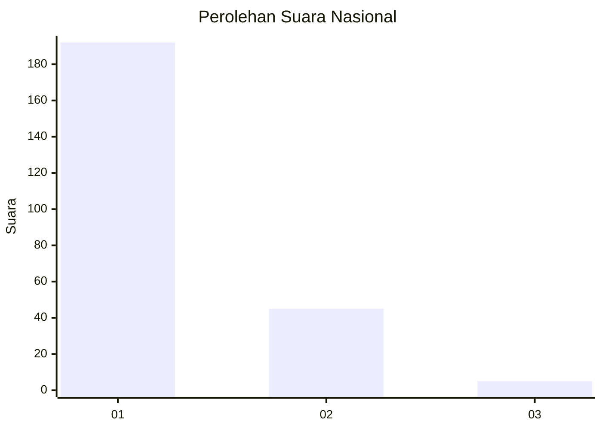
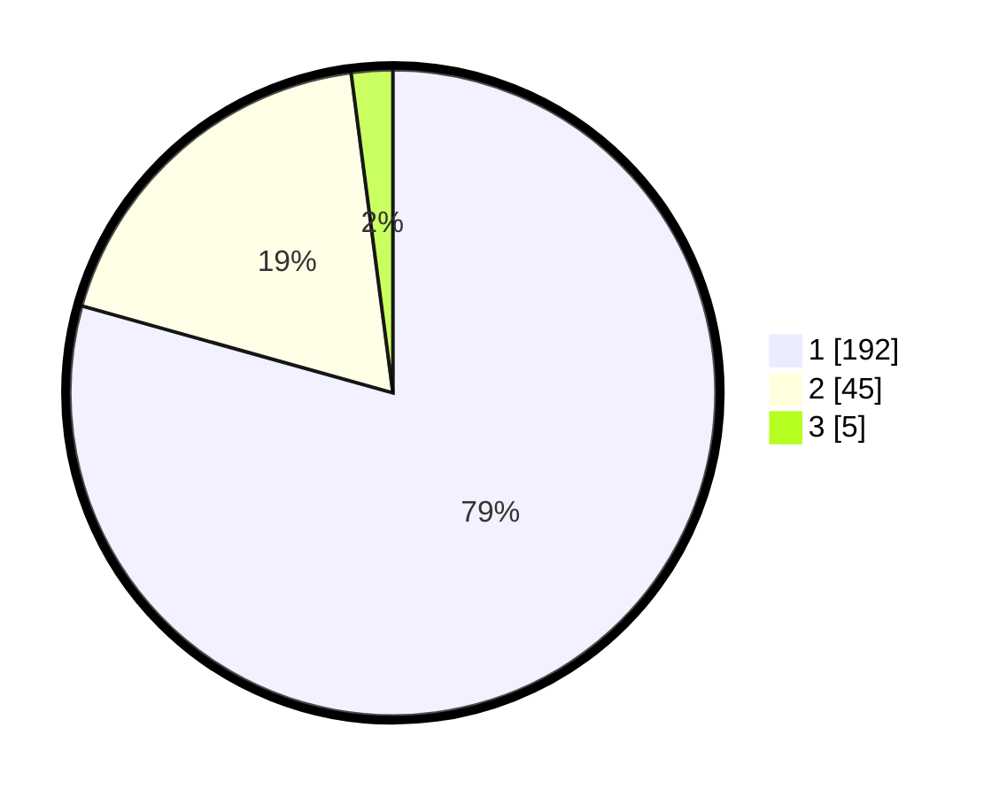

# Hasil

## Grafik

## Tabel

| No. | Nama Paslon    | Suara | Suara (raw) | Persentase |
|:--- |:-------------- | -----:| -----------:| ----------:|
| 1   | ANIES MUHAIMIN | 192   | [192][p-1]  | 79,34      |
| 2   | PRABOWO GIBRAN | 45    | [45][p-2]   | 18,60      |
| 3   | GANJAR MAHFUD  | 5     | [5][p-3]    | 2,07       |

[p-1]: https://github.com/gigit-pemilu/pemilu-2024/blob/main/pilpres/hitung-suara/sub/11-aceh/sub/01-aceh-selatan/sub/04-labuhanhaji/sub/2002-padang-bakau/sub/003-tps/sub/paslon-1.txt
[p-2]: https://github.com/gigit-pemilu/pemilu-2024/blob/main/pilpres/hitung-suara/sub/11-aceh/sub/01-aceh-selatan/sub/04-labuhanhaji/sub/2002-padang-bakau/sub/003-tps/sub/paslon-2.txt
[p-3]: https://github.com/gigit-pemilu/pemilu-2024/blob/main/pilpres/hitung-suara/sub/11-aceh/sub/01-aceh-selatan/sub/04-labuhanhaji/sub/2002-padang-bakau/sub/003-tps/sub/paslon-3.txt

## Foto C Plano

https://sirekap-obj-formc.kpu.go.id/1fa2/pemilu/ppwp/11/01/04/20/02/1101042002003-20240214-223224--4793d98c-28d5-41c7-9fc6-c257ab2c412c.jpg

https://sirekap-obj-formc.kpu.go.id/1fa2/pemilu/ppwp/11/01/04/20/02/1101042002003-20240215-123648--e0ce4732-ccc3-4b30-9188-aa390514f112.jpg

https://sirekap-obj-formc.kpu.go.id/1fa2/pemilu/ppwp/11/01/04/20/02/1101042002003-20240215-123943--9699bcec-288c-4d55-bd8f-17de17316ddc.jpg

## Metadata

| Key        | Value               |
| ---------- | ------------------- |
| Time Stamp | 2024-02-15 15:00:29 |

## DATA PEMILIH TETAP

Jumlah pemilih dalam DPT: **277**.
 * L: **130**.
 * P: **147**.

## DATA PENGGUNA HAK PILIH

Jumlah pengguna hak pilih dalam DPT: **237**.
 * L: **104**.
 * P: **133**.

Jumlah pengguna hak pilih dalam DPTb: **5**.
 * L: **2**.
 * P: **3**.

Jumlah pengguna hak pilih dalam DPK: **1**.
 * L: **1**.
 * P: **0**.

Jumlah pengguna hak pilih: **243**.
 * L: **107**.
 * P: **136**.

## JUMLAH SUARA SAH DAN TIDAK SAH

JUMLAH SELURUH SUARA SAH: **242**.

JUMLAH SUARA TIDAK SAH: **1**.

JUMLAH SELURUH SUARA SAH DAN SUARA TIDAK SAH: **243**.

