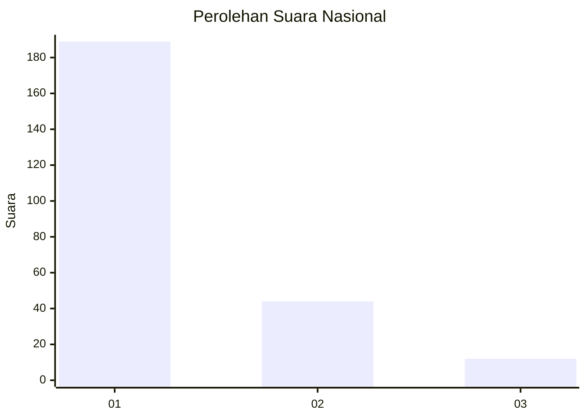
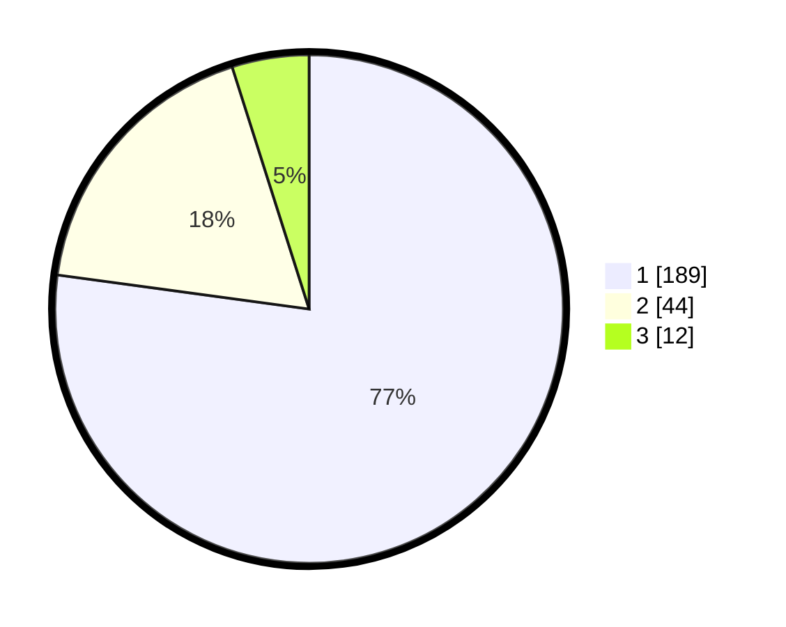

# Hasil

## Grafik

## Tabel

| No. | Nama Paslon    | Suara | Suara (raw) | Persentase |
|:--- |:-------------- | -----:| -----------:| ----------:|
| 1   | ANIES MUHAIMIN | 189   | [189][p-1]  | 77,14      |
| 2   | PRABOWO GIBRAN | 44    | [44][p-2]   | 17,96      |
| 3   | GANJAR MAHFUD  | 12    | [12][p-3]   | 4,90       |

[p-1]: https://github.com/gigit-pemilu/pemilu-2024/blob/main/pilpres/hitung-suara/sub/11-aceh/sub/01-aceh-selatan/sub/04-labuhanhaji/sub/2003-manggis-harapan/sub/001-tps/sub/paslon-1.txt
[p-2]: https://github.com/gigit-pemilu/pemilu-2024/blob/main/pilpres/hitung-suara/sub/11-aceh/sub/01-aceh-selatan/sub/04-labuhanhaji/sub/2003-manggis-harapan/sub/001-tps/sub/paslon-2.txt
[p-3]: https://github.com/gigit-pemilu/pemilu-2024/blob/main/pilpres/hitung-suara/sub/11-aceh/sub/01-aceh-selatan/sub/04-labuhanhaji/sub/2003-manggis-harapan/sub/001-tps/sub/paslon-3.txt

## Foto C Plano

https://sirekap-obj-formc.kpu.go.id/660f/pemilu/ppwp/11/01/04/20/03/1101042003001-20240215-231108--7ef272bc-67db-4706-aff7-3123fa1d53bd.jpg

https://sirekap-obj-formc.kpu.go.id/660f/pemilu/ppwp/11/01/04/20/03/1101042003001-20240215-231110--bad943ad-cc4e-4ff6-b862-14677e53a04f.jpg

https://sirekap-obj-formc.kpu.go.id/660f/pemilu/ppwp/11/01/04/20/03/1101042003001-20240215-231109--531bcbd6-ce36-4513-81c7-dc049afe0002.jpg

## Metadata

| Key        | Value               |
| ---------- | ------------------- |
| Time Stamp | 2024-02-15 23:29:50 |

## DATA PEMILIH TETAP

Jumlah pemilih dalam DPT: **290**.
 * L: **137**.
 * P: **153**.

## DATA PENGGUNA HAK PILIH

Jumlah pengguna hak pilih dalam DPT: **246**.
 * L: **107**.
 * P: **139**.

Jumlah pengguna hak pilih dalam DPTb: **2**.
 * L: **1**.
 * P: **1**.

Jumlah pengguna hak pilih dalam DPK: **5**.
 * L: **3**.
 * P: **2**.

Jumlah pengguna hak pilih: **253**.
 * L: **111**.
 * P: **142**.

## JUMLAH SUARA SAH DAN TIDAK SAH

JUMLAH SELURUH SUARA SAH: **245**.

JUMLAH SUARA TIDAK SAH: **8**.

JUMLAH SELURUH SUARA SAH DAN SUARA TIDAK SAH: **253**.

