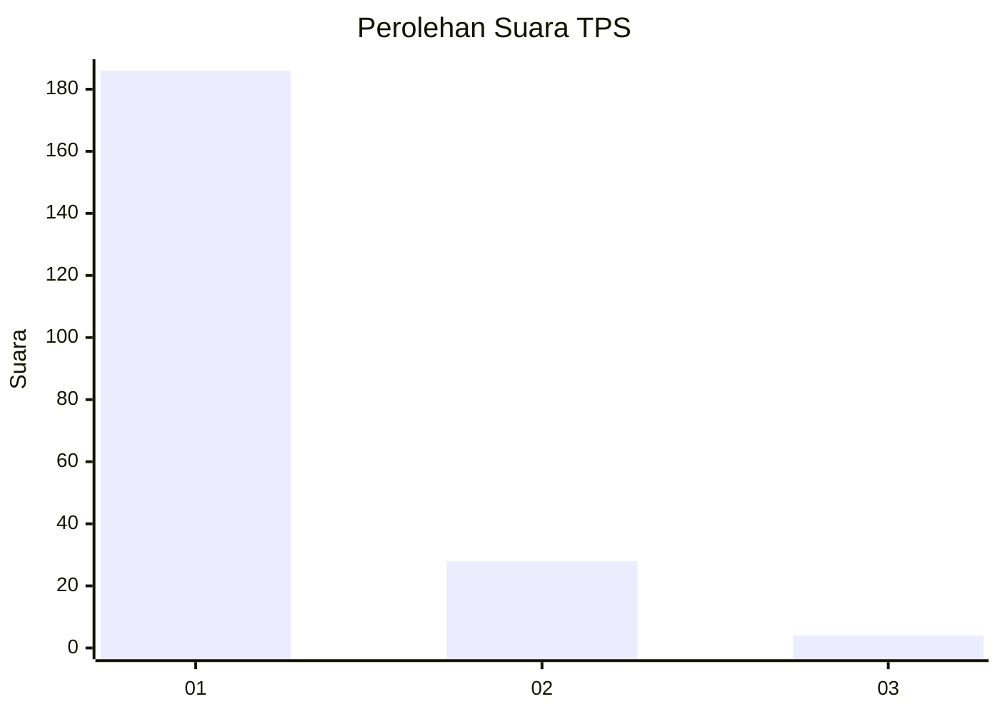
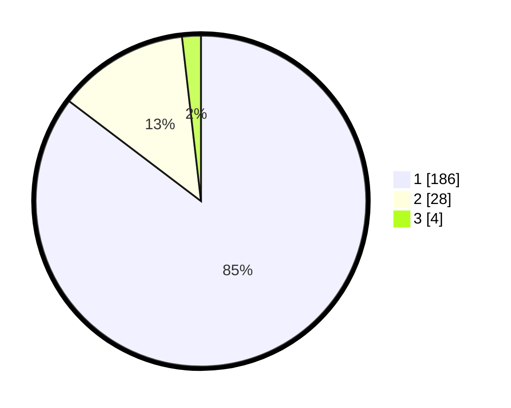

# Hasil

## Grafik

## Tabel

| No. | Nama Paslon    | Suara | Suara (raw) | Persentase |
|:--- |:-------------- | -----:| -----------:| ----------:|
| 1   | ANIES MUHAIMIN | 186   | [186][p-1]  | 85,32      |
| 2   | PRABOWO GIBRAN | 28    | [28][p-2]   | 12,84      |
| 3   | GANJAR MAHFUD  | 4     | [4][p-3]    | 1,83       |

[p-1]: https://github.com/gigit-pemilu/pemilu-2024-11-aceh/blob/main/pilpres/hitung-suara/sub/11-aceh/sub/01-aceh-selatan/sub/04-labuhanhaji/sub/2004-pasar-lama/sub/001-tps/sub/paslon-1.txt
[p-2]: https://github.com/gigit-pemilu/pemilu-2024-11-aceh/blob/main/pilpres/hitung-suara/sub/11-aceh/sub/01-aceh-selatan/sub/04-labuhanhaji/sub/2004-pasar-lama/sub/001-tps/sub/paslon-2.txt
[p-3]: https://github.com/gigit-pemilu/pemilu-2024-11-aceh/blob/main/pilpres/hitung-suara/sub/11-aceh/sub/01-aceh-selatan/sub/04-labuhanhaji/sub/2004-pasar-lama/sub/001-tps/sub/paslon-3.txt

## Foto C Plano

https://sirekap-obj-formc.kpu.go.id/1654/pemilu/ppwp/11/01/04/20/04/1101042004001-20240215-164006--425fd853-6109-4ef6-9979-5133328c3caa.jpg

https://sirekap-obj-formc.kpu.go.id/1654/pemilu/ppwp/11/01/04/20/04/1101042004001-20240215-163548--5dc88488-647a-4e71-b1bb-4760078a50d4.jpg

https://sirekap-obj-formc.kpu.go.id/1654/pemilu/ppwp/11/01/04/20/04/1101042004001-20240214-221609--e1c60886-6693-4e10-b7ce-f4c63c2b6d52.jpg

## Metadata

| Key        | Value               |
| ---------- | ------------------- |
| Time Stamp | 2024-02-15 18:00:26 |

