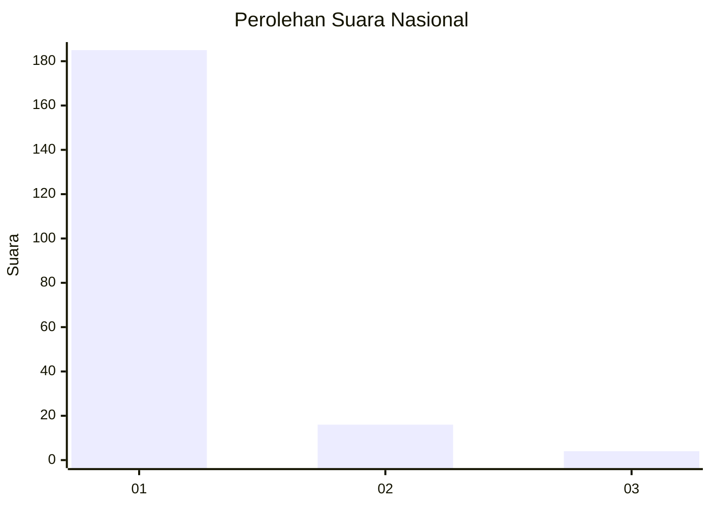
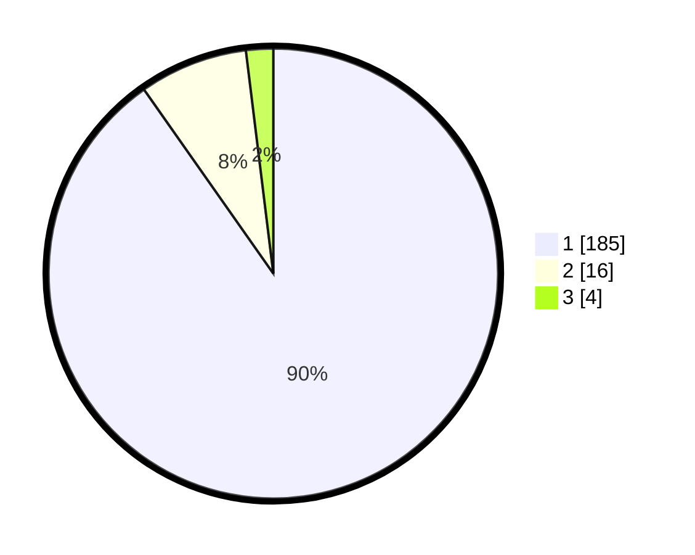

# Hasil

## Grafik

## Tabel

| No. | Nama Paslon    | Suara | Suara (raw) | Persentase |
|:--- |:-------------- | -----:| -----------:| ----------:|
| 1   | ANIES MUHAIMIN | 185   | [185][p-1]  | 90,24      |
| 2   | PRABOWO GIBRAN | 16    | [16][p-2]   | 7,80       |
| 3   | GANJAR MAHFUD  | 4     | [4][p-3]    | 1,95       |

[p-1]: https://github.com/gigit-pemilu/pemilu-2024/blob/main/pilpres/hitung-suara/sub/11-aceh/sub/01-aceh-selatan/sub/04-labuhanhaji/sub/2004-pasar-lama/sub/003-tps/sub/paslon-1.txt
[p-2]: https://github.com/gigit-pemilu/pemilu-2024/blob/main/pilpres/hitung-suara/sub/11-aceh/sub/01-aceh-selatan/sub/04-labuhanhaji/sub/2004-pasar-lama/sub/003-tps/sub/paslon-2.txt
[p-3]: https://github.com/gigit-pemilu/pemilu-2024/blob/main/pilpres/hitung-suara/sub/11-aceh/sub/01-aceh-selatan/sub/04-labuhanhaji/sub/2004-pasar-lama/sub/003-tps/sub/paslon-3.txt

## Foto C Plano

https://sirekap-obj-formc.kpu.go.id/e678/pemilu/ppwp/11/01/04/20/04/1101042004003-20240215-074035--39e4f220-15d1-4ed8-9812-8e0cdb64a840.jpg

https://sirekap-obj-formc.kpu.go.id/e678/pemilu/ppwp/11/01/04/20/04/1101042004003-20240215-085523--ea0d9f77-48e6-4627-bee7-135908c08b4a.jpg

https://sirekap-obj-formc.kpu.go.id/e678/pemilu/ppwp/11/01/04/20/04/1101042004003-20240215-085620--38746c1e-db9f-4ad0-af6f-66f09ae6753a.jpg

## Metadata

| Key        | Value               |
| ---------- | ------------------- |
| Time Stamp | 2024-02-16 16:25:10 |

## DATA PEMILIH TETAP

Jumlah pemilih dalam DPT: **240**.
 * L: **107**.
 * P: **133**.

## DATA PENGGUNA HAK PILIH

Jumlah pengguna hak pilih dalam DPT: **201**.
 * L: **81**.
 * P: **120**.

Jumlah pengguna hak pilih dalam DPTb: **4**.
 * L: **3**.
 * P: **1**.

Jumlah pengguna hak pilih dalam DPK: **0**.
 * L: **0**.
 * P: **0**.

Jumlah pengguna hak pilih: **205**.
 * L: **84**.
 * P: **121**.

## JUMLAH SUARA SAH DAN TIDAK SAH

JUMLAH SELURUH SUARA SAH: **205**.

JUMLAH SUARA TIDAK SAH: **0**.

JUMLAH SELURUH SUARA SAH DAN SUARA TIDAK SAH: **205**.

